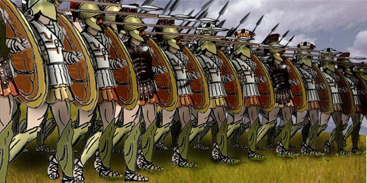
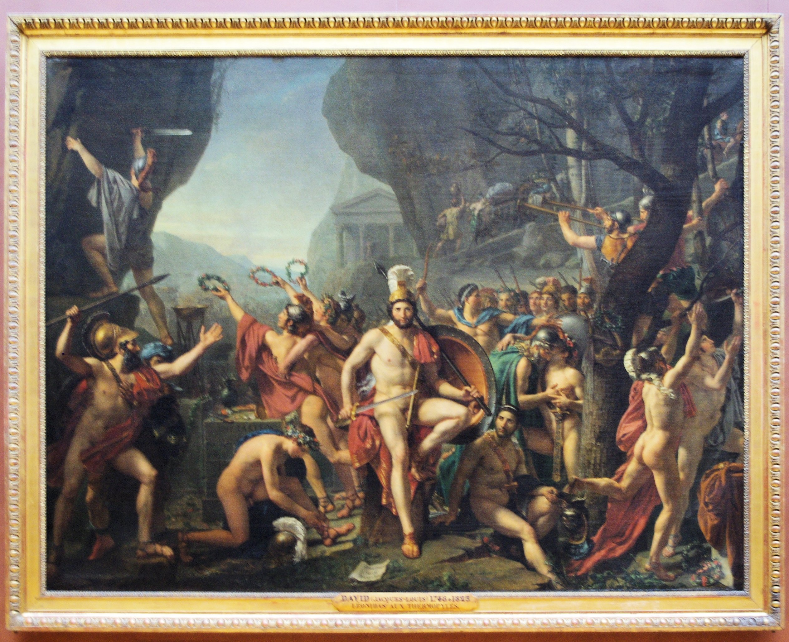
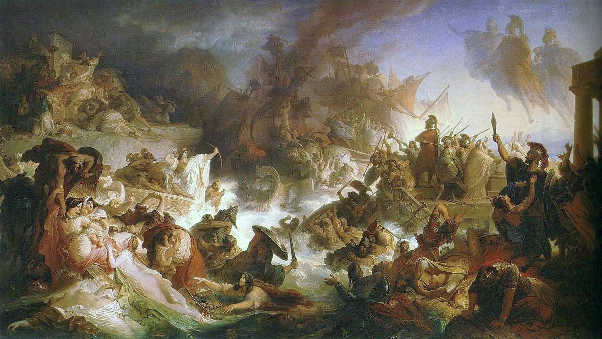

# The Persian Wars (499–479 BC)

## Background: The Ionian Revolt (499–493 BC)

Greeks living in Persia-controlled Anatolia (called Ionian Greeks) revolted against Persian taxation. They asked for help. Sparta refused — not our problem. Athens agreed — a chance to achieve eudaimonia. Persia crushed the revolt and turned its attention to Athens as the instigator.

---

## Battle of Marathon (490 BC)

Darius I sent a punitive force of ~25,000 Persians to teach Athens a lesson. Athens fielded ~10,000 hoplites — no Spartan support, no cavalry.

**Why geography shaped the outcome.** Persia's vast flat empire produced cavalry-and-archer tactics: fast, mobile, deadly at range. Greece's hilly terrain produced the **hoplite phalanx** — men in locked formation behind large round shields (*hoplon*, from which "hoplite" derives), carrying long spears, advancing as a moving armored wall. Against cavalry archers on open ground, Persians won. Against a phalanx in confined terrain, armor beat speed every time.

*The hoplite phalanx: an armored wall of shields and spears that negated Persian cavalry tactics.*

Athens destroyed the Persian force. Athenian casualties: ~192. Persian casualties: ~5,000. The result stunned the ancient world and gave Athens a mythology of invincibility — one small city had stopped the greatest empire on earth.

---

## The Second Invasion: Xerxes (480 BC)

Darius died before he could respond. His son Xerxes assembled a force so large ancient sources called it 500,000 men (modern estimates range from 100,000–300,000). The invasion came overland through Macedonia (which sided with Persia) and Thebes (also neutral-to-Persian). Sparta and Athens, mutual rivals, allied out of necessity.

---

## Battle of Thermopylae (480 BC)

The Persian army marched south along the coast. The Greeks chose to make a stand at the **Pass of Thermopylae** — a narrow coastal corridor flanked by mountains and the sea, no more than 100 meters wide at its tightest point. In that terrain, 300,000 men had no more practical room than 300.

**The Greek force.** King Leonidas of Sparta led a coalition of ~7,000: 300 Spartans, 700 Thespians, 400 Thebans, ~900 helots, and other Greek allies. They held the pass for two days, inflicting catastrophic Persian casualties. Xerxes reportedly threw wave after wave of soldiers against the phalanx — including his elite Immortals — and lost thousands for no ground gained.

**The betrayal.** On the third night, a local man named Ephialtes revealed a mountain path that circled behind the Greek position. Xerxes sent 20,000 men through it overnight. Surrounded, the position was lost.

**The last stand.** Leonidas dismissed most of the Greek forces while he could. The 300 Spartans, 700 Thespians (who refused to leave), and a Theban contingent remained to fight a rearguard so the allied army could escape. All were killed.

Xerxes' emissary had demanded the Greeks lay down their weapons. Leonidas's reply has become one of history's most famous three words: **"Molṑn labé" — Come and take them.**

The Spartan epitaph, written by Simonides: *"O stranger, tell the Lacedaemonians that we lie here, obedient to their words."*

*"Leonidas at Thermopylae" by Jacques-Louis David (1814). Sparta's king and his warriors before their last stand.*

Thermopylae was a Persian military victory and a Greek moral one. The delay it bought — combined with the psychological blow of how many men it cost Persia — set up the decisive engagement that followed.

---

## Battle of Salamis (480 BC)

With Thermopylae lost, the Greek coalition faced collapse. The Persians burned Athens to the ground. But Athens was not a place — it was a *polis*, a community. The Athenians had already evacuated their population onto ships. The city was ash. The people were still intact.

The Greek navy anchored near **Salamis**, an island in a narrow strait off the coast. Two positions were available: retreat south to defend Sparta's coastline (the Spartan preference), or stand and fight in the straits (the Athenian preference).

The Athenian general **Themistocles** saw what others missed. The Persians had ~800–1,000 ships to the Greek ~370, but the strait at Salamis was narrow. In confined water, Persian numbers became a liability — ships would jam against each other, unable to maneuver. He made his argument to the Spartan commanders: fight here or Athens takes its fleet and sails west to Sicily. The Spartans had no choice but to agree.

**The deception.** Themistocles sent a trusted servant to Xerxes with false intelligence: the Greek fleet was planning to flee. Attack now and you can destroy it before it escapes. Xerxes, eager to prove himself greater than his father Darius, wanted the decisive victory. Against his generals' advice, he ordered his entire fleet into the straits.

**The battle.** Xerxes watched from a golden throne on the slopes of Mount Aigaleo. He expected to watch his navy crush the Greeks. Instead, he watched Persian ships funnel into the narrows, jam together, and be rammed and boarded one by one by the heavier, better-crewed Greek triremes. Persian vessels fouled each other, rowers panicked, ships sank. The Greek crews were armored hoplites; the Persian crews were not. In close quarters, armor wins.

Result: Persia lost ~300 ships. Greece lost ~40. Xerxes' brother Ariabignes was killed in the fighting.

*"The Battle of Salamis" by Wilhelm von Kaulbach (1868). Greek and Persian fleets clash in the straits.*

With his supply lines cut and his navy destroyed, Xerxes went home. He left his general **Mardonius** with a land army to finish the job.

---

## Battle of Plataea (479 BC)

Mardonius could have waited the Greeks out — Athens was in ruins, resources were thin, starvation was plausible. Instead he chose battle. At Plataea in Boeotia, ~80,000 Greeks (Spartans and Athenians fighting together again) faced a Persian force of similar size. The Greeks won decisively. Mardonius was killed. Persian survivors fled north toward the Hellespont. On the same day, Greek forces destroyed the remaining Persian navy at Cape Mycale.

The Second Persian Invasion was over. Persia never invaded Greece again — though the Greeks did not know it yet and would spend the next generation preparing for the next attack.

---

## What the Wars Actually Did

The lecturer's argument: these wars were less important as military events than as economic ones. Greece went into the Persian Wars poor and came out wealthy. Persia was forced to retreat from Asia Minor, and the Greeks captured enormous quantities of Persian treasure. Athens used that windfall to build the Delian League, the Parthenon, and a naval empire. The Persian Wars transformed Athens from a scrappy city-state into the richest city in the Mediterranean — and with that wealth came all the dynamics of Rat Utopia.

Militarily, the wars also proved something that would echo for centuries: the hoplite phalanx, democratic discipline, and citizen soldiers fighting for *their own* city were more effective than subjects fighting for a king's glory. The Greeks defeated Persia not just because of terrain or luck, but because their soldiers had reasons to win that Persian conscripts did not.
