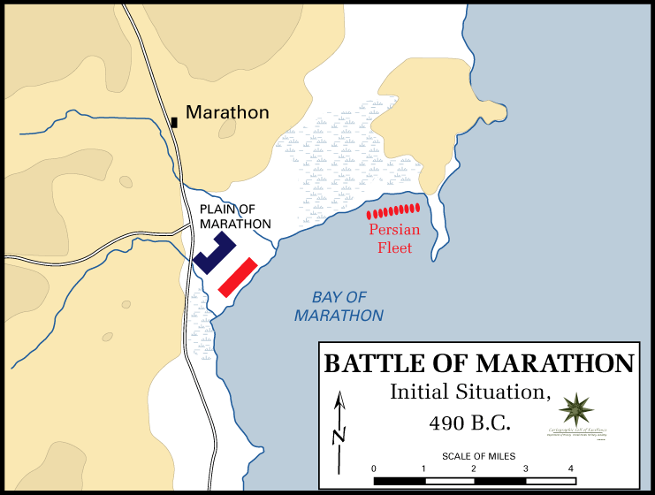
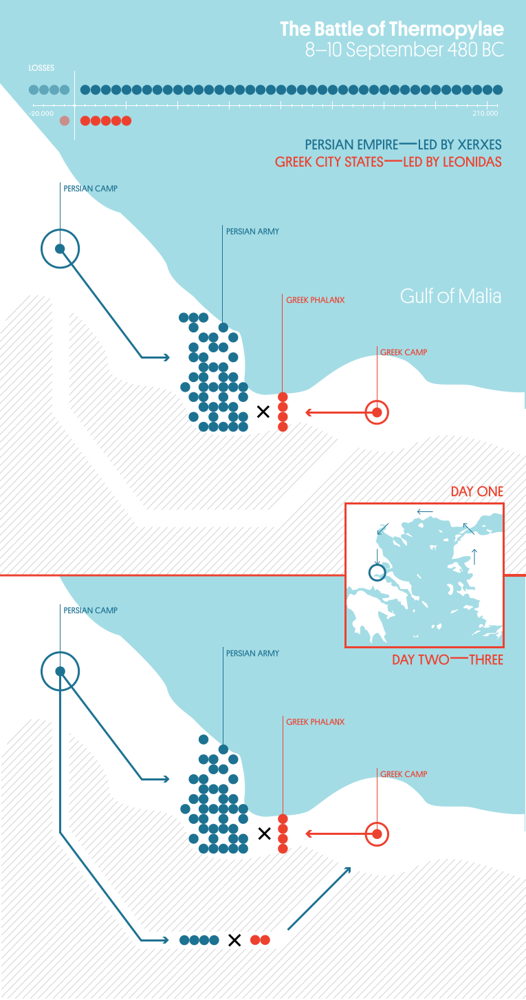
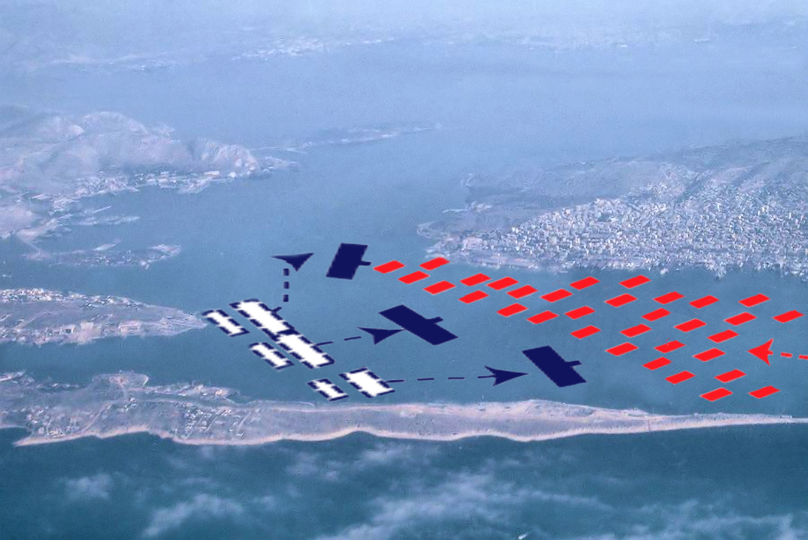
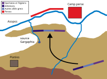

# Các Cuộc Chiến Tranh Ba Tư (499–479 TCN)

## Bối Cảnh: Cuộc Nổi Dậy Ionia (499–493 TCN)

Những người Hy Lạp sống ở Anatolia do Ba Tư kiểm soát (gọi là người Hy Lạp Ionia) đã nổi dậy chống lại thuế của Ba Tư. Họ cầu cứu. Sparta từ chối — không phải việc của chúng ta. Athens đồng ý — một cơ hội để đạt được eudaimonia. Ba Tư dập tắt cuộc nổi dậy và chĩa sự chú ý vào Athens với tư cách là kẻ kích động.

---

## Trận Marathon (490 TCN)

Darius I phái một lực lượng trừng phạt ~25.000 người Ba Tư để dạy Athens một bài học. Athens tập hợp ~10.000 hoplite — không có sự hỗ trợ của Sparta, không có kỵ binh.

**Tại sao địa lý định hình kết quả.** Đế chế Ba Tư bằng phẳng rộng lớn tạo ra chiến thuật kỵ binh-cung thủ: nhanh, cơ động, chết người ở tầm xa. Địa hình đồi núi của Hy Lạp tạo ra **đội hình phalanx hoplite** — những người đàn ông trong đội hình khóa chặt phía sau những tấm khiên tròn lớn (*hoplon*, từ đó có từ "hoplite"), mang giáo dài, tiến lên như một bức tường giáp di động. Trên vùng đất bằng trước kỵ binh cung thủ, người Ba Tư thắng. Trước phalanx trên địa hình chật hẹp, giáp phục luôn thắng tốc độ.

*Phalanx hoplite: bức tường giáp khiên và giáo vô hiệu hóa chiến thuật kỵ binh Ba Tư.*

*Bản đồ chiến thuật: bố trí quân ban đầu tại Marathon — hoplite Hy Lạp neo ở hai sườn, sau đó xung phong bao vây trung tâm Ba Tư.*

Athens tiêu diệt lực lượng Ba Tư. Thương vong Athens: ~192 người. Thương vong Ba Tư: ~5.000 người. Kết quả gây chấn động thế giới cổ đại và trao cho Athens một huyền thoại bất khả chiến bại — một thành phố nhỏ đã chặn đứng đế chế vĩ đại nhất trên trái đất.

---

## Cuộc Xâm Lược Thứ Hai: Xerxes (480 TCN)

Darius mất trước khi có thể đáp trả. Con trai ông Xerxes tập hợp một lực lượng lớn đến mức các nguồn cổ đại gọi là 500.000 người (ước tính hiện đại dao động từ 100.000–300.000). Cuộc xâm lược tiến qua đất liền qua Macedonia (đứng về phía Ba Tư) và Thebes (cũng trung lập-ngả về Ba Tư). Sparta và Athens, hai đối thủ vốn thù địch, liên minh vì cần thiết.

---

## Trận Thermopylae (480 TCN)

Quân Ba Tư tiến về phía nam dọc theo bờ biển. Người Hy Lạp chọn chặn đánh tại **Đèo Thermopylae** — một hành lang ven biển hẹp kẹp giữa núi và biển, chỉ rộng không quá 100 mét ở điểm hẹp nhất. Trên địa hình đó, 300.000 người không có nhiều không gian thực tế hơn 300 người.

**Lực lượng Hy Lạp.** Vua Leonidas của Sparta dẫn đầu một liên quân ~7.000 người: 300 Spartans, 700 Thespians, 400 Thebans, ~900 helot và các đồng minh Hy Lạp khác. Họ giữ đèo trong hai ngày, gây thương vong khủng khiếp cho Ba Tư. Xerxes tương truyền đã tung làn sóng binh sĩ này qua làn sóng khác vào phalanx — kể cả đội Bất Tử tinh nhuệ — và mất hàng nghìn người mà không giành được tấc đất.

**Sự phản bội.** Đêm thứ ba, một người địa phương tên Ephialtes tiết lộ con đường núi bao vòng phía sau trận địa Hy Lạp. Xerxes phái 20.000 người đi qua đó suốt đêm. Bị bao vây, trận địa đã mất.

**Trận chiến cuối cùng.** Leonidas giải tán hầu hết lực lượng Hy Lạp khi còn có thể. 300 Spartans, 700 Thespians (từ chối rút lui) và một đội Theban ở lại chiến đấu bảo vệ rút lui để quân đồng minh thoát ra. Tất cả đều hy sinh.

Sứ giả của Xerxes đã yêu cầu người Hy Lạp buông vũ khí. Câu trả lời của Leonidas đã trở thành ba từ nổi tiếng nhất lịch sử: **"Molṑn labé" — Hãy đến mà lấy.**

Bài thơ khắc mộ của người Sparta, do Simonides viết: *"Này người lữ khách, hãy về báo cho người Lacedaemon biết rằng chúng tôi nằm đây, tuân theo lời của họ."*

*Sơ đồ chiến thuật: phalanx Hy Lạp chặn đèo hẹp tại Thermopylae, với con đường vòng của Ephialtes vượt qua núi.*

*"Leonidas tại Thermopylae" của Jacques-Louis David (1814). Vua Sparta và các chiến binh trước trận chiến cuối cùng.*

Thermopylae là chiến thắng quân sự của Ba Tư và chiến thắng đạo đức của Hy Lạp. Sự trì hoãn nó mang lại — cộng với cú đòn tâm lý từ số người Ba Tư phải bỏ mạng — đã dàn xếp cho trận chiến quyết định tiếp theo.

---

## Trận Salamis (480 TCN)

Sau khi Thermopylae thất thủ, liên quân Hy Lạp đứng trước nguy cơ tan rã. Người Ba Tư đốt cháy Athens đến tro tàn. Nhưng Athens không chỉ là một nơi chốn — đó là một *polis*, một cộng đồng. Người Athens đã sơ tán dân số của họ lên tàu thuyền từ trước. Thành phố đã thành tro. Người dân vẫn còn nguyên vẹn.

Hải quân Hy Lạp neo đậu gần **Salamis**, một đảo nằm trong eo biển hẹp ngoài khơi bờ biển. Có hai lựa chọn: rút về phía nam để bảo vệ bờ biển Sparta (ưu tiên của Sparta), hoặc đứng lại và chiến đấu trong eo biển (ưu tiên của Athens).

Tướng Athens **Themistocles** nhìn thấy điều người khác bỏ qua. Người Ba Tư có ~800–1.000 tàu so với ~370 tàu của Hy Lạp, nhưng eo biển tại Salamis rất hẹp. Trong vùng nước chật hẹp, số lượng của Ba Tư trở thành bất lợi — các tàu sẽ chen chúc nhau, không thể cơ động. Ông trình bày lập luận với các chỉ huy Sparta: chiến đấu ở đây hoặc Athens đem hạm đội đi về phía tây đến Sicily. Sparta không có lựa chọn nào khác ngoài việc đồng ý.

**Kế sách đánh lừa.** Themistocles phái một người hầu tin cậy đến Xerxes với thông tin tình báo giả: hạm đội Hy Lạp đang chuẩn bị chạy trốn. Tấn công ngay và bạn có thể tiêu diệt nó trước khi thoát. Xerxes, háo hức chứng tỏ mình vĩ đại hơn cha Darius, muốn có chiến thắng quyết định. Bất chấp lời khuyên của các tướng, ông ra lệnh toàn bộ hạm đội tiến vào eo biển.

**Trận chiến.** Xerxes ngồi trên ngai vàng trên sườn núi Aigaleo. Ông dự kiến xem hải quân của mình nghiền nát người Hy Lạp. Thay vào đó, ông chứng kiến các tàu Ba Tư đổ vào eo hẹp, kẹt chặt với nhau, và từng chiếc một bị đâm và bắt bởi các chiến hạm Hy Lạp nặng hơn, thủy thủ lành nghề hơn. Tàu Ba Tư vướng vào nhau, tay chèo hoảng loạn, tàu chìm. Thủy thủ Hy Lạp là những hoplite có giáp; thủy thủ Ba Tư thì không. Trong không gian hẹp, giáp phục thắng.

Kết quả: Ba Tư mất ~300 tàu. Hy Lạp mất ~40 tàu. Em trai Xerxes, Ariabignes, tử trận trong cuộc chiến.

*Bản đồ chiến thuật: bố trí hạm đội Hy Lạp và Ba Tư trong Eo biển Salamis — vùng nước hẹp vô hiệu hóa ưu thế số lượng của Ba Tư.*

*"Trận Salamis" của Wilhelm von Kaulbach (1868). Hạm đội Hy Lạp và Ba Tư giao chiến trong eo biển.*

Với đường tiếp tế bị cắt đứt và hải quân bị tiêu diệt, Xerxes về nước. Ông để lại tướng **Mardonius** với một đội quân bộ để hoàn thành công việc.

---

## Trận Plataea (479 TCN)

*Bản đồ chiến thuật: các chuyển động quân ban đầu tại Plataea — lực lượng Hy Lạp và Ba Tư cơ động trước trận giao chiến quyết định.*

Mardonius đáng lẽ có thể kéo dài thời gian — Athens đang trong đống đổ nát, tài nguyên eo hẹp, nạn đói là có thể. Thay vào đó ông chọn tấn công. Tại Plataea ở Boeotia, ~80.000 người Hy Lạp (Sparta và Athens lại chiến đấu cùng nhau) đối mặt với lực lượng Ba Tư tương đương. Người Hy Lạp giành chiến thắng áp đảo. Mardonius bị giết. Quân Ba Tư sống sót chạy về phía bắc đến Hellespont. Cùng ngày đó, lực lượng Hy Lạp tiêu diệt phần còn lại của hải quân Ba Tư tại Mũi Mycale.

Cuộc Xâm Lược Ba Tư Lần Thứ Hai đã kết thúc. Ba Tư không bao giờ xâm lược Hy Lạp nữa — dù người Hy Lạp chưa biết điều đó và sẽ dành thế hệ tiếp theo chuẩn bị cho cuộc tấn công kế tiếp.

---

## Những Gì Các Cuộc Chiến Thực Sự Làm

Lập luận của bài giảng: các cuộc chiến này ít quan trọng hơn với tư cách là sự kiện quân sự mà quan trọng hơn với tư cách là sự kiện kinh tế. Hy Lạp bước vào Chiến Tranh Ba Tư nghèo nàn và bước ra giàu có. Ba Tư bị buộc rút khỏi Tiểu Á, và người Hy Lạp chiếm được số lượng kho báu Ba Tư khổng lồ. Athens sử dụng khoản tiền trời cho đó để xây dựng Liên minh Delian, Parthenon và một đế chế hải quân. Các Cuộc Chiến Tranh Ba Tư đã biến Athens từ một thành bang bé nhỏ thành thành phố giàu nhất Địa Trung Hải — và với sự giàu có đó đến tất cả những động lực của Thiên Đường Chuột.

Về mặt quân sự, các cuộc chiến cũng chứng minh điều gì đó sẽ vang vọng trong nhiều thế kỷ: phalanx hoplite, kỷ luật dân chủ và những binh sĩ công dân chiến đấu vì *thành phố của chính họ* hiệu quả hơn những thần dân chiến đấu vì vinh quang của một ông vua. Người Hy Lạp đánh bại Ba Tư không chỉ vì địa hình hay may mắn, mà vì những người lính của họ có lý do để chiến thắng mà lính quân dịch Ba Tư không có.
