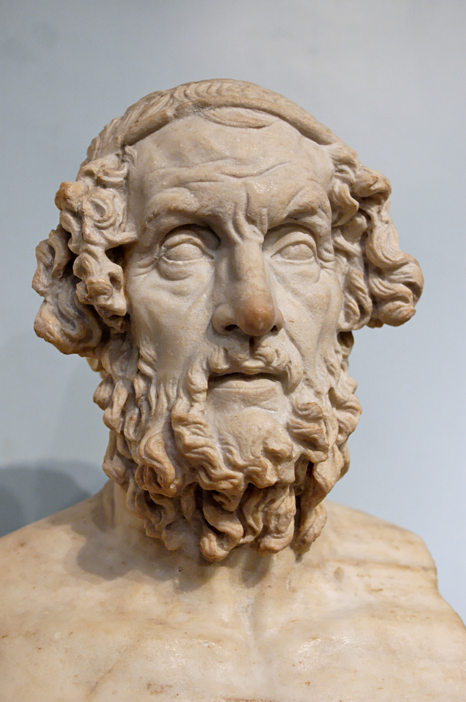
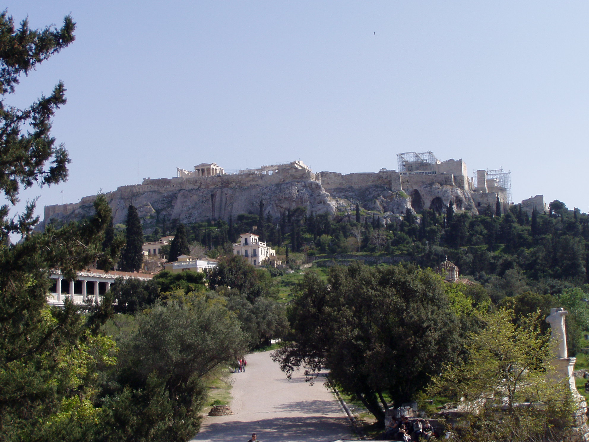
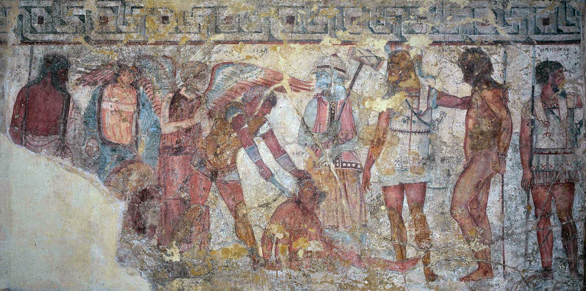
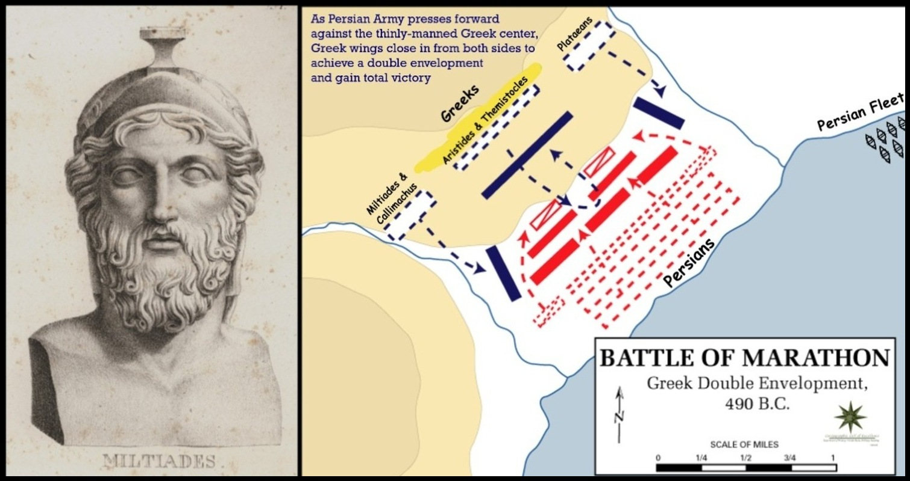
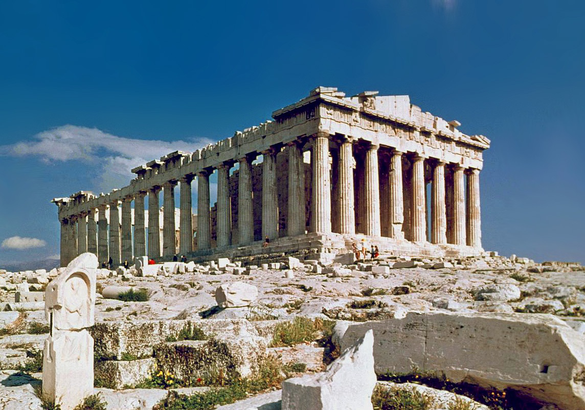
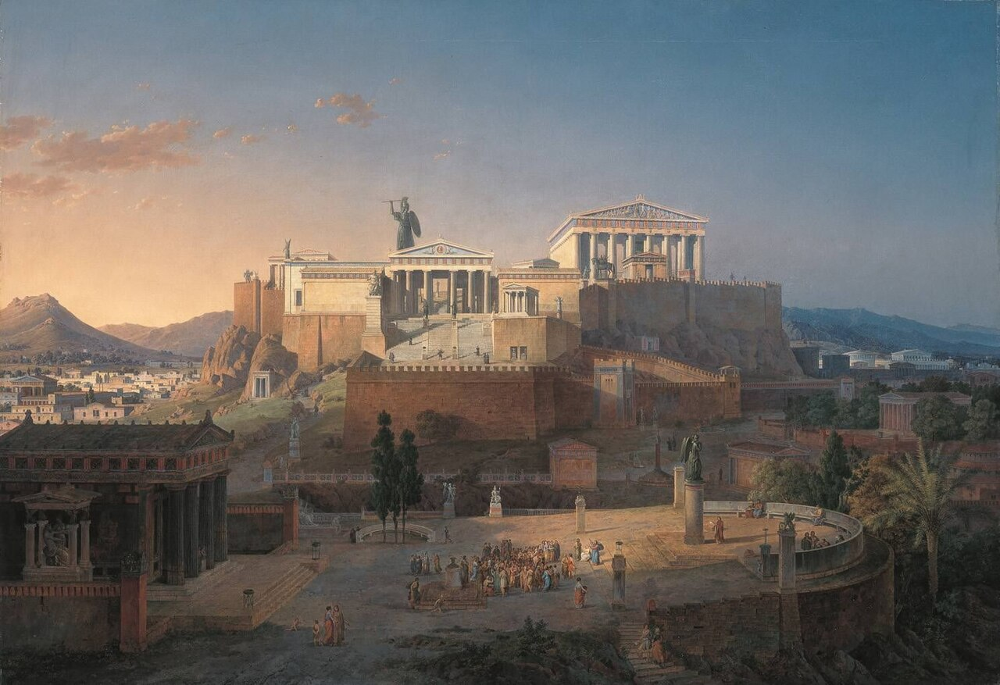
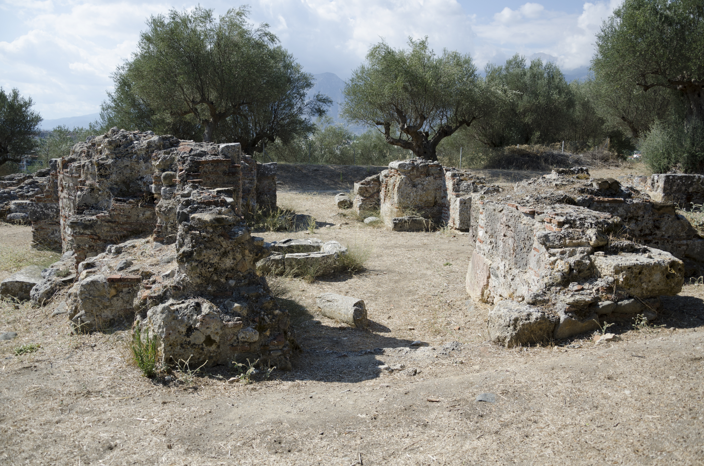
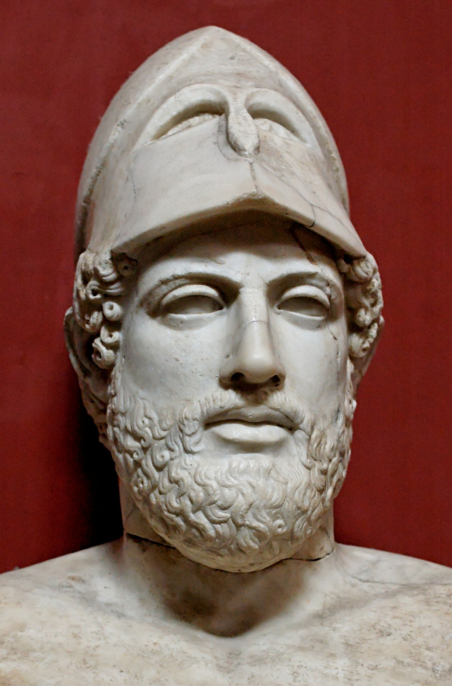
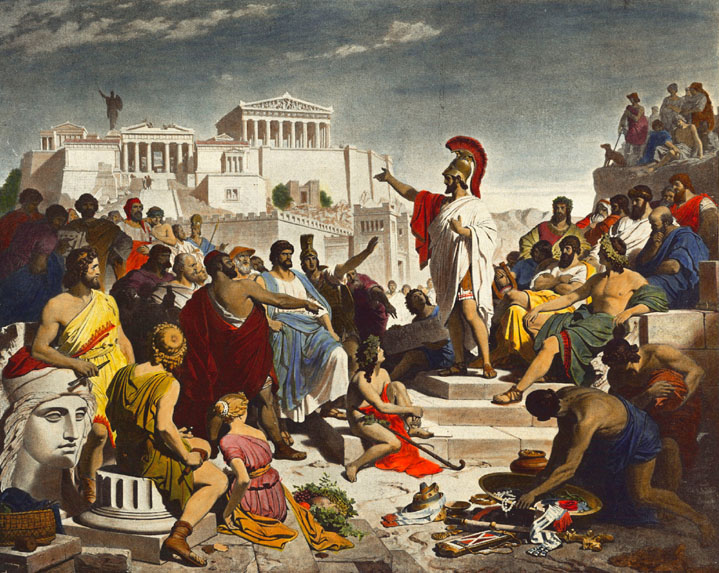

# Văn Minh Hy Lạp

## Homer và Sự Ra Đời Của Nền Văn Minh Hy Lạp

*Tượng bán thân đá cẩm thạch La Mã về Homer, Bảo tàng Anh (bản sao thế kỷ 2 CN từ nguyên bản Hy Lạp hóa)*

Sự Sụp Đổ Thời Đại Đồng Thau (~1100 TCN) đã tạo ra một nghịch lý: những điều kiện cho sự vĩ đại của Hy Lạp. Sự hủy diệt Mycenae để lại Hy Lạp trong tình trạng phi tập trung, mù chữ và nghèo nàn — và ba thiếu hụt đó trở thành động cơ của đổi mới. (Xem: [Sự Sụp Đổ Thời Đại Đồng Thau](../000_BronzeAgeCollapse_DONE/readme_vi.md))

Ba đổi mới xuất hiện từ sự hỗn loạn:

*Agora Cổ Đại Athens — trung tâm dân sự và thương mại của polis*

**Polis** — Không có thẩm quyền tập trung, hàng nghìn thành bang nhỏ (~1.000 người mỗi) hình thành trên khắp Hy Lạp. Sự cạnh tranh giữa các polis thúc đẩy đổi mới không ngừng. Sự đa dạng địa lý (núi, đồng bằng, bờ biển) có nghĩa là mỗi polis phát triển nền văn hóa và nền kinh tế riêng biệt. Sự nghèo đói buộc sự tham gia quân sự rộng rãi, từ đó làm nảy sinh nền dân chủ: nếu bạn chiến đấu cho thành phố, bạn có quyền phát biểu.

*Bảng chữ cái Phoenicia — tiền thân trực tiếp mà người Hy Lạp đã tiếp nhận và cải biến, giúp chữ viết trở nên phổ cập*

**Bảng chữ cái** — Khi người Hy Lạp học lại chữ viết, họ áp dụng bảng chữ cái phụ âm Phoenicia thay vì xây dựng lại một hệ thống thư lại phức tạp. Không giống như ký tự biểu ý Trung Quốc, mà các thư lại chuyên nghiệp độc quyền như một công cụ quyền lực, bảng chữ cái đủ đơn giản để mọi người học. Điều này dân chủ hóa việc học chữ và pha trộn văn hóa truyền khẩu (cảm xúc, tưởng tượng, trí nhớ mạnh) với văn hóa chữ viết (logic, phản tư) — tạo ra một phương thức tư duy độc đáo mạnh mẽ.

*Achilles hiến tế tù nhân Trojan tại lễ hỏa táng của Patroclus — một cảnh từ Iliad*

**Homer** — *Iliad* và *Odyssey* của Homer đã phát minh ra văn học bằng cách làm ba điều chưa từng được làm trước đó: (1) chuyển góc nhìn để người Trojan xuất hiện anh hùng hơn người Hy Lạp, tạo ra sự đồng cảm; (2) giải thích tâm lý nhân vật — điều gì thúc đẩy Achilles; (3) sử dụng phép ẩn dụ như công cụ cho tư duy mới. Homer đặt một lý thuyết về nhân loại vào trung tâm văn hóa Hy Lạp: là con người là có sự đồng cảm, trí tưởng tượng và ý chí tư duy.

---

## Arete và Eudaimonia

Hai khái niệm định nghĩa thế giới quan Athens và tách biệt nó rõ ràng với Sparta.

**Arete** (xuất sắc/đức hạnh) là phẩm chất trở thành tốt nhất trong những gì bạn là. Đối với những anh hùng của Homer, arete có nghĩa là xuất sắc trong chiến đấu và lòng dũng cảm. Đối với công dân Athens, nó mở rộng sang xuất sắc trong tất cả các hoạt động của con người — chính trị, trí tuệ, thể thao, nghệ thuật.

**Eudaimonia** (sự phồn thịnh của con người) là mục tiêu mà arete phục vụ. Biểu hiện nổi tiếng nhất đến từ Achilles trong *Iliad*: trước khi lên đường đến Troy, anh được trao một lời tiên tri — sống lâu và bị lãng quên, hoặc chết trẻ và được nhớ mãi. Đối với Achilles, đây không phải là lựa chọn gì cả. Đạt được tiềm năng đầy đủ của mình là cuộc sống duy nhất đáng sống.

Athens xây dựng toàn bộ nền văn hóa của mình xung quanh giá trị này. Nó làm cho thành phố bành trướng, cạnh tranh và đổi mới. Nó cũng làm cho nó nguy hiểm — vì nếu mọi người đều đuổi theo eudaimonia, việc đâm sau lưng đối thủ trên đường đi lên được coi là hợp pháp. Athens thậm chí đã phát minh ra ostracism (lưu đày 10 năm) để quản lý những công dân cạnh tranh quá hung hãn.

**Hai con đường thuyết phục**: Tư tưởng Hy Lạp truyền thống công nhận hai mô hình bắt nguồn từ những anh hùng của Homer:

- **Hùng biện** (con đường của Odysseus) — diễn thuyết khéo léo, lập luận và thao túng. Odysseus là bậc thầy của ngôn từ, lừa dối và đàm phán.
- **Bạo lực** (con đường của Achilles) — sức mạnh trực tiếp và sự thống trị quân sự. Achilles là chiến binh vĩ đại nhất, giải quyết tranh chấp bằng ngọn giáo, không phải bằng lời nói.

Hai mô hình này — thuyết phục qua lý trí/lời nói so với thuyết phục qua sức mạnh — trở thành sự căng thẳng tổ chức của cuộc sống chính trị và triết học Hy Lạp. Các nhà soạn kịch và triết học sẽ tranh luận trong nhiều thế kỷ về điều nào tạo ra công lý.

---

## Các Cuộc Chiến Tranh Ba Tư (499–479 TCN)

Xem chi tiết đầy đủ: [Các Cuộc Chiến Tranh Ba Tư](persian_wars_vi.md)

*Bao vây hai cánh của Miltiades tại Marathon (490 TCN) — 10.000 hoplite đối 25.000 quân Ba Tư*

*Đội hình phalanx hoplite đã chứng tỏ tính quyết định tại Marathon*

*Thermopylae — 300 Spartans và 7.000 người Hy Lạp giữ đèo suốt hai ngày*

*Salamis (480 TCN) — Themistocles dụ hạm đội Ba Tư vào eo biển và tiêu diệt ~300 tàu*

Cuộc Nổi Dậy Ionia (499 TCN) đã kích hoạt hai cuộc xâm lược của Ba Tư. Athens đẩy lui cuộc xâm lược đầu tiên tại **Marathon** (490 TCN) — 10.000 hoplite chống 25.000 quân Ba Tư, thương vong ~192 so với ~5.000 — chứng minh phalanx hoplite vượt trội kỵ binh cung thủ Ba Tư. Cuộc xâm lược thứ hai dưới Xerxes (480 TCN) lớn hơn nhiều. **Thermopylae** tranh thủ thời gian: 300 Spartans và ~7.000 người Hy Lạp giữ một đèo ven biển hẹp suốt hai ngày trước khi bị phản bội và dẫn đến trận chiến cuối cùng. **Salamis** là trận quyết định: Themistocles dụ hạm đội Ba Tư vào eo biển, nơi các chiến hạm Hy Lạp tiêu diệt ~300 tàu Ba Tư. Xerxes về nước. **Plataea** (479 TCN) kết thúc chiến tranh trên bộ — Mardonius bị giết, cuộc xâm lược chấm dứt.

Các cuộc chiến có ý nghĩa ít hơn như sự kiện quân sự mà quan trọng hơn như sự kiện kinh tế: Hy Lạp bước vào nghèo nàn và bước ra giàu có, với kho báu Ba Tư tài trợ cho Liên minh Delian, Parthenon và mọi thứ tiếp theo.

---

## Thời Đại Hoàng Kim Athens & Liên Minh Delian (478–431 TCN)

*Parthenon — được xây bằng tiền cống nộp của Liên minh Delian dưới thời Pericles, biểu tượng của Thời Đại Hoàng Kim*

*Phục dựng Acropolis ở đỉnh cao thời Pericles*

Sau Các Cuộc Chiến Tranh Ba Tư, Athens biến **Liên minh Delian** (478 TCN) — một liên minh phòng thủ chống Ba Tư — thành **Đế Chế Athens**, rút tiền cống nộp của các đồng minh vào Athens thời Pericles. Sự giàu có và tham vọng đã xây nên Parthenon và tạo ra Thời Đại Hoàng Kim cũng khiến Athens bá quyền, đặt nền móng cho Chiến Tranh Peloponnesus. Xem chi tiết: [Thời Đại Hoàng Kim Athens](golden_age_athens_detail_vi.md)

---

## Thiên Đường Chuột và Chiến Tranh Peloponnesus

Chiến Tranh Peloponnesus (431–404 TCN) không thực sự là cuộc chiến giữa Athens và Sparta — nó là triệu chứng của sự suy thoái xã hội do sự giàu có gây ra. Xem chi tiết: [Thiên Đường Chuột](rat_utopia_vi.md)

*Phế tích Sparta cổ đại — nhà nước quân sự mà địa lý của nó định hình toàn bộ nền văn minh*

**Địa lý là số phận** đã định hình hoàn toàn hai đối thủ:

- *Sparta* (đồng bằng nội địa, nông nghiệp): cộng đồng, bảo thủ, biệt lập. Tỷ lệ helot trên công dân 10:1 buộc nó phải trở thành một nhà nước cảnh sát quân sự. Giống như Trung Quốc trong suốt lịch sử, tập trung hoàn toàn vào kiểm soát nội bộ.
- *Athens* (bờ biển đồi núi, cảng, dầu ô liu, gốm sứ): thương mại, bành trướng, hướng đến eudaimonia. Thương mại buộc Athens phải đưa công dân ra ngoài để tìm thị trường, điều này khiến nó tự nhiên là dân chủ và cạnh tranh.

*Pericles — người biến Liên minh Delian thành đế chế Athens và tài trợ Thời Đại Hoàng Kim*

*Pericles đọc Bài Điếu — bài diễn văn mà Euripides sau này sẽ đảo ngược trong The Bacchae*

**Pericles** (461–429 TCN) biến Athens thành một đế chế bằng cách chuyển đổi Liên minh Delian (một liên minh phòng thủ chống Ba Tư) thành một đế chế nộp cống. Ông trao dân chủ cho quần chúng để vượt qua tầng lớp quý tộc cao, tài trợ Parthenon bằng tiền của các đồng minh, và lưu đày những người phản đối buộc tội ông tham nhũng. Athens trở nên cực kỳ giàu có.

**Cuộc chiến không có ý nghĩa chiến lược từ cả hai phía.** Athens có thể đã giải phóng những người helot của Sparta — một bước đi sẽ phá hủy Sparta từ bên trong (tỷ lệ 10:1, sợ nổi loạn liên tục). Sparta có thể đã giải phóng những nô lệ của Athens. Không ai làm, vì phá hủy trật tự xã hội nội bộ quan trọng hơn việc thắng cuộc chiến.

**Thiên Đường Chuột** giải thích tại sao. Trong các thí nghiệm của James B. Calhoun những năm 1960–70, chuột được đặt trong điều kiện dư dả hoàn toàn — thức ăn vô hạn, không có thiên địch — không phát triển mạnh. Các nghi lễ xã hội sụp đổ. Chuột đực trở nên hung hãn và ngừng tuân theo phong tục giao phối. Cưỡng hiếp tập thể thay thế việc tán tỉnh. Các mẹ bỏ rơi hoặc tấn công con của chính mình. Cuối cùng toàn bộ thuộc địa chết. Thí nghiệm được lặp lại nhiều lần với kết quả giống hệt nhau.

Giải thích không phải là quá tải dân số (không gian có sẵn). Đó là **khóa địa vị**: trong dư dả, người già không chết, điều này ngăn chặn các thế hệ trẻ thăng tiến trong hệ thống phân cấp. Bị mắc kẹt không có nơi nào để đi, họ trở nên bạo lực với nhau — không phải vì tài nguyên, mà từ sự thất vọng thuần túy.

Áp dụng cho Athens và Sparta: cả hai đều đủ giàu để tầng lớp tinh hoa hiện có ngăn chặn những quý tộc trẻ hơn khỏi quyền lực. Cuộc chiến trở thành cơ chế để đốt cháy năng lượng thất vọng đó. Thế giới năm 404 TCN về mặt chính trị giống hệt năm 431 TCN. Chỉ có những người trẻ là đã chết.

**Bài học lịch sử quan trọng**: xung đột lớn không bao giờ là giữa người giàu và người nghèo. Người nghèo bạo loạn nhưng không nổi dậy. Luôn là tầng lớp quý tộc thấp hơn — những người có phần ít hơn — mới làm cách mạng (tiểu tư sản Pháp, tầng lớp trung lưu hiện đại). Nền dân chủ Athens là cuộc thi giữa tầng lớp quý tộc cao và thấp, với quần chúng như một công cụ mà mỗi phe sử dụng.

---

## Aeschylus, Sophocles và Euripides về Nền Dân Chủ

Athens tổ chức **Lễ hội Dionysus** hai lần một năm (mùa đông và mùa hè). Sân khấu miễn phí cho tất cả công dân, được quyết định bằng bỏ phiếu phổ thông, và có thể thu hút 10–15.000 trong số ~50.000 công dân Athens. Chiến thắng giải nhất là danh dự cao nhất trong cuộc sống Athens — tương đương với việc đoạt giải Nobel ngày nay. Các quý tộc giàu có tài trợ cho các buổi biểu diễn để giành được sự ủng hộ của dân chúng.

Ba nhà soạn kịch vĩ đại không chỉ là những người giải trí. Họ là **những người tiên tri của nền dân chủ** — sử dụng thần thoại Hy Lạp để dạy công dân tại sao nền dân chủ tồn tại, điều gì đe dọa nó và cách bảo vệ nó.

### Aeschylus — *Oresteia* (458 TCN)

**Bối cảnh Athens**: được viết vào đỉnh cao quyền lực Athens, trước Chiến Tranh Peloponnesus. Bản thân Aeschylus đã chiến đấu tại Marathon (490 TCN).

**Tóm tắt cốt truyện**: Ngôi nhà Atreus mang lời nguyền cổ xưa. Atreus (Vua Argos) đã giết những đứa con của anh trai và cho người cha ăn chúng tại một bữa tiệc — vi phạm mối ràng buộc thiêng liêng của lòng hiếu khách. Con trai ông **Agamemnon** thừa hưởng lời nguyền. Để có gió thuận cho cuộc xâm lược Troy, Agamemnon hiến tế con gái **Iphigenia**. Vợ ông **Clytemnestra** âm mưu trả thù trong suốt 10 năm chiến tranh. Khi Agamemnon trở về chiến thắng, Clytemnestra và người tình **Aegisthus** giết ông. Con trai Agamemnon **Orestes** (đang lưu vong) được thần Apollo nói rằng anh phải trả thù cho cha — có nghĩa là anh phải giết chính mẹ mình. Anh làm vậy. Các **Furies** (các nữ thần cổ đại của sự báo thù huyết thống) sau đó ám ảnh Orestes không thương tiếc vì tội giết mẹ. Trong tuyệt vọng, Orestes chạy trốn đến Athens và cầu xin **Athena** giúp đỡ. Athena triệu tập một hội đồng bồi thẩm gồm 500 công dân Athens. Cả hai bên tranh luận. Kết quả bỏ phiếu hòa 250–250. Athena bỏ phiếu quyết định tha bổng. Bà sau đó đàm phán với Furies: thay vì là những con quỷ trừng phạt, bà biến họ thành những người bảo vệ công lý cho Athens. Orestes được tự do.

**Thông điệp**: Nền dân chủ là món quà thiêng liêng từ chính Athena. Mỗi thành viên bồi thẩm đoàn Athens nắm giữ quyền năng của một vị thần — Athena chỉ có thể bỏ một phiếu, như bất kỳ công dân nào. Khi công dân bỏ phiếu với lý trí và thiện chí, họ đưa sự thật và công lý vào thế giới. Chu kỳ trả thù tư nhân được thay thế bằng luật công cộng.

---

### Sophocles — *Bộ Ba Oedipus* & *Antigone* (~441 TCN)

**Bối cảnh Athens**: được viết trong thời điểm đỉnh cao của nền dân chủ Pericles và căng thẳng gia tăng trước Chiến Tranh Peloponnesus.

**Oedipus Rex — Tóm tắt cốt truyện**: Vua Thebes và hoàng hậu nhận được lời tiên tri: con trai của họ sẽ giết cha và cưới mẹ. Họ ra lệnh giết đứa trẻ sơ sinh. Một người lính để đứa bé phơi nắng trên đồi thay vào đó. Một người chăn cừu từ Corinth tìm thấy đứa trẻ và giao cho vua và hoàng hậu vô sinh của Corinth, những người đặt tên cho anh là **Oedipus**. Lớn lên thành người đàn ông, Oedipus nghe những tin đồn rằng anh được nhận nuôi, tham khảo Oracle và được cho biết cùng lời tiên tri — anh sẽ giết cha và cưới mẹ. Để thoát khỏi số phận của mình, anh bỏ trốn khỏi Corinth. Trên đường anh tranh cãi với một ông già và đám cận vệ của ông, giết tất cả. Ông già đó là Vua Thebes — cha ruột của anh. Đến Thebes, Oedipus đánh bại Sphinx (đang khủng bố thành phố) bằng cách trả lời câu đố của cô: "Điều gì đi bằng bốn chân vào buổi sáng, hai chân buổi trưa, ba chân buổi tối?" Trả lời: con người. Thành phố biết ơn phong ông làm vua và ông cưới hoàng hậu góa **Jocasta** — mẹ ruột của anh. Hai mươi năm sau, một trận dịch ập vào Thebes. Oracle tiết lộ thành phố bị nguyền rủa vì kẻ giết vua chưa bị trừng phạt. Oedipus điều tra. Từng mảnh, sự thật lộ ra. Jocasta tự treo cổ. Oedipus tự chọc mù mắt và lưu đày bản thân để lang thang cho đến khi chết.

**Oedipus tại Colonus — Tóm tắt cốt truyện**: Oedipus mù, lưu vong lang thang cùng con gái **Antigone**. Anh đến rừng thiêng Colonus gần Athens, nơi Oracle nói anh sẽ chết và nơi chôn cất anh sẽ bảo vệ bất kỳ thành phố nào giữ nó. Các con trai **Eteocles** và **Polynices** đã chiến đấu về ngai vàng Thebes. Cả hai muốn có được lời chúc phước của Oedipus để được ơn trên trong chiến tranh. Oedipus nguyền rủa cả hai con trai vì đã bỏ rơi anh. Anh chết bình yên tại Colonus và Athens nhận được sự bảo vệ của anh.

**Antigone — Tóm tắt cốt truyện**: Eteocles và Polynices giết nhau trong trận chiến. Chú của họ **Creon** lên ngai vàng và tuyên bố rằng Eteocles (người bảo vệ thành phố) sẽ được tổ chức tang lễ nhà nước đầy đủ, nhưng Polynices (người tấn công) sẽ bị để không chôn cất — một số phận khủng khiếp trong tín ngưỡng Hy Lạp, kết án linh hồn lang thang mãi mãi. Con gái Oedipus **Antigone** phá lệnh và bí mật chôn cất Polynices. Creon bắt giữ cô. Cô lập luận rằng luật thiêng liêng (luật bất thành văn của các thần đòi hỏi chôn cất người chết) vượt qua luật con người. Creon khẳng định thẩm quyền của ông phải tuyệt đối nếu không tất cả trật tự sẽ sụp đổ. Ông kết án tử hình cô. Con trai Creon **Haemon** — hôn phu của Antigone — cầu xin tha bổng cho cô, cảnh báo rằng tất cả Thebes đứng về phía Antigone. Creon từ chối. Một nhà tiên tri cảnh báo Creon rằng các thần đang giận dữ. Creon đổi ý và vội vã tha bổng Antigone — nhưng cô đã tự treo cổ trong ngôi mộ của mình. Haemon tự giết mình bên cạnh cô. Khi vợ Creon **Eurydice** nghe về cái chết của con trai mình, bà tự giết mình. Creon còn lại hoàn toàn một mình.

**Thông điệp**: (1) **Các vua rất nguy hiểm** — quyền lực tạo ra kiêu ngạo, điều này hủy hoại phán đoán, điều này gây ra bi kịch. Nền dân chủ tốt hơn. (2) **Người già phải nhường đường cho người trẻ** — chu kỳ hoạt động khi người già nhường; khi họ từ chối (Creon từ chối Haemon, các con trai Oedipus tranh giành quyền lực), bi kịch xảy ra. Đáng chú ý, *Oresteia* kết thúc với Furies cổ đại nhường cho các thần mới, khiến nó thành công; bộ ba *Oedipus* kết thúc trong bi kịch chính xác vì sự chuyển giao này thất bại.

---

### Euripides — *Những Người Phụ Nữ Trojan* (415 TCN) & *Bacchae* (405 TCN, xuất bản sau khi mất)

**Bối cảnh Athens**: *Những Người Phụ Nữ Trojan* được trình diễn vào năm 415 TCN — một năm sau khi Athens thảm sát toàn bộ dân số nam của Melos và bắt làm nô lệ phụ nữ và trẻ em vì từ chối khuất phục đế chế Athens. *Bacchae* được viết trong thời lưu vong ở Macedonia sau khi Athens từ chối Euripides.

**Những Người Phụ Nữ Trojan — Tóm tắt cốt truyện**: Sự sụp đổ của Troy đã hoàn tất. Tất cả đàn ông Trojan đã chết. Những phụ nữ sống sót chờ đợi số phận của họ như nô lệ và nàng hầu của người Hy Lạp chiến thắng. **Hecuba** (hoàng hậu Troy, vợ của Priam) đã mất chồng và chứng kiến tất cả các con trai của bà chết, kể cả Hector dưới tay Achilles. Một trong những người con gái của bà đã bị hiến tế tại ngôi mộ của Achilles để cùng đồng hành với linh hồn ông. Những người con gái khác đã được phân phối như chiến lợi phẩm chiến tranh cho các tướng lĩnh Hy Lạp. **Andromache** (vợ của Hector) đến trên một con tàu Hy Lạp. Cô được thông báo rằng con trai sơ sinh của cô **Astyanax** phải bị giết — người Hy Lạp sợ anh sẽ lớn lên để trả thù. Cô phải xem đứa bé của mình bị ném từ những bức tường Troy. Sau khi hành quyết, chính Hecuba phải rửa và bọc thi thể nhỏ bé để chôn cất. Thành phố cháy đằng sau họ khi những người phụ nữ bị dẫn đi làm nô lệ.

**Thông điệp**: Một tấm gương trực tiếp chiếu vào Athens. Những gì Athens đã làm với Melos — giết đàn ông, bắt làm nô lệ phụ nữ, giết trẻ em — là chính xác những gì diễn ra trên sân khấu. Euripides đang nói: *Bạn có thấy chúng ta đang tàn ác như thế nào không? Chúng ta có thể làm tốt hơn.* Athens bỏ phiếu chống lại vở kịch. Euripides thua một đối thủ vô danh.

**Bacchae — Tóm tắt cốt truyện**: Thần **Dionysus** (còn gọi là Bacchus) trở về Thebes, quê hương của ông. Mẹ ông là một công chúa Theban người tuyên bố Zeus là cha của đứa con của bà — không ai tin bà, và dân chúng chế nhạo bà. Dionysus, tức giận vì sự xúc phạm này và vì sự từ chối thờ phụng ông của Thebes, cải trang thành một người lang thang và làm điên đảo những người phụ nữ của Thebes với sự cuồng tín tôn giáo. Họ chạy trốn lên núi, nơi họ thực hiện các nghi lễ hoang dã để tôn vinh ông. **Pentheus** — vị vua trẻ của Thebes — bị gây phẫn nộ và ra lệnh bắt giữ và trừng phạt những người bạn đồng hành. Dionysus (vẫn cải trang) đề nghị Pentheus được xem riêng tư các nghi lễ của phụ nữ nếu anh cải trang thành phụ nữ. Pentheus, nửa điên vì tò mò, đồng ý. Trên núi, Dionysus phản bội anh — hạ thấp anh vào vòng tròn của những người phụ nữ cuồng tín và tiết lộ danh tính của anh. Những người phụ nữ, bao gồm cả mẹ của Pentheus **Agave**, xé anh ra từng mảnh, mỗi người tin rằng mình đang xé một con sư tử. Agave trở về Thebes đắc thắng, mang đầu bị chặt của con trai mình, thông báo cho bất kỳ ai sẽ nghe về sự dũng cảm và sức mạnh của bà — bà đã giết một con sư tử bằng tay không. Dần dần, người khác giúp bà nhận ra sự thật.

**Thông điệp** (một trong những cách diễn giải): Hình ảnh một người mẹ cầm đầu bị chặt của con trai mình và tôn vinh vinh quang của chính mình là một sự tái hiện trực tiếp của *Bài điếu* của Pericles — bài phát biểu trong đó nhà lãnh đạo Athens nói với các cha mẹ của thành phố rằng con cái của họ đã chết một cách vinh quang cho đế chế, và đây là nguồn tự hào. Euripides đang nói: đó là những gì đế chế thực sự trông như thế nào. Người già đưa người trẻ đến cái chết vì vinh quang của chính họ.

**Các cách diễn giải khác**: (1) Cuồng tín tôn giáo — vở kịch khám phá cách đức tin đưa con người vào điên loạn; (2) Một sự châm biếm về chính Lễ hội Dionysus, gợi ý rằng nhà hát Athens đã trở nên ít phản ánh dân chủ hơn và nhiều hơn về giải trí và tự tôn vinh; (3) Một cuộc tấn công vào nhà hát/nền dân chủ như những thể chế về cơ bản phi lý.

Euripides được coi là tài năng kỹ thuật nhất trong ba nhà soạn kịch nhưng bị đương thời khinh bỉ nhất vì ông thách thức thay vì ca ngợi Athens. Ông chết trong thời lưu vong ở Macedonia. *Bacchae* giành giải nhất sau khi ông mất vào năm 405 TCN — Athens cuối cùng đã công nhận thiên tài của ông sau khi ông đã ra đi.

**Các chủ đề lặp lại trong cả ba**: kiêu ngạo (quyền lực làm hỏng phán đoán không thể tránh khỏi), báo thù như động cơ của bạo lực, sự căng thẳng giữa luật con người và công lý thiêng liêng/tự nhiên, và câu hỏi về ý nghĩa của việc là con người.

---

## Phiên Tòa Xét Xử Socrates và Phép Ngụ Ngôn Cái Hang của Plato

Xem chi tiết đầy đủ: [Socrates và Plato Chi Tiết](socrates_plato_detail_vi.md)

**Socrates** đã dành cả cuộc đời mình ở Agora Athens thách thức tất cả mọi người ông gặp qua **đối thoại Socrates** — một phương pháp đặt câu hỏi có hệ thống phơi bày những lỗ hổng logic trong bất kỳ lập trường nào. Tiền đề của ông: nền dân chủ đòi hỏi những công dân có khả năng lý luận, nhưng hầu hết mọi người không có khả năng này. Ông chứng minh điều này hàng ngày bằng cách công khai làm mất mặt ngay cả những nhân vật được kính trọng nhất ở Athens.

Hầu hết người Athens coi ông là kẻ lừa đảo và bắt nạt. Bộ phim hài *Những Đám Mây* (423 TCN) của Aristophanes mô tả ông đang treo lơ lửng trong một cái giỏ thờ phụng mây và dạy học sinh cách tránh nợ — hình ảnh phổ biến. Những người hâm mộ thực sự của ông là những thanh niên quý tộc chống dân chủ, bao gồm những thành viên tương lai của Ba Mươi Bạo Chúa.

**Phiên tòa (399 TCN)** mang tính chính trị, không phải triết học. Sau khi Athens thua Chiến Tranh Peloponnesus (404 TCN), Sparta thiết lập một chế độ đầu sỏ tàn bạo — Ba Mươi Bạo Chúa — chủ yếu lấy từ những học trò của Socrates. Họ giết ~5% Athens trước khi nền dân chủ được khôi phục. Vào năm 399 TCN, Socrates bị buộc tội không tôn giáo và làm hỏng thanh niên. Nền dân chủ đã tuyên bố ân xá cho các tội lỗi trong quá khứ, nhưng mối liên hệ của Socrates với bọn bạo chúa vẫn còn là một vết thương.

Người dân mong đợi ông xin lỗi và kể vài câu chuyện cười. Thay vào đó Socrates:

1. Từ chối tự bào chữa, gọi bồi thẩm đoàn là ngu ngốc nếu họ bỏ phiếu có tội
2. Khi bị kết tội 280–220, đề xuất một *lương hưu* như hình phạt — dựa trên lý do rằng cuộc đời phục vụ Athens của ông xứng đáng được thưởng
3. Bị kết án tử hình, và sau đó yêu cầu tự mình uống thuốc độc hemlock

Người giảng viên lập luận đây là **nghệ thuật trình diễn**: Socrates, ở tuổi 70, có một cơ hội cuối cùng để chứng minh luận điểm suốt đời của mình — rằng nền dân chủ thất bại vì đám đông không thể lý luận. Bằng cách buộc họ giết ông, ông làm cho bằng chứng trở nên vĩnh cửu.

**Phép Ngụ Ngôn Cái Hang của Plato** (từ *Cộng Hòa*, ~375 TCN) là phép ngụ ngôn triết học mạnh mẽ nhất trong lịch sử phương Tây. Nó thực hiện đồng thời ba điều:

*Phép ngụ ngôn*: Những tù nhân bị xiềng xích trong một hang chỉ có thể nhìn thấy những bóng trên tường, được chiếu bởi một ngọn lửa đằng sau họ. Họ đặt tên cho những bóng và nhầm chúng là thực tế. Một tù nhân thoát ra, leo ra khỏi hang và nhìn thấy mặt trời — nguồn gốc của tất cả sự thật. Khi anh trở lại để cứu những người khác, anh vấp ngã trong bóng tối và không thể mô tả những gì anh đã thấy. Những tù nhân kết luận anh bị điên và giết anh.

1. **Phục hồi Socrates**: Tù nhân thoát ra rõ ràng là Socrates. Ông đã thấy sự thật; Athens giết ông vì điều đó. Plato mãi mãi biến đổi cách lịch sử nhìn nhận người đàn ông đã bị hành quyết như một kẻ lừa đảo.

2. **Tiên đoán Jesus**: Người đàn ông đi xuống từ ánh sáng để cứu người khác và bị giết vì nói sự thật đã trở thành khuôn mẫu cho trí tưởng tượng Kitô giáo về Jesus. "Plato là người sáng lập thực sự của tôn giáo Kitô giáo, không phải Jesus."

3. **Tạo ra khuôn khổ cho Kitô giáo**: Hệ thống phân cấp platonic — Hình thức Tốt (= Thiên Chúa) → Hình thức vĩnh cửu (= thiên đường) → thế giới bóng vật chất (= Trái Đất) — ánh xạ trực tiếp lên vũ trụ học Kitô giáo. Plato đã phát minh ra cấu trúc này 400 năm trước Chúa Kitô.

**Tại sao Plato là triết học gia có ảnh hưởng nhất trong lịch sử** (được đọc liên tục hơn 2.000+ năm):

- Ông viết theo định dạng đối thoại (mượn từ sân khấu), khiến ông độc đáo dễ đọc
- Ông chống dân chủ — mọi vị vua và hoàng đế trong lịch sử đều thấy lập luận của ông thuận lợi
- Học viện của ông đào tạo thế giới Alexander; học trò nổi tiếng nhất của ông là Aristotle

*Cộng Hòa* của Plato trả lời câu hỏi "Xã hội tốt là gì?": một xã hội được cai trị bởi những vua triết học những người duy nhất có thể tiếp cận sự thật qua lý trí thuần túy. Ông đã cố gắng thực hiện điều này ở Syracuse (Sicily) — suýt bị giết và phải đổi lấy sự ra đi.
