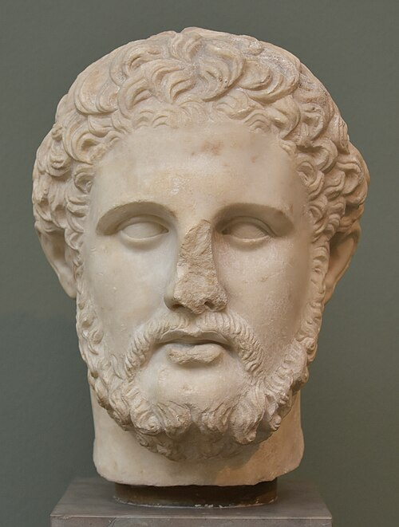
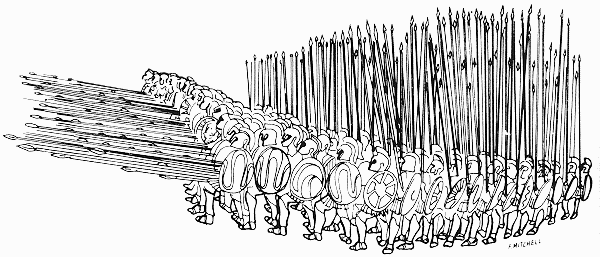
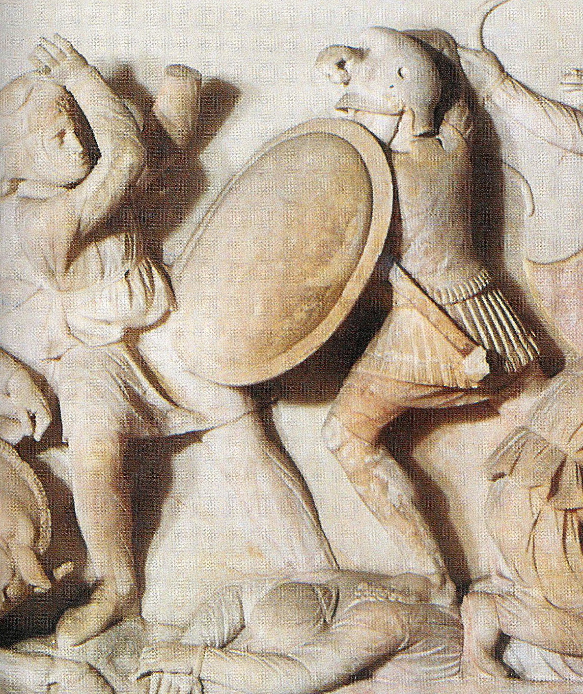
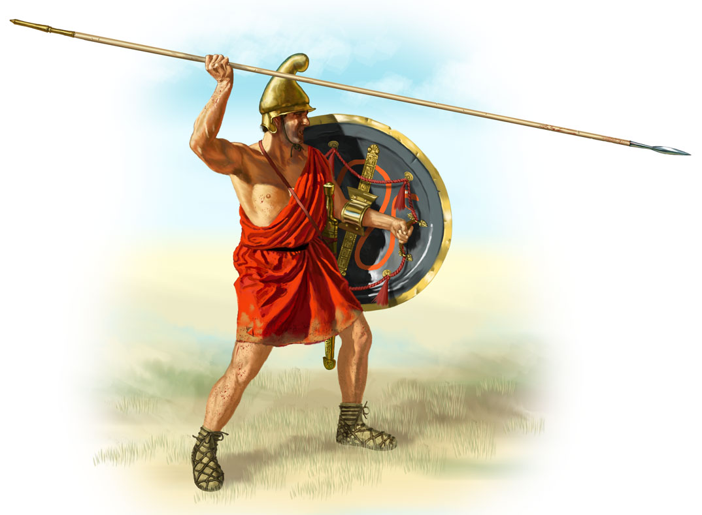
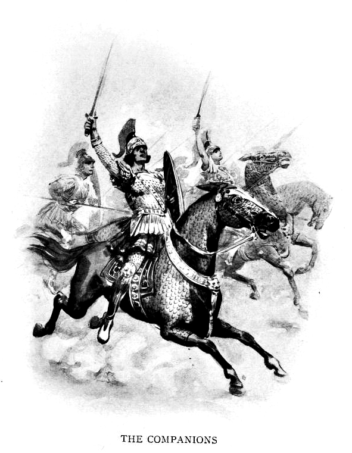
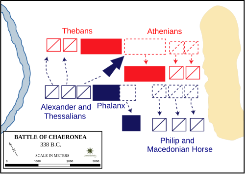
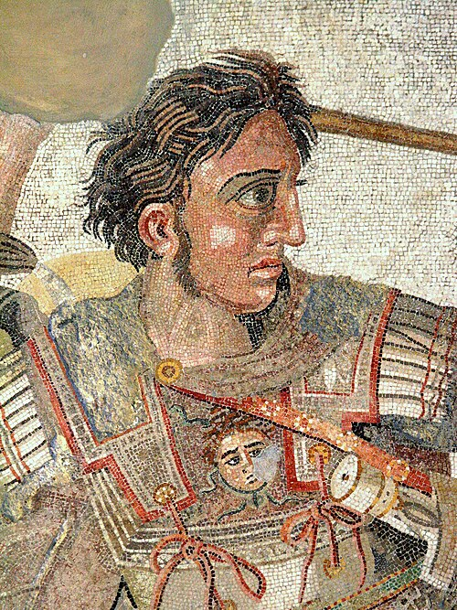
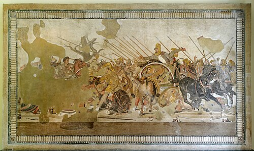
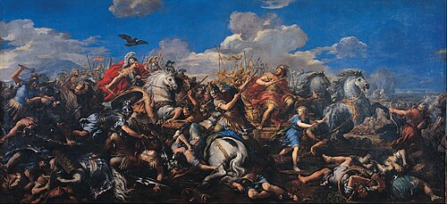
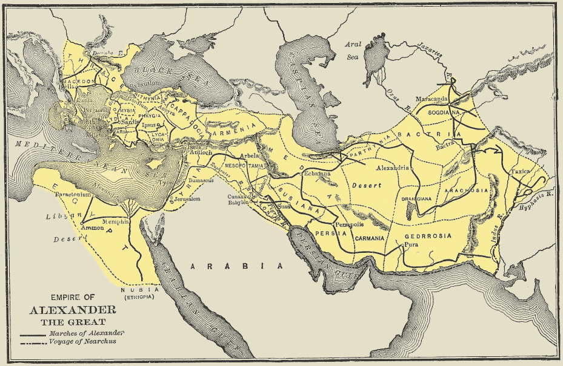

# Macedonia & the Greek Empire

**Scope:** The rise of the Macedonian kingdom under Philip II, Alexander's conquest of the Persian Empire, and the Hellenistic world that followed — c. 383–280 BC.

---

## Table of Contents

1. [Greece Before Macedonia (c. 400–359 BC)](#1-greece-before-macedonia)
2. [Philip II — The Man Who Built Everything](#2-philip-ii--the-man-who-built-everything)
   - [Early Life and Upbringing](#21-early-life-and-upbringing)
   - [Philip's Military Innovations](#22-philips-military-innovations)
   - [Philip's Rise to Power and Diplomacy](#23-philips-rise-to-power-and-diplomacy)
   - [Battle of Chaeronea (338 BC) — Greece Falls](#24-battle-of-chaeronea-338-bc)
   - [The Assassination of Philip (336 BC)](#25-the-assassination-of-philip-336-bc)
3. [Alexander the Great — The Son Who Expanded Everything](#3-alexander-the-great--the-son-who-expanded-everything)
   - [Alexander Secures Power (336–334 BC)](#31-alexander-secures-power-336334-bc)
   - [The Persian Campaign: Three Decisive Battles](#32-the-persian-campaign-three-decisive-battles)
   - [The Tyrant Emerges: Killing Parmenion and Cleitus](#33-the-tyrant-emerges-killing-parmenion-and-cleitus)
   - [India and the Mutiny (326 BC)](#34-india-and-the-mutiny-326-bc)
   - [Death in Babylon (323 BC)](#35-death-in-babylon-323-bc)
4. [The Hellenistic Legacy](#4-the-hellenistic-legacy)
5. [Key Themes: Father vs. Son](#5-key-themes-father-vs-son)
6. [Sources](#sources)

---

## 1. Greece Before Macedonia

Around the time Philip was born (383 BC), three powers dominated Greece:

- **Athens** — still wealthy, still the best navy, despite losing the Peloponnesian War (404 BC)
- **Sparta** — considered the finest land military for most of Greek history
- **Thebes** — had emerged as the new dominant military power after Athens and Sparta destroyed each other in the Peloponnesian War

Macedonia sat to the **far north** — poor, weak, and divided. Its problems:
- Geography: farmland in the south, raiding mountain tribes in the north
- Surrounded by hostile powers on every side (Epirus, Paeonia, Phocis, Thessaly, Thebes, Persia)
- Internal instability: a polygamous king produced many sons who fought over succession, always backed by foreign powers who wanted Macedonia to stay weak

No one took Macedonia seriously. That oversight would cost Greece its freedom.

*Left: Macedon around 431 BC, before Philip's reign — a small territory hemmed in by Illyria, Paeonia, Thessaly, and the Greek city-states. Right: Macedon at Philip's death in 336 BC, after he had built the army and diplomacy described below. The contrast is the whole point of this section — no one expected the kingdom on the left to become the kingdom on the right. Wikimedia Commons, CC BY-SA 4.0.*

---

## 2. Philip II — The Man Who Built Everything

> *"Philip is more impressive than Alexander because he started with nothing. The father does all the work; the son gets all the credit."* — lecture thesis

*Philip II of Macedon — Roman copy of a Greek original. Ny Carlsberg Glyptotek, Copenhagen. Public domain.*

### 2.1 Early Life and Upbringing

**Born: 383 BC** in Pella, Macedonia.

The defining experience of his youth was **five years as a hostage in Thebes (369–365 BC)**. Macedonia had lost a war to Thebes; sending a prince as hostage was the standard way to guarantee compliance. Because he was royalty, Philip was treated well and given freedom to move around and observe.

What he observed was the most advanced military system in Greece at the time:

- **The Sacred Band of Thebes** — 300 elite volunteer soldiers organized as 150 pairs of devoted companions. The key innovation was that these were not just aristocrats: commoners with talent could be selected. Discipline, not birth, determined membership.
- **The oblique phalanx (Epaminondas's innovation)** — instead of a straight wall advancing against the enemy, the Thebans used a slanted formation: put your best troops first on one side, crush the enemy's strongest point, and the psychological shock breaks their whole line.
- **The Anvil-and-Hammer strategy** — use disciplined infantry to lock the enemy in place (the anvil), then send cavalry streaming around the flank to destroy them from behind (the hammer).

Philip absorbed all of this. He also learned something more fundamental: **discipline transforms an army**. A disciplined army develops three irreplaceable advantages — **mobility** (it can march faster than anyone), **coordination** (different units work together), and **flexibility** (commanders can change tactics in real time).

At the time, almost no Greek army had these qualities. Athens used citizen-soldiers who fought part-time as a civic duty. Even Sparta, with its famous toughness, ran a rigid system rather than a flexible meritocracy.

[Read more about Philip's Theban education and the Sacred Band](details/philip-theban-years.md)

---

### 2.2 Philip's Military Innovations

In 359 BC, Philip's brother died. His nephew was too young to rule, so Philip became regent — and within years, de facto king. The Macedonian army at this point was "getting destroyed by everyone." Philip set out to rebuild it entirely.

*The Macedonian phalanx: soldiers equipped with the long sarissa pike in overlapping rows. Public domain (Wikimedia Commons).*

**The five core innovations Philip introduced:**

| Innovation | What Changed | Why It Mattered |
|------------|-------------|-----------------|
| **Sarissa pike** | Replaced the 2.4m Greek dory with a 5.5–6m pike | Five rows of pikes projected ahead of the front rank; the enemy could not reach the phalanx before being impaled |
| **Lighter armor** | Reduced the heavy Greek hoplite gear | The phalanx could march faster and maneuver more; mobility became a weapon |
| **Hypaspists (shield-bearers)** | New elite infantry unit on the flanks | Bridged the gap between phalanx and cavalry; could adapt rapidly when the phalanx was threatened |
| **Meritocracy** | Promoted talent regardless of birth; cavalry (nobles) made equal to infantry (commoners) | Created loyalty from talent, not class; Parmenion — lower nobility — rose to become Philip's partner-general |
| **Companion Cavalry (Hetairoi)** | Organized into 8 territorial squadrons (~2,600 riders); armed with the xyston lance | The "hammer" in Anvil-and-Hammer; trained to charge the gap opened by the phalanx |

**The units, in detail:**

*Pezetairos ("foot companion") — the ordinary Macedonian phalanx infantryman, armed with the sarissa pike and a small shield strapped to the forearm. This was the rank-and-file soldier who formed the "anvil." Wikimedia Commons, public domain.*

*Hypaspist ("shield-bearer") — the elite infantry unit that flanked the phalanx, more lightly equipped and more mobile than the pezetairoi, able to respond fast when a sector of the line was threatened. Wikimedia Commons, public domain.*

*Hetairoi ("Companions") — the Companion Cavalry, drawn from Macedonian nobility and armed with the xyston lance, trained to charge in wedge formation. This was the "hammer" that delivered the decisive blow once the phalanx had pinned the enemy. Wikimedia Commons, public domain.*

**The Anvil-and-Hammer in practice:**
1. The phalanx advances and locks the enemy infantry in place (the anvil)
2. While the enemy is pinned and cannot break formation without being speared, the Companion Cavalry streams around the exposed flank
3. The cavalry destroys the enemy from behind or punches through to kill the opposing commander
4. The enemy collapses

This combined-arms doctrine was *new*. Greek armies typically had a phalanx and a cavalry that each "did their own thing." Philip drilled his entire force to act as one coordinated machine.

Philip also **built loyalty through behavior**, not just systems:
- He fought at the front, not from the rear — he lost an eye in battle and accumulated many wounds
- He ate and drank with common soldiers, treating them as equals
- He gave speeches that praised individual soldiers by name
- He refused to risk his men's lives unnecessarily — strategic caution was a form of care

His men were fanatically loyal to him. This was the culture Alexander would inherit — and eventually destroy.

**A note on the sarissa:** it was not a cavalry weapon or an elite-only tool — Philip issued it to the ordinary infantry phalangite, arming the *majority* of common soldiers with it rather than reserving it for a specialized unit. That is what made it transformative: it changed the baseline capability of every regular Macedonian foot soldier, not just a select few.

**A note on meritocracy:** this went hand-in-hand with the sarissa reform. Philip promoted based on demonstrated battlefield performance rather than birth, most visibly by making the Companion Cavalry (drawn from nobility) formally equal in status to the phalanx infantry (drawn from commoners). This is the same principle he had observed in Thebes' Sacred Band — talent over birth — applied at the scale of an entire national army.

[Read the full military innovations detail](details/philip-military-innovations.md)

---

### 2.3 Philip's Rise to Power and Diplomacy

Philip recognized that **diplomacy was as valuable as military power**. While building his army, he bought time through:

- **Negotiating with enemies** rather than fighting wars he couldn't yet win
- **Marrying foreign princesses** to seal alliances with neighboring powers — Philip took **seven wives** over his life (Audata of Illyria, Phila of Elimeia, Nicesipolis of Thessaly, Olympias of Epirus — Alexander's mother, Philinna of Larissa, Meda of Thrace, and finally Cleopatra Eurydice of Macedonia), each one tying Macedon to a different neighboring or rival power. Classical Greek city-states practiced monogamy; polygamy on this scale was associated with "barbarian" (non-Greek) royal custom, and Macedon's practice of it was one more mark, alongside its northern geography and mixed pedigree, of why Athens and Thebes did not consider Macedonians fully Greek
- **Bribing the Athenian nobility** to neutralize opposition — the most vocal critic who could not be bought was Demosthenes, who gave his famous Philippic orations warning Athens about Philip

**The Amphipolis campaign (357 BC)** was the turning point for resources. Philip seized this city (the lecture incorrectly dates this to "347") because it had gold mines. With steady gold income he could:
- Pay a professional standing army that trained year-round rather than part-time
- Fund major public works and infrastructure in Macedonia
- Bribe the nobility of rival cities

With resources, his diplomatic reach expanded. He slowly extended Macedonian influence south, always keeping Athens, Thebes, and Sparta from forming a unified coalition against him.

---

### 2.4 Battle of Chaeronea (338 BC)

*Battle of Chaeronea (338 BC) — tactical diagram showing Philip's forces vs. the allied Athenian-Theban army. Philip commanded the right; 18-year-old Alexander commanded the left cavalry. Public domain.*

By 338 BC, the great Theban generals (Epaminondas and Pelopidas) were dead. Athens and Thebes formed a coalition, but Athens sent a weakened force.

Philip brought ~30,000 infantry and 2,000 cavalry. The allied force numbered ~35,000. The battle's decisive moment:

1. Philip **executed a deliberate feigned withdrawal** on his right wing — pulling back and inducing the Athenians to chase him, breaking their formation
2. While the Athenians rushed forward in disorder, **Alexander led the cavalry against the Theban Sacred Band** on the other flank
3. All 300 members of the Sacred Band fought to the death rather than surrender — they were annihilated

The irony was complete: the Sacred Band, whose tactics had taught Philip everything, was destroyed by what he had learned from them. Casualties were lopsided — over 1,000 Athenians killed and 2,000 captured, comparable Theban losses, against low Macedonian casualties. Plutarch records that when Philip walked the battlefield afterward and recognized the Sacred Band's dead "heaped one upon another," he wept and declared: *"Perish any man who suspects that these men either did or suffered anything unseemly."* The Thebans later raised the **Lion of Chaeronea** monument over their mass grave; excavation in the 19th century uncovered 254 skeletons laid out in seven rows at the site, widely — though not universally — identified as the Sacred Band.

**Historical significance:** the Athenian orator Lycurgus called it starkly: *"With the corpses of those who died here the freedom of the Greeks was also buried."* Historian George Cawkwell ranks Chaeronea among the most decisive battles in ancient history — after it, no Greek army remained capable of blocking Philip's advance. Thebes was punished harshly (exiled leaders, a Macedonian garrison installed, forced to pay for its own dead's burial); Athens was treated leniently, since Philip wanted its navy for the coming Persian war; Sparta alone refused to submit. The battle directly produced the **League of Corinth**, which bound Greek city-states never to make war on one another except to suppress revolution — ending independent inter-city warfare and subordinating Greek sovereignty to Macedonian-led collective structures for good.

Philip won Greece. He then formed the League of Corinth (337 BC) — a pan-Greek alliance under Macedonian hegemony, ostensibly to invade Persia together.

---

### 2.5 The Assassination of Philip (336 BC)

Philip was stabbed by his own bodyguard **Pausanias** at his daughter's wedding in Aegae, 336 BC. Pausanias was killed while fleeing (his horse tripped on a vine).

**Three theories:**

| Theory | Motive | Opportunity | Assessment |
|--------|--------|-------------|------------|
| **Persia** | Knew Philip was about to invade | Very low — no access to Philip's inner court | Least plausible |
| **Personal grudge** | Complex personal grievance involving Attalus | High (bodyguard access) | Possible but seems insufficient for Philip, who was skilled at managing loyalty |
| **Olympias and/or Alexander** | Alexander's succession threatened by Philip's new Macedonian wife (Cleopatra Eurydice); Attalus insulted Alexander at the wedding | High (family access to court) | Most plausible — Olympias immediately built a monument to Pausanias after his death |

Philip died at approximately 46 years of age, in the prime of his military career, with 30–40 years of campaigning still ahead of him. He had already dispatched Parmenion with an advance force of 10,000 men into Anatolia to begin the Persian invasion. The invasion was ready. He just wouldn't lead it.

---

## 3. Alexander the Great — The Son Who Expanded Everything

*Alexander the Great — detail from the Alexander Mosaic (c. 100 BC), Naples National Archaeological Museum. Found at Pompeii; depicts the Battle of Issus. Public domain.*

Alexander became king at roughly 20 years old. Using the analytical model from the lectures: as the "son" inheriting a great organization, he was predicted to be:
1. An **aggressive risk-taker** focused on expansion
2. A **tyrant** demanding obedience who would promote loyalty over talent
3. A man of **boundless ambition** who would never stop

All three predictions were confirmed.

### 3.1 Alexander Secures Power (336–334 BC)

The moment Philip died, rebellions erupted — Athens, Thebes, Illyria, and others sensed opportunity. Alexander moved with extraordinary speed.

His most consequential act: **destroying Thebes (335 BC)**. He besieged the city, then massacred all the men and enslaved all the women. This was unprecedented among Greek cities. When Sparta defeated Athens in 404 BC, the Spartans left Athens intact. Alexander set a nuclear precedent.

It worked: the rest of Greece was terrified into submission. But Greeks never forgot or forgave. Throughout his campaigns, Alexander faced potential Greek rebellions and could not fully trust Greek troops in his invasion force.

**Olympias** also acted swiftly: she killed Philip's new wife Cleopatra Eurydice and her infant son, eliminating the rival heir. **Parmenion**, Philip's greatest general, killed his own son-in-law Attalus to back Alexander — an act of extraordinary loyalty.

Alexander now controlled Greece and inherited Philip's Persian invasion plan.

---

### 3.2 The Persian Campaign: Three Decisive Battles

Alexander landed in Anatolia (modern Turkey) in 334 BC. He faced the Persian Empire — larger in manpower, richer in resources, controlling far more territory.

Why did he win? The lectures argue the key was not strategy but three qualities his army had that the Persian army lacked:

| Quality | Macedonia | Persia |
|---------|-----------|--------|
| **Cohesion** | Shared culture, language, 30 years of fighting together | Multicultural empire; units couldn't coordinate across language barriers |
| **Discipline** | Trained and battle-hardened continuously under Philip | Wealthy empire; soldiers rarely fought real battles |
| **Devotion** | Soldiers loved Parmenion and Alexander; fought for loyalty | Soldiers fought for pay; no personal loyalty to Darius |

*Battle of Issus mosaic (c. 100 BC), Museo Nazionale, Naples. Public domain.*

**Battle of Granicus (334 BC)** — First major engagement in Asia Minor. Alexander displayed characteristic recklessness by charging to the front. A Persian satrap nearly killed him; **Cleitus the Black** saved his life by cutting off the satrap's arm. Alexander won, but barely.

**Battle of Issus (333 BC)** — Southern Anatolia. Darius III commanded in person. Despite being outnumbered roughly 2:1, Alexander used the Anvil-and-Hammer:
- **Parmenion** held the left flank against overwhelming Persian pressure — barely, through extraordinary discipline
- **Alexander** punched through the center and drove straight for Darius
- Darius fled; the Persian army collapsed

Darius sent envoys offering half his empire. Alexander refused.

**Battle of Gaugamela (331 BC)** — Mesopotamia. Same pattern repeated at larger scale:

*Pietro da Cortona — Battle of Alexander vs. Darius (Gaugamela), 1644. Capitoline Museums, Rome. Public domain.*

- Parmenion's left flank was being overwhelmed by superior numbers but held its ground
- Alexander opened a gap in the Persian center and drove straight for Darius
- Darius fled again; his army disintegrated
- Alexander turned back to rescue Parmenion

Darius was later killed by his own general Bessus. The Persian Empire was effectively over.

**Note on strategy:** The lecture argues that Philip would have *negotiated* after Darius's offer at Issus — "half the empire is already a victory." Alexander's insistence on total conquest was driven by personal glory, not strategic necessity. At both Issus and Gaugamela, if Parmenion's left flank had broken before Alexander reached Darius, the entire Macedonian army would have been destroyed with no retreat possible.

---

### 3.3 The Tyrant Emerges: Killing Parmenion and Cleitus

**The Oracle of Siwa (332 BC):** After conquering Egypt (which surrendered without resistance — Egyptians hated Persian rule), Alexander traveled alone into the desert to consult the Oracle of Zeus-Ammon. He returned claiming Philip was not his real father — Zeus was. He then demanded **proskynesis** (prostration, kissing feet) — a Persian royal custom — from his Macedonian officers.

The Macedonian army was built on relative equality between officers and men. This demand was an insult to the culture that made them. Discontent began building.

**Parmenion killed (330 BC):** Parmenion's son Philotas failed to report a conspiracy against Alexander (he was drunk and dismissed it). When the plot was uncovered, Philotas was tortured and confessed — under torture — that his father was also involved. No credible evidence existed against Parmenion. Alexander ordered him killed anyway.

The lecture's analysis: Alexander had always been jealous of Parmenion, whose troops were more personally loyal to him than to Alexander. Younger officers who wanted to advance needed Parmenion gone. A false or forced confession provided the excuse.

After Parmenion's death, every major restraint on Alexander was gone. There was no longer anyone in the army with enough standing to urge caution.

**Cleitus the Black killed (328 BC):** At a drunken banquet, Cleitus — the man who had saved Alexander's life at Granicus — publicly accused Alexander of betraying Macedonian culture by adopting Persian customs. Then he said the thing Alexander could least bear: "Everything you've achieved in Persia — that's not you. It's your father. He built this army. He developed this plan."

Alexander threw a spear at Cleitus and killed him on the spot.

The two men most responsible for his victories were now dead by his own hand.

---

### 3.4 India and the Mutiny (326 BC)

After conquering Persia, Alexander pushed east into India (modern Pakistan). There was no strategic rationale — Persia was already won. The invasion was purely about boundless ambition.

The army won battles. But soldiers were exhausted and thousands of miles from home. At the **Hyphasis River (326 BC)**, the army **mutinied** — refused to march further.

Alexander's response:
- **Killed the leaders of the mutiny** — soldiers who had spoken up on behalf of their comrades
- **Forced the army home through the Gedrosian Desert** rather than take the safe coastal route — a punitive march in which many soldiers died of thirst and starvation

Back in Babylon, Alexander began planning an invasion of **Arabia** — more desert, no strategic value, no reason except that it had never been conquered. He also began **replacing Macedonian officers with Persians**, building an army loyal only to him by obedience rather than devotion.

---

### 3.5 Death in Babylon (323 BC)

Alexander died in Babylon in June 323 BC, aged 32–33, after a 12–14 day illness beginning after a banquet hosted by Medius of Larissa.

**Main theories:**

| Theory | Evidence | Assessment |
|--------|----------|------------|
| **Typhoid fever** (possibly with Guillain-Barré complication) | Fits the 12-day symptom pattern; a 2018 study suggests his apparent non-decomposition for 6 days was consistent with typhoid-induced coma | Most supported by modern medical analysis |
| **Malaria** (Plasmodium falciparum) | Initial intermittent fever pattern matches | Plausible secondary factor |
| **Poison** (organized by generals, possibly Antipater's son as cup-bearer) | Fits the political logic — generals had concluded he would kill everyone eventually | The lecture's preferred theory; Robin Lane Fox calls it "technically implausible" given the 12-day duration |
| **Alcohol/pancreatitis** | Heavy drinking documented | Possible contributing factor, not primary cause |

The lecture argument for poisoning: Alexander had become increasingly paranoid, had killed or exiled his most trusted officers, and was Persianizing his army. His generals concluded he was going to kill everyone. The logical endpoint of the pattern was assassination.

Whatever the cause, Alexander left no functioning heir and no succession plan.

---

## 4. The Hellenistic Legacy

*Alexander's empire at its greatest extent, stretching from Greece to modern Pakistan. Public domain (Wikimedia Commons).*

Alexander's successors (the **Diadochi**) fought the Wars of the Successors (323–281 BC), dividing the empire into three major kingdoms:

- **Antigonid Kingdom** — Greece and Macedonia
- **Ptolemaic Kingdom** — Egypt (Ptolemy stole Alexander's body for legitimacy)
- **Seleucid Kingdom** — Persia and the Near East

To govern populations far larger and more diverse than Greece, they had to **invent and standardize Greek culture**. This created the Hellenistic world — a massive Greek cultural overlay on top of Egyptian, Persian, and Near Eastern traditions.

Key legacy institutions:
- **Library of Alexandria** (~300 BC, Ptolemy I) — compiled, standardized, and commented on all Greek texts; tricked Athens into surrendering original manuscripts of the three great playwrights
- **Aristotle's Lyceum** (335 BC) — created as a pan-Hellenic encyclopedia to provide cultural legitimacy for conquest; its texts became the intellectual foundation of Greek governance
- **Syncretism** — Greek culture merged with local traditions; most consequentially, with **Judaism** in Alexandria, producing the Septuagint (Greek translation of the Hebrew Bible) and eventually creating the philosophical framework that enabled **Christianity**

The Hellenistic legacy chain: Philip builds the army → Alexander conquers with it → successors are forced to spread Greek culture to govern → Greek thought merges with Judaism → Christianity emerges.

---

## 5. Key Themes: Father vs. Son

The lectures use a **father-son analytical model** as their core interpretive lens:

| Quality | Philip (Father) | Alexander (Son) |
|---------|----------------|-----------------|
| Core drive | Build the organization / serve the vision | Personal glory / prove superiority over the father |
| Leadership style | Promotes talent; meritocracy | Promotes loyalty and obedience; eliminates rivals |
| Risk tolerance | Strategic and cautious; conserves soldiers' lives | Aggressive risk-taker; charges into the front line |
| Discipline | Selfless; trains harder than everyone else | Expects obedience but lives by different rules |
| Relationship to power | Builds loyalty through earned trust | Demands loyalty through fear and reward |
| Military parallel | Genghis Khan, Muhammad — start-from-nothing world-changers | Every imperial son who expanded a father's empire |

**Why the son wins more glory:** $10 billion makes a bigger headline than $10 million, even if the first $10 million was the harder achievement. History celebrates scale; it forgets the unglamorous foundation-building that made scale possible.

**Controversy note:** Most military historians rate Alexander as a genuine strategic genius (Arrian, Delbrück, etc.) whose adaptability, pace, and combined-arms doctrine were extraordinary. The lecture's revisionist argument — that Parmenion "did the real work" — is a minority view. The truth is likely between: Alexander was reckless in ways Philip would never have been, AND his personal physical courage and tactical instinct were exceptional. He simply would not have had an army worth leading without Philip.

---

## Sources

**Primary source material:**
- Lecture transcripts: "Civilization" series #11 (Philip II), #12 (Alexander the Great), #13 (Aristotle & Greek Legacy)
- Supporting context: Lecture #6 (Bronze Age Collapse), #8 (Peloponnesian War), #10 (Socrates & Plato)

**Supplementary sources (for factual verification and dates):**
- Wikipedia, "Philip II of Macedon" — [en.wikipedia.org/wiki/Philip_II_of_Macedon](https://en.wikipedia.org/wiki/Philip_II_of_Macedon)
- Wikipedia, "Alexander the Great" — [en.wikipedia.org/wiki/Alexander_the_Great](https://en.wikipedia.org/wiki/Alexander_the_Great)
- Wikipedia, "Battle of Chaeronea (338 BC)" — [en.wikipedia.org/wiki/Battle_of_Chaeronea_(338_BC)](https://en.wikipedia.org/wiki/Battle_of_Chaeronea_(338_BC))
- Wikipedia, "Battle of Gaugamela" — [en.wikipedia.org/wiki/Battle_of_Gaugamela](https://en.wikipedia.org/wiki/Battle_of_Gaugamela)
- Wikipedia, "Sarissa" — [en.wikipedia.org/wiki/Sarissa](https://en.wikipedia.org/wiki/Sarissa)
- Wikipedia, "Sacred Band of Thebes" — [en.wikipedia.org/wiki/Sacred_Band_of_Thebes](https://en.wikipedia.org/wiki/Sacred_Band_of_Thebes)
- Wikipedia, "History of Macedonia (ancient kingdom)" — [en.wikipedia.org/wiki/History_of_Macedonia_(ancient_kingdom)](https://en.wikipedia.org/wiki/History_of_Macedonia_(ancient_kingdom))
- University of Maryland (1998) — typhoid fever theory for Alexander's death

**Image credits (all public domain / freely licensed via Wikimedia Commons):**
- `philip_ii_bust.jpg` — Roman copy of Greek original, Ny Carlsberg Glyptotek, Copenhagen. CC BY-SA 3.0.
- `alexander_mosaic.jpg` — Alexander Mosaic detail, c. 100 BC, Naples National Archaeological Museum. Public domain.
- `battle_of_chaeronea.png` — Tactical diagram of Battle of Chaeronea 338 BC. Public domain.
- `battle_of_issus.jpg` — Battle of Issus mosaic, c. 100 BC, Museo Nazionale, Naples. Public domain.
- `gaugamela_painting.jpg` — Pietro da Cortona, *Battle of Alexander vs. Darius*, 1644. Capitoline Museums. Public domain.
- `macedonian_phalanx.png` — Macedonian phalanx formation diagram. Public domain.
- `macedonian_phalanx_sarissa.png` — Macedonian phalanx with sarissa pike detail. Public domain.
- `alexander_empire_map.png` — Map of Alexander's empire at greatest extent. Public domain.
- `macedon_before_and_after.svg` — Macedon during the Peloponnesian War (c. 431 BC) vs. at the death of Philip II (336 BC). Wikimedia Commons, CC BY-SA 4.0.
- `pezetairos_phalanx_infantry.jpg` — Macedonian pezetairos (phalanx infantryman) illustration. Wikimedia Commons, public domain.
- `hypaspist.jpg` — Macedonian hypaspist (shield-bearer) illustration. Wikimedia Commons, public domain.
- `companion_cavalry.jpg` — The Companions of Alexander the Great (Hetairoi cavalry) illustration. Wikimedia Commons, public domain.
