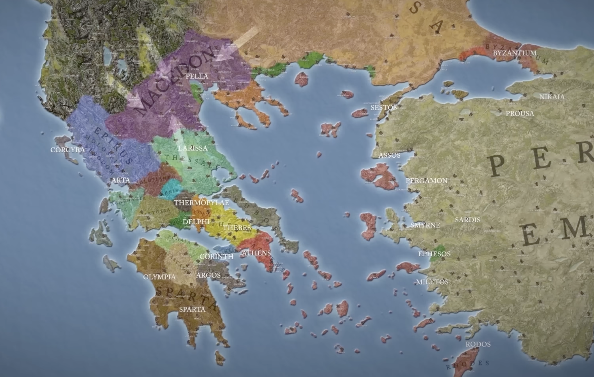
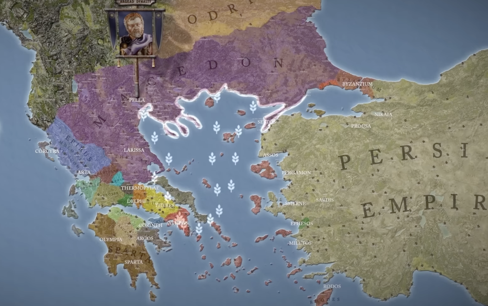
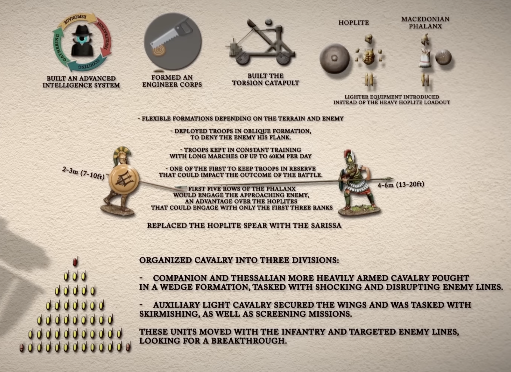

# Macedonia & Đế chế Hy Lạp

**Phạm vi:** Sự trỗi dậy của vương quốc Macedonia dưới thời Philip II, cuộc chinh phục Đế chế Ba Tư của Alexander, và thế giới Hy Lạp hóa (Hellenistic) tiếp sau đó — khoảng 383–280 TCN.

---

## Mục lục

1. [Hy Lạp trước Macedonia (khoảng 400–359 TCN)](#1-greece-before-macedonia)
2. [Philip II — Người Xây Dựng Mọi Thứ](#2-philip-ii--the-man-who-built-everything)
   - [Thuở nhỏ và sự trưởng thành](#21-early-life-and-upbringing)
   - [Những cải cách quân sự của Philip](#22-philips-military-innovations)
   - [Sự trỗi dậy quyền lực và ngoại giao của Philip](#23-philips-rise-to-power-and-diplomacy)
   - [Trận Chaeronea (338 TCN) — Hy Lạp sụp đổ](#24-battle-of-chaeronea-338-bc)
   - [Vụ ám sát Philip (336 TCN)](#25-the-assassination-of-philip-336-bc)
3. [Alexander Đại Đế — Người Con Mở Rộng Mọi Thứ](#3-alexander-the-great--the-son-who-expanded-everything)
   - [Alexander củng cố quyền lực (336–334 TCN)](#31-alexander-secures-power-336334-bc)
   - [Chiến dịch Ba Tư: Ba trận đánh quyết định](#32-the-persian-campaign-three-decisive-battles)
   - [Kẻ chuyên quyền xuất hiện: Giết Parmenion và Cleitus](#33-the-tyrant-emerges-killing-parmenion-and-cleitus)
   - [Ấn Độ và cuộc binh biến (326 TCN)](#34-india-and-the-mutiny-326-bc)
   - [Cái chết ở Babylon (323 TCN)](#35-death-in-babylon-323-bc)
4. [Di sản Hy Lạp hóa](#4-the-hellenistic-legacy)
5. [Chủ đề chính: Cha và Con](#5-key-themes-father-vs-son)
6. [Nguồn tham khảo](#sources)

---

## 1. Hy Lạp trước Macedonia

Vào khoảng thời điểm Philip sinh ra (383 TCN), ba thế lực thống trị Hy Lạp:

- **Athens** — vẫn giàu có, vẫn có lực lượng hải quân tốt nhất, dù đã thua trong Cuộc chiến Peloponnesian (404 TCN)
- **Sparta** — được xem là lực lượng lục quân tinh nhuệ nhất trong hầu hết lịch sử Hy Lạp
- **Thebes** — đã trở thành thế lực quân sự thống trị mới sau khi Athens và Sparta hủy hoại lẫn nhau trong Cuộc chiến Peloponnesian

Macedonia nằm ở **phía cực bắc** — nghèo, yếu, và chia rẽ. Các vấn đề của nó:
- Địa lý: đất nông nghiệp ở phía nam, các bộ tộc miền núi hay cướp bóc ở phía bắc
- Bị các thế lực thù địch bao quanh mọi phía (Epirus, Paeonia, Phocis, Thessaly, Thebes, Ba Tư)
- Bất ổn nội bộ: một vị vua đa thê sinh ra nhiều con trai tranh giành quyền kế vị, luôn được các thế lực nước ngoài hậu thuẫn vì họ muốn Macedonia tiếp tục suy yếu

Không ai coi Macedonia là đáng để lưu tâm. Sự xem nhẹ đó sẽ khiến Hy Lạp phải trả giá bằng tự do của mình.

*Bên trái: Macedon vào khoảng 431 TCN, trước thời Philip — một lãnh thổ nhỏ bị kẹp giữa Illyria, Paeonia, Thessaly và các thành bang Hy Lạp. Bên phải: Macedon vào lúc Philip qua đời năm 336 TCN, sau khi ông đã xây dựng quân đội và nền ngoại giao được mô tả dưới đây. Sự đối lập này chính là trọng tâm(điểm chính) của phần này — không ai từng nghĩ vương quốc bên trái sẽ trở thành vương quốc bên phải. Wikimedia Commons, CC BY-SA 4.0.*

---

## 2. Philip II — Người Xây Dựng Mọi Thứ

> *"Philip đáng nể hơn Alexander vì ông bắt đầu từ hai bàn tay trắng. Người cha làm hết mọi việc; người con nhận hết mọi vinh quang(tiếng tăm)."* — luận đề của bài giảng

*Philip II của Macedon — bản sao La Mã của một nguyên tác Hy Lạp. Ny Carlsberg Glyptotek, Copenhagen. Public domain(thuộc phạm vi công cộng).*

### 2.1 Thuở nhỏ và sự trưởng thành

**Sinh năm: 383 TCN** tại Pella, Macedonia.

Trải nghiệm mang tính định hình(quyết định) thời trẻ của ông là **năm năm làm con tin tại Thebes (369–365 TCN)**. Macedonia đã thua một cuộc chiến với Thebes; việc gửi một hoàng tử làm con tin là cách tiêu chuẩn để đảm bảo sự phục tùng. Vì là hoàng tộc, Philip được đối xử tốt và được tự do đi lại, quan sát.

Những gì ông quan sát được là hệ thống quân sự tiên tiến nhất ở Hy Lạp thời đó:

- **Đội quân Thánh (Sacred Band) của Thebes** — 300 binh sĩ tinh nhuệ tự nguyện, được tổ chức thành 150 cặp đồng đội(bạn đồng hành) trung thành. Cải cách(đổi mới) then chốt là những người này không chỉ gồm giới quý tộc: người bình dân có năng lực(tài năng) cũng có thể được chọn. Kỷ luật, không phải xuất thân, quyết định thành viên.
- **Phalanx lệch (cải cách của Epaminondas)** — thay vì một hàng ngang tiến thẳng vào đối phương, người Thebes dùng thế trận nghiêng: đặt quân tinh nhuệ nhất lên một cánh, đè bẹp điểm mạnh nhất của kẻ địch, và cú sốc tâm lý(tinh thần) sẽ làm sụp toàn bộ đội hình đối phương.
- **Chiến thuật Đe-và-Búa (Anvil-and-Hammer)** — dùng bộ binh có kỷ luật để chốt chặt đối phương tại chỗ (cái đe), rồi cho kỵ binh vòng qua sườn để tiêu diệt từ phía sau (cái búa).

Philip đã học hỏi(hấp thụ) tất cả những điều này. Ông cũng học được một điều căn bản(nền tảng) hơn: **kỷ luật biến đổi một quân đội**. Một quân đội có kỷ luật phát triển ba lợi thế không thể thay thế — **tính di động** (hành quân nhanh hơn bất kỳ ai), **sự phối hợp** (các đơn vị khác nhau hoạt động cùng nhau), và **tính linh hoạt** (chỉ huy có thể thay đổi chiến thuật theo thời gian thực).

Vào thời đó, hầu như không quân đội Hy Lạp nào có những phẩm chất này. Athens dùng công dân-binh sĩ chiến đấu bán thời gian như một nghĩa vụ công dân. Ngay cả Sparta, với sự khắc nghiệt nổi tiếng của mình, cũng vận hành một hệ thống cứng nhắc chứ không phải một chế độ trọng dụng nhân tài(meritocracy) linh hoạt.

[Đọc thêm về những năm tháng ở Thebes và Đội quân Thánh của Philip](details/philip-theban-years.md)

---

### 2.2 Những cải cách quân sự của Philip

Năm 359 TCN, anh trai của Philip qua đời. Người con trai của anh trai còn quá nhỏ để cai trị, nên Philip trở thành người phụ chính — và trong vài năm, trở thành vua trên thực tế(de facto). Vào thời điểm này, quân đội Macedonia "bị mọi người đánh bại." Philip quyết tâm xây dựng lại nó từ đầu.

*Phalanx Macedonia: binh sĩ được trang bị giáo dài sarissa xếp thành nhiều hàng chồng lên nhau. Public domain (Wikimedia Commons).*

**Năm cải cách cốt lõi(then chốt) mà Philip đưa vào:**

| Cải cách | Điều gì đã thay đổi | Vì sao nó quan trọng |
|------------|-------------|-----------------|
| **Giáo sarissa** | Thay thế cây dory Hy Lạp dài 2,4m bằng cây giáo dài 5,5–6m | Năm hàng giáo nhô ra trước hàng đầu; kẻ địch không thể tiếp cận phalanx trước khi bị đâm |
| **Áo giáp nhẹ hơn** | Giảm bớt trang bị hoplite nặng nề của Hy Lạp | Phalanx có thể hành quân nhanh hơn và cơ động hơn; tính di động trở thành một loại vũ khí |
| **Hypaspist (lính mang khiên)** | Đơn vị bộ binh tinh nhuệ mới ở hai cánh | Lấp khoảng trống giữa phalanx và kỵ binh; có thể phản ứng nhanh khi phalanx bị đe dọa |
| **Chế độ trọng dụng nhân tài** | Thăng chức dựa trên tài năng bất kể xuất thân; kỵ binh (quý tộc) được đặt ngang hàng với bộ binh (bình dân) | Tạo ra sự trung thành từ tài năng, không phải từ giai cấp; Parmenion — xuất thân quý tộc thấp — vươn lên trở thành tướng-đối tác của Philip |
| **Kỵ binh Đồng hành (Hetairoi)** | Tổ chức thành 8 đội theo lãnh thổ (~2.600 kỵ sĩ); trang bị giáo dài xyston | Là "cái búa" trong chiến thuật Đe-và-Búa; được huấn luyện để xông vào khe hở mà phalanx mở ra |

**Các đơn vị, chi tiết hơn:**

*Pezetairos ("bộ binh đồng hành") — người bộ binh phalanx Macedonia bình thường, trang bị giáo sarissa và một khiên nhỏ buộc vào cẳng tay. Đây là binh sĩ hạng thường tạo nên "cái đe." Wikimedia Commons, public domain.*

*Hypaspist ("lính mang khiên") — đơn vị bộ binh tinh nhuệ đóng ở hai cánh của phalanx, trang bị nhẹ hơn và cơ động hơn pezetairoi, có thể phản ứng nhanh khi một đoạn của tuyến trận bị đe dọa. Wikimedia Commons, public domain.*

*Hetairoi ("Đồng hành") — Kỵ binh Đồng hành, tuyển từ quý tộc Macedonia và trang bị giáo xyston, được huấn luyện để xông trận theo hình nêm. Đây là "cái búa" tạo ra cú đánh quyết định sau khi phalanx đã chốt chặt kẻ địch. Wikimedia Commons, public domain.*

**Chiến thuật Đe-và-Búa trong thực tế:**
1. Phalanx tiến lên và chốt chặt bộ binh đối phương tại chỗ (cái đe)
2. Khi đối phương bị ghim chặt và không thể phá vỡ đội hình mà không bị giáo đâm, Kỵ binh Đồng hành vòng qua sườn đang hở
3. Kỵ binh tiêu diệt đối phương từ phía sau hoặc đánh xuyên qua để giết chỉ huy đối phương
4. Đối phương sụp đổ

Học thuyết binh chủng phối hợp (combined-arms) này là *mới*. Các quân đội Hy Lạp thường có một phalanx và một lực lượng kỵ binh mỗi bên "tự làm việc riêng." Philip huấn luyện toàn bộ lực lượng của mình để hoạt động như một cỗ máy phối hợp thống nhất.

Philip cũng **xây dựng lòng trung thành qua hành động**, không chỉ qua hệ thống:
- Ông chiến đấu ở tiền tuyến, không phải từ phía sau — ông mất một mắt trong chiến đấu và mang nhiều vết thương
- Ông ăn uống cùng binh sĩ thường, đối xử với họ như người ngang hàng
- Ông có những bài phát biểu khen ngợi từng binh sĩ theo tên
- Ông từ chối liều mạng sống của binh sĩ một cách không cần thiết — sự cẩn trọng chiến lược(chiến thuật) là một hình thức của sự quan tâm

Binh sĩ của ông trung thành với ông đến mức cuồng nhiệt(tận tụy). Đây là nền văn hóa mà Alexander sẽ tiếp nhận — và cuối cùng sẽ phá hủy.

**Một chú ý về giáo sarissa:** đây không phải vũ khí kỵ binh hay công cụ chỉ dành cho tinh nhuệ — Philip cấp nó cho lính phalangite bộ binh thông thường, trang bị cho *đa số* binh sĩ bình thường thay vì chỉ dành riêng cho một đơn vị đặc biệt. Đó chính là điều khiến nó mang tính đột phá(cách mạng): nó thay đổi năng lực nền tảng của mọi người lính bộ binh Macedonia chính quy, không chỉ một số ít được chọn.

**Một chú ý về chế độ trọng dụng nhân tài:** điều này song hành với cải cách sarissa. Philip thăng chức dựa trên hiệu suất chiến đấu thể hiện được thay vì xuất thân, rõ nhất là việc đặt Kỵ binh Đồng hành (xuất thân quý tộc) chính thức ngang hàng về vị thế với bộ binh phalanx (xuất thân bình dân). Đây chính là nguyên tắc ông đã quan sát được ở Đội quân Thánh của Thebes — tài năng hơn xuất thân — được áp dụng ở quy mô toàn quân đội quốc gia.

[Đọc chi tiết đầy đủ về các cải cách quân sự](details/philip-military-innovations.md)

---

### 2.3 Sự trỗi dậy quyền lực và ngoại giao của Philip

Philip nhận ra rằng **ngoại giao có giá trị không kém sức mạnh quân sự**. Trong khi xây dựng quân đội, ông tranh thủ thời gian bằng cách:

- **Đàm phán với kẻ địch** thay vì tham gia những cuộc chiến ông chưa thể thắng
- **Cưới các công chúa nước ngoài** để gắn kết liên minh với các thế lực láng giềng — Philip có **bảy người vợ** trong đời (Audata của Illyria, Phila của Elimeia, Nicesipolis của Thessaly, Olympias của Epirus — mẹ của Alexander, Philinna của Larissa, Meda của Thracia, và cuối cùng là Cleopatra Eurydice của Macedonia), mỗi người gắn Macedon với một thế lực láng giềng hoặc đối thủ khác nhau. Các thành bang Hy Lạp cổ điển theo chế độ một vợ một chồng; đa thê ở quy mô này bị gắn với tập tục hoàng gia "man rợ" (không phải Hy Lạp), và việc Macedon thực hành điều này là một dấu hiệu nữa, cùng với vị trí địa lý phía bắc và dòng dõi lai tạp của họ, khiến Athens và Thebes không xem người Macedonia là người Hy Lạp thực sự
- **Hối lộ giới quý tộc Athens** để trung hòa sự phản đối — người chỉ trích mạnh mẽ nhất mà không thể mua chuộc là Demosthenes, người đã có những bài diễn thuyết Philippic nổi tiếng cảnh báo Athens về Philip

**Chiến dịch Amphipolis (357 TCN)** là bước ngoặt về nguồn lực. Philip chiếm thành phố này (bài giảng ghi sai niên đại là "347") vì nó có các mỏ vàng. Với nguồn thu vàng ổn định, ông có thể:
- Trả lương cho một quân đội chuyên nghiệp thường trực, huấn luyện quanh năm thay vì bán thời gian
- Cấp vốn cho các công trình công cộng và hạ tầng lớn ở Macedonia
- Hối lộ giới quý tộc của các thành phố đối thủ

Với nguồn lực trong tay, tầm ảnh hưởng ngoại giao của ông mở rộng. Ông từ từ mở rộng ảnh hưởng của Macedonia về phía nam, luôn giữ cho Athens, Thebes, và Sparta không thể hình thành một liên minh thống nhất chống lại ông.

---

### 2.4 Trận Chaeronea (338 TCN)

*Trận Chaeronea (338 TCN) — sơ đồ chiến thuật cho thấy lực lượng của Philip đối đầu liên quân Athens-Thebes. Philip chỉ huy cánh phải; Alexander, 18 tuổi, chỉ huy kỵ binh cánh trái. Public domain.*

Đến năm 338 TCN, các đại tướng lớn của Thebes (Epaminondas và Pelopidas) đã qua đời. Athens và Thebes hình thành liên minh, nhưng Athens gửi một lực lượng đã suy yếu.

Philip mang theo ~30.000 bộ binh và 2.000 kỵ binh. Lực lượng liên minh có khoảng ~35.000 quân. Thời điểm quyết định của trận đánh:

1. Philip **thực hiện một cuộc rút lui giả có tính toán** ở cánh phải của mình — lùi lại và khiến quân Athens đuổi theo, làm vỡ đội hình của họ
2. Khi quân Athens xông tới trong tình trạng hỗn loạn, **Alexander dẫn kỵ binh tấn công Đội quân Thánh của Thebes** ở cánh còn lại
3. Toàn bộ 300 thành viên của Đội quân Thánh chiến đấu đến chết chứ không đầu hàng — họ bị tiêu diệt hoàn toàn

Điều trớ trêu đã hoàn tất: Đội quân Thánh, những người mà chiến thuật của họ đã dạy cho Philip mọi thứ, lại bị tiêu diệt bởi chính những gì ông đã học từ họ. Thương vong lệch hẳn về một phía — hơn 1.000 quân Athens bị giết và 2.000 bị bắt, thiệt hại tương đương của Thebes, so với thương vong thấp của Macedonia. Plutarch ghi lại rằng khi Philip đi qua chiến trường sau đó và nhận ra xác của Đội quân Thánh "chồng chất lên nhau," ông đã khóc và tuyên bố: *"Chết đi bất kỳ ai nghi ngờ rằng những người này đã làm hoặc chịu đựng bất cứ điều gì không xứng đáng."* Người Thebes sau đó đã dựng đài tưởng niệm **Sư tử Chaeronea** trên ngôi mộ tập thể của họ; khai quật thế kỷ 19 phát hiện 254 hài cốt xếp thành bảy hàng tại địa điểm này, được nhiều người — nhưng không phải tất cả — cho là của Đội quân Thánh.

**Ý nghĩa lịch sử:** nhà hùng biện Athens Lycurgus đã nói một cách thẳng thắn: *"Cùng với xác của những người đã chết ở đây, tự do của người Hy Lạp cũng đã bị chôn cất."* Nhà sử học George Cawkwell xếp Chaeronea vào hàng những trận đánh mang tính quyết định nhất trong lịch sử cổ đại — sau trận này, không còn quân đội Hy Lạp nào có khả năng ngăn cản Philip tiến quân. Thebes bị trừng phạt nặng nề (lãnh đạo bị đày ải, một đội quân trú phòng Macedonia được đặt vào, bị buộc phải tự trả tiền chôn cất người chết của mình); Athens được đối xử khoan dung hơn, vì Philip muốn hải quân của họ cho cuộc chiến Ba Tư sắp tới; chỉ riêng Sparta từ chối khuất phục. Trận đánh này trực tiếp tạo ra **Liên minh Corinth**, ràng buộc các thành bang Hy Lạp không được gây chiến với nhau ngoại trừ để đàn áp cách mạng — chấm dứt chiến tranh giữa các thành bang độc lập và đặt chủ quyền Hy Lạp dưới các cấu trúc tập thể do Macedonia lãnh đạo, vĩnh viễn.

Philip đã chiến thắng Hy Lạp. Sau đó ông thành lập Liên minh Corinth (337 TCN) — một liên minh toàn Hy Lạp dưới sự bá quyền(thống trị) của Macedonia, danh nghĩa là để cùng nhau xâm chiếm Ba Tư.

---

### 2.5 Vụ ám sát Philip (336 TCN)

Philip bị đâm bởi chính cận vệ của mình, **Pausanias**, tại lễ cưới con gái ông ở Aegae, năm 336 TCN. Pausanias bị giết khi đang chạy trốn (ngựa của anh ta vấp vào một dây leo).

**Ba giả thuyết:**

| Giả thuyết | Động cơ | Cơ hội thực hiện | Đánh giá |
|--------|--------|-------------|------------|
| **Ba Tư** | Biết Philip sắp xâm lược | Rất thấp — không có khả năng tiếp cận triều đình thân cận của Philip | Ít khả tín(khả năng xảy ra) nhất |
| **Thù hằn cá nhân** | Mối bất bình cá nhân phức tạp liên quan đến Attalus | Cao (do có khả năng tiếp cận với tư cách cận vệ) | Có thể nhưng dường như không đủ lý do đối với Philip, người rất khéo trong việc quản lý lòng trung thành |
| **Olympias và/hoặc Alexander** | Quyền kế vị của Alexander bị đe dọa bởi người vợ Macedonia mới của Philip (Cleopatra Eurydice); Attalus đã sỉ nhục Alexander tại lễ cưới | Cao (khả năng tiếp cận qua quan hệ gia đình với triều đình) | Khả tín nhất — Olympias đã lập tức xây một tượng đài cho Pausanias sau khi anh ta chết |

Philip mất khi khoảng 46 tuổi, đang ở đỉnh cao sự nghiệp quân sự, với 30–40 năm chinh chiến còn ở phía trước. Ông đã cử Parmenion dẫn một lực lượng tiên phong 10.000 quân vào Anatolia để bắt đầu cuộc xâm lược Ba Tư. Cuộc xâm lược đã sẵn sàng. Chỉ là ông sẽ không dẫn dắt nó.

---

## 3. Alexander Đại Đế — Người Con Mở Rộng Mọi Thứ

*Alexander Đại Đế — chi tiết từ Bức khảm Alexander (khoảng 100 TCN), Bảo tàng Khảo cổ học Quốc gia Naples. Được tìm thấy tại Pompeii; mô tả Trận Issus. Public domain.*

Alexander lên ngôi vua khi khoảng 20 tuổi. Sử dụng mô hình phân tích từ các bài giảng: với vai trò "người con" tiếp nhận một tổ chức vĩ đại, ông được dự đoán sẽ là:
1. Một **người liều lĩnh chấp nhận rủi ro** tập trung vào việc bành trướng(mở rộng)
2. Một **kẻ chuyên quyền** đòi hỏi sự phục tùng, người sẽ đề cao lòng trung thành hơn tài năng
3. Một người có **hoài bão vô hạn** và sẽ không bao giờ dừng lại

Cả ba dự đoán đều được xác nhận.

### 3.1 Alexander củng cố quyền lực (336–334 TCN)

Ngay khi Philip qua đời, các cuộc nổi loạn nổ ra — Athens, Thebes, Illyria, và nhiều nơi khác cảm nhận được cơ hội. Alexander hành động với tốc độ phi thường.

Hành động hệ trọng nhất của ông: **phá hủy Thebes (335 TCN)**. Ông bao vây thành phố, rồi tàn sát toàn bộ nam giới và bắt tất cả phụ nữ làm nô lệ. Điều này chưa có tiền lệ trong các thành bang Hy Lạp. Khi Sparta đánh bại Athens năm 404 TCN, người Sparta để Athens nguyên vẹn. Alexander đã đặt ra một tiền lệ mang tính hủy diệt(tận diệt).

Điều đó có hiệu quả: phần còn lại của Hy Lạp khiếp sợ và khuất phục. Nhưng người Hy Lạp không bao giờ quên hay tha thứ. Xuyên suốt các chiến dịch của mình, Alexander luôn đối mặt với nguy cơ nổi loạn từ người Hy Lạp và không thể hoàn toàn tin tưởng lực lượng Hy Lạp trong đội quân viễn chinh của mình.

**Olympias** cũng hành động nhanh chóng: bà giết người vợ mới của Philip, Cleopatra Eurydice, và con trai còn ẵm(sơ sinh) của bà ta, loại bỏ người kế vị tiềm tàng cạnh tranh. **Parmenion**, đại tướng vĩ đại nhất của Philip, đã giết chính con rể của mình, Attalus, để hậu thuẫn Alexander — một hành động trung thành phi thường.

Alexander giờ kiểm soát Hy Lạp và tiếp nhận kế hoạch xâm lược Ba Tư của Philip.

---

### 3.2 Chiến dịch Ba Tư: Ba trận đánh quyết định

Alexander đổ bộ vào Anatolia (Thổ Nhĩ Kỳ hiện đại) năm 334 TCN. Ông đối mặt với Đế chế Ba Tư — lớn hơn về nhân lực, giàu có hơn về tài nguyên, kiểm soát lãnh thổ rộng hơn nhiều.

Vì sao ông thắng? Các bài giảng cho rằng chìa khóa không nằm ở chiến lược mà ở ba phẩm chất mà quân đội của ông có mà quân đội Ba Tư không có:

| Phẩm chất | Macedonia | Ba Tư |
|---------|-----------|--------|
| **Tính đoàn kết(cố kết)** | Văn hóa, ngôn ngữ chung, 30 năm chiến đấu cùng nhau | Đế chế đa văn hóa; các đơn vị không thể phối hợp qua rào cản ngôn ngữ |
| **Kỷ luật** | Được huấn luyện và tôi luyện qua trận mạc liên tục dưới thời Philip | Đế chế giàu có; binh sĩ hiếm khi tham gia trận chiến thực sự |
| **Sự tận tụy(trung thành)** | Binh sĩ yêu quý Parmenion và Alexander; chiến đấu vì lòng trung thành | Binh sĩ chiến đấu vì tiền lương; không có lòng trung thành cá nhân với Darius |

*Bức khảm Trận Issus (khoảng 100 TCN), Museo Nazionale, Naples. Public domain.*

**Trận Granicus (334 TCN)** — Cuộc giao tranh lớn đầu tiên tại Tiểu Á. Alexander thể hiện sự liều lĩnh đặc trưng của mình bằng cách xông lên tiền tuyến. Một thống đốc(satrap) Ba Tư suýt giết được ông; **Cleitus Đen (Cleitus the Black)** đã cứu mạng ông bằng cách chặt đứt cánh tay của viên thống đốc đó. Alexander thắng, nhưng suýt thua.

**Trận Issus (333 TCN)** — Nam Anatolia. Darius III trực tiếp chỉ huy. Dù bị áp đảo quân số khoảng 2:1, Alexander đã dùng chiến thuật Đe-và-Búa:
- **Parmenion** giữ vững cánh trái trước áp lực áp đảo của quân Ba Tư — chỉ vừa đủ, nhờ kỷ luật phi thường
- **Alexander** đánh xuyên qua trung tâm và tiến thẳng về phía Darius
- Darius bỏ chạy; quân đội Ba Tư sụp đổ

Darius gửi sứ giả đề nghị nhượng nửa đế chế của mình. Alexander từ chối.

**Trận Gaugamela (331 TCN)** — Mesopotamia. Cùng một khuôn mẫu(mô hình) tái diễn ở quy mô lớn hơn:

*Pietro da Cortona — Trận đánh giữa Alexander và Darius (Gaugamela), 1644. Bảo tàng Capitoline, Roma. Public domain.*

- Cánh trái của Parmenion bị quân số đông hơn áp đảo nhưng vẫn giữ vững
- Alexander mở một khe hở ở trung tâm quân Ba Tư và tiến thẳng về phía Darius
- Darius lại bỏ chạy; quân đội của ông tan rã
- Alexander quay lại để giải cứu Parmenion

Darius sau đó bị chính tướng của mình, Bessus, giết chết. Đế chế Ba Tư về cơ bản đã kết thúc.

**Ghi chú về chiến lược:** Bài giảng cho rằng Philip sẽ *đàm phán* sau đề nghị của Darius tại Issus — "nửa đế chế đã là một chiến thắng." Sự khăng khăng của Alexander muốn chinh phục toàn bộ bắt nguồn từ vinh quang cá nhân, không phải nhu cầu chiến lược. Ở cả Issus và Gaugamela, nếu cánh trái của Parmenion sụp đổ trước khi Alexander tiếp cận được Darius, toàn bộ quân đội Macedonia đã bị tiêu diệt mà không có đường rút lui.

---

### 3.3 Kẻ chuyên quyền xuất hiện: Giết Parmenion và Cleitus

**Đền thờ Siwa (332 TCN):** Sau khi chinh phục Ai Cập (nơi đầu hàng không kháng cự — người Ai Cập căm ghét sự cai trị của Ba Tư), Alexander đi một mình vào sa mạc để hỏi ý kiến Đền thờ thần Zeus-Ammon. Ông trở về tuyên bố rằng Philip không phải là cha thật của mình — mà là thần Zeus. Sau đó ông yêu cầu **proskynesis** (nghi thức quỳ lạy, hôn chân) — một tập tục hoàng gia Ba Tư — từ các sĩ quan Macedonia của mình.

Quân đội Macedonia được xây dựng trên nền tảng bình đẳng tương đối giữa sĩ quan và binh sĩ. Đòi hỏi này là một sự sỉ nhục đối với nền văn hóa đã tạo nên họ. Sự bất mãn bắt đầu tích tụ.

**Parmenion bị giết (330 TCN):** Philotas, con trai của Parmenion, đã không báo cáo một âm mưu chống lại Alexander (anh ta đang say rượu và xem nhẹ nó). Khi âm mưu bị phát hiện, Philotas bị tra tấn và thú nhận — dưới sự tra tấn — rằng cha mình cũng có liên quan. Không có bằng chứng đáng tin cậy nào chống lại Parmenion. Alexander vẫn ra lệnh giết ông.

Phân tích của bài giảng: Alexander luôn ghen tị với Parmenion, người mà binh sĩ trung thành với cá nhân ông hơn là với Alexander. Các sĩ quan trẻ muốn thăng tiến cần Parmenion biến mất. Một lời thú nhận sai lệch hoặc bị ép buộc đã tạo ra cái cớ.

Sau khi Parmenion chết, mọi sự kiềm chế lớn đối với Alexander đã biến mất. Không còn ai trong quân đội có đủ uy tín để khuyến khích sự cẩn trọng.

**Cleitus Đen bị giết (328 TCN):** Tại một bữa tiệc say rượu, Cleitus — người đã cứu mạng Alexander tại Granicus — công khai cáo buộc Alexander phản bội văn hóa Macedonia bằng cách tiếp nhận tập tục Ba Tư. Sau đó anh ta nói điều mà Alexander không thể chịu đựng nổi: "Mọi thứ ngươi đạt được ở Ba Tư — đó không phải là ngươi. Đó là cha ngươi. Ông ấy đã xây dựng quân đội này. Ông ấy đã phát triển kế hoạch này."

Alexander ném một cây giáo vào Cleitus và giết anh ta ngay tại chỗ.

Hai người chịu trách nhiệm nhiều nhất cho những chiến thắng của ông giờ đã chết dưới tay chính ông.

---

### 3.4 Ấn Độ và cuộc binh biến (326 TCN)

Sau khi chinh phục Ba Tư, Alexander tiến về phía đông vào Ấn Độ (Pakistan hiện đại). Không có lý do chiến lược nào — Ba Tư đã bị chinh phục xong. Cuộc xâm lược này hoàn toàn xuất phát từ hoài bão vô hạn.

Quân đội thắng các trận đánh. Nhưng binh sĩ đã kiệt sức và xa nhà hàng ngàn dặm. Tại **sông Hyphasis (326 TCN)**, quân đội **nổi loạn** — từ chối tiến quân thêm.

Phản ứng của Alexander:
- **Giết những lãnh đạo của cuộc binh biến** — những binh sĩ đã lên tiếng thay mặt cho đồng đội của họ
- **Buộc quân đội hành quân về nhà qua Sa mạc Gedrosia** thay vì đi tuyến đường bờ biển an toàn — một cuộc hành quân mang tính trừng phạt(kỷ luật) mà nhiều binh sĩ chết vì khát và đói

Trở về Babylon, Alexander bắt đầu lập kế hoạch xâm lược **Ả Rập** — thêm sa mạc, không có giá trị chiến lược, không có lý do gì ngoài việc nó chưa từng bị chinh phục. Ông cũng bắt đầu **thay thế các sĩ quan Macedonia bằng người Ba Tư**, xây dựng một quân đội chỉ trung thành với ông bằng sự phục tùng chứ không phải sự tận tụy.

---

### 3.5 Cái chết ở Babylon (323 TCN)

Alexander chết tại Babylon vào tháng 6 năm 323 TCN, ở tuổi 32–33, sau một trận bệnh kéo dài 12–14 ngày bắt đầu sau một bữa tiệc do Medius của Larissa tổ chức.

**Các giả thuyết chính:**

| Giả thuyết | Bằng chứng | Đánh giá |
|--------|----------|------------|
| **Sốt thương hàn** (có thể kèm biến chứng Guillain-Barré) | Phù hợp với khuôn mẫu triệu chứng 12 ngày; một nghiên cứu năm 2018 cho rằng việc thi thể ông có vẻ không phân hủy trong 6 ngày là phù hợp với hôn mê do sốt thương hàn gây ra | Được ủng hộ nhiều nhất bởi phân tích y học hiện đại |
| **Sốt rét** (Plasmodium falciparum) | Khuôn mẫu sốt ngắt quãng ban đầu khớp | Yếu tố phụ khả tín(có thể xảy ra) |
| **Đầu độc** (do các tướng lĩnh tổ chức, có thể do con trai của Antipater làm người rót rượu) | Phù hợp với logic chính trị — các tướng lĩnh đã kết luận rằng cuối cùng ông sẽ giết tất cả mọi người | Giả thuyết ưa chuộng của bài giảng; Robin Lane Fox gọi nó là "về mặt kỹ thuật khó khả thi" do thời gian bệnh kéo dài 12 ngày |
| **Rượu/viêm tụy** | Uống rượu nặng đã được ghi chép | Yếu tố góp phần có thể xảy ra, không phải nguyên nhân chính |

Lập luận của bài giảng cho việc đầu độc: Alexander ngày càng trở nên hoang tưởng, đã giết hoặc lưu đày các sĩ quan tin cận nhất của mình, và đang Ba Tư hóa quân đội của mình. Các tướng lĩnh của ông kết luận rằng ông sẽ giết tất cả mọi người. Điểm kết thúc logic của khuôn mẫu này là ám sát.

Bất kể nguyên nhân là gì, Alexander không để lại người kế vị đủ năng lực và không có kế hoạch kế vị.

---

## 4. Di sản Hy Lạp hóa

*Đế chế của Alexander ở giai đoạn mở rộng lớn nhất, kéo dài từ Hy Lạp đến Pakistan hiện đại. Public domain (Wikimedia Commons).*

Những người kế vị Alexander (**Diadochi**) đã tham gia Các cuộc chiến Kế vị (323–281 TCN), chia đế chế thành ba vương quốc lớn:

- **Vương quốc Antigonid** — Hy Lạp và Macedonia
- **Vương quốc Ptolemaic** — Ai Cập (Ptolemy đã lấy(đánh cắp) thi thể của Alexander để hợp thức hóa quyền lực của mình)
- **Vương quốc Seleucid** — Ba Tư và vùng Cận Đông

Để cai trị các dân số lớn hơn và đa dạng hơn nhiều so với Hy Lạp, họ đã phải **phát minh và tiêu chuẩn hóa văn hóa Hy Lạp**. Điều này đã tạo nên thế giới Hy Lạp hóa — một lớp phủ văn hóa Hy Lạp khổng lồ lên trên các truyền thống Ai Cập, Ba Tư, và Cận Đông.

Các tổ chức di sản chính:
- **Thư viện Alexandria** (khoảng 300 TCN, Ptolemy I) — biên soạn, tiêu chuẩn hóa và chú giải tất cả văn bản Hy Lạp; đã lừa Athens giao nộp các bản thảo nguyên tác của ba nhà viết kịch vĩ đại
- **Lyceum của Aristotle** (335 TCN) — được tạo ra như một bộ bách khoa toàn Hy Lạp để cung cấp tính hợp pháp văn hóa cho công cuộc chinh phục; các văn bản của nó trở thành nền tảng trí tuệ của việc cai trị theo kiểu Hy Lạp
- **Sự hòa hợp văn hóa (Syncretism)** — văn hóa Hy Lạp hòa trộn với các truyền thống địa phương; đáng kể nhất, với **Do Thái giáo** ở Alexandria, tạo ra bản Septuagint (bản dịch Hy Lạp của Kinh Thánh Hebrew) và cuối cùng tạo ra khung triết học làm nền tảng cho sự ra đời của **Cơ Đốc giáo**

Chuỗi di sản Hy Lạp hóa: Philip xây dựng quân đội → Alexander chinh phục bằng quân đội đó → những người kế vị buộc phải lan truyền văn hóa Hy Lạp để cai trị → tư tưởng Hy Lạp hòa trộn với Do Thái giáo → Cơ Đốc giáo ra đời.

---

## 5. Chủ đề chính: Cha và Con

Các bài giảng sử dụng một **mô hình phân tích cha-con** làm lăng kính diễn giải cốt lõi(trung tâm) của mình:

| Phẩm chất | Philip (Cha) | Alexander (Con) |
|---------|----------------|-----------------|
| Động lực cốt lõi | Xây dựng tổ chức / phục vụ tầm nhìn | Vinh quang cá nhân / chứng minh sự vượt trội so với cha |
| Phong cách lãnh đạo | Đề cao tài năng; chế độ trọng dụng nhân tài | Đề cao lòng trung thành và sự phục tùng; loại bỏ đối thủ |
| Mức độ chấp nhận rủi ro | Có tính chiến lược và cẩn trọng; giữ mạng sống binh sĩ | Người liều lĩnh chấp nhận rủi ro; xông vào tiền tuyến |
| Kỷ luật | Vô ngã(hy sinh bản thân); huấn luyện chăm chỉ hơn mọi người | Đòi hỏi sự phục tùng nhưng sống theo những quy tắc khác |
| Quan hệ với quyền lực | Xây dựng lòng trung thành qua sự tin tưởng đã giành được | Đòi hỏi lòng trung thành qua sợ hãi và phần thưởng |
| Điển hình tương đồng về quân sự | Genghis Khan, Muhammad — những người thay đổi thế giới bắt đầu từ hai bàn tay trắng | Mọi người con hoàng tộc từng mở rộng đế chế của cha mình |

**Vì sao người con nhận được nhiều vinh quang hơn:** 10 tỷ đô la tạo ra một hàng tít lớn hơn 10 triệu đô la, dù 10 triệu đô la đầu tiên là thành tựu khó khăn hơn. Lịch sử tôn vinh quy mô(tầm cỡ); nó quên đi công việc nền tảng không hào nhoáng đã làm cho quy mô đó trở nên khả thi.

**Ghi chú tranh cãi:** Đa số các nhà sử học quân sự đánh giá Alexander là một thiên tài chiến lược đích thực (Arrian, Delbrück, v.v.) với khả năng thích ứng, tốc độ, và học thuyết binh chủng phối hợp phi thường. Lập luận xét lại(revisionist) của bài giảng — rằng Parmenion "đã làm công việc thực sự" — là quan điểm thiểu số. Sự thật có khả năng nằm ở giữa: Alexander liều lĩnh theo những cách mà Philip sẽ không bao giờ làm, VÀ sự can đảm thể chất cá nhân cùng bản năng chiến thuật của ông là xuất sắc. Ông đơn giản là sẽ không có được một quân đội đáng để dẫn dắt nếu không có Philip.

---

## Nguồn tham khảo

**Tài liệu nguồn chính:**
- Bản ghi bài giảng: chuỗi "Civilization" #11 (Philip II), #12 (Alexander Đại Đế), #13 (Aristotle & Di sản Hy Lạp)
- Bối cảnh hỗ trợ: Bài giảng #6 (Sự sụp đổ Thời đại Đồng), #8 (Cuộc chiến Peloponnesian), #10 (Socrates & Plato)

**Nguồn bổ sung (để xác minh sự việc và niên đại):**
- Wikipedia, "Philip II of Macedon" — [en.wikipedia.org/wiki/Philip_II_of_Macedon](https://en.wikipedia.org/wiki/Philip_II_of_Macedon)
- Wikipedia, "Alexander the Great" — [en.wikipedia.org/wiki/Alexander_the_Great](https://en.wikipedia.org/wiki/Alexander_the_Great)
- Wikipedia, "Battle of Chaeronea (338 BC)" — [en.wikipedia.org/wiki/Battle_of_Chaeronea_(338_BC)](https://en.wikipedia.org/wiki/Battle_of_Chaeronea_(338_BC))
- Wikipedia, "Battle of Gaugamela" — [en.wikipedia.org/wiki/Battle_of_Gaugamela](https://en.wikipedia.org/wiki/Battle_of_Gaugamela)
- Wikipedia, "Sarissa" — [en.wikipedia.org/wiki/Sarissa](https://en.wikipedia.org/wiki/Sarissa)
- Wikipedia, "Sacred Band of Thebes" — [en.wikipedia.org/wiki/Sacred_Band_of_Thebes](https://en.wikipedia.org/wiki/Sacred_Band_of_Thebes)
- Wikipedia, "History of Macedonia (ancient kingdom)" — [en.wikipedia.org/wiki/History_of_Macedonia_(ancient_kingdom)](https://en.wikipedia.org/wiki/History_of_Macedonia_(ancient_kingdom))
- University of Maryland (1998) — giả thuyết sốt thương hàn cho cái chết của Alexander

**Ghi công hình ảnh (tất cả đều thuộc phạm vi công cộng / được cấp phép sử dụng tự do qua Wikimedia Commons):**
- `philip_ii_bust.jpg` — Bản sao La Mã của nguyên tác Hy Lạp, Ny Carlsberg Glyptotek, Copenhagen. CC BY-SA 3.0.
- `alexander_mosaic.jpg` — Chi tiết Bức khảm Alexander, khoảng 100 TCN, Bảo tàng Khảo cổ học Quốc gia Naples. Public domain.
- `battle_of_chaeronea.png` — Sơ đồ chiến thuật Trận Chaeronea 338 TCN. Public domain.
- `battle_of_issus.jpg` — Bức khảm Trận Issus, khoảng 100 TCN, Museo Nazionale, Naples. Public domain.
- `gaugamela_painting.jpg` — Pietro da Cortona, *Trận đánh giữa Alexander và Darius*, 1644. Bảo tàng Capitoline. Public domain.
- `macedonian_phalanx.png` — Sơ đồ đội hình phalanx Macedonia. Public domain.
- `macedonian_phalanx_sarissa.png` — Chi tiết phalanx Macedonia với giáo sarissa. Public domain.
- `alexander_empire_map.png` — Bản đồ đế chế Alexander ở giai đoạn mở rộng lớn nhất. Public domain.
- `macedon_before_and_after.svg` — Macedon trong Cuộc chiến Peloponnesian (khoảng 431 TCN) so với vào lúc Philip II qua đời (336 TCN). Wikimedia Commons, CC BY-SA 4.0.
- `pezetairos_phalanx_infantry.jpg` — Hình minh họa pezetairos Macedonia (bộ binh phalanx). Wikimedia Commons, public domain.
- `hypaspist.jpg` — Hình minh họa hypaspist Macedonia (lính mang khiên). Wikimedia Commons, public domain.
- `companion_cavalry.jpg` — Hình minh họa Kỵ binh Đồng hành của Alexander Đại Đế (Hetairoi). Wikimedia Commons, public domain.
</content>
