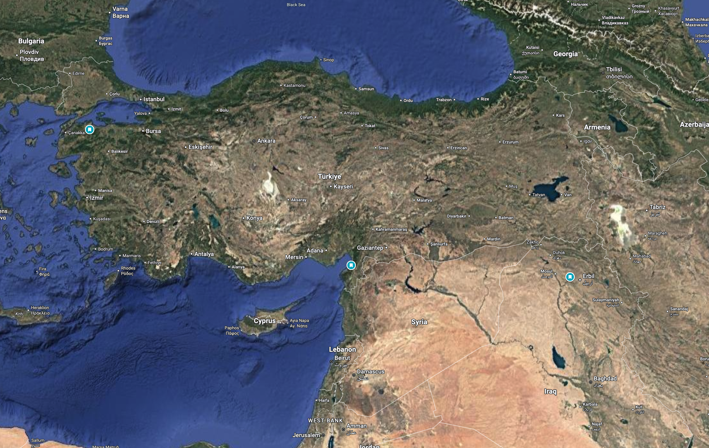

# Alexander the Great — The Gambler Who Won (and Then Consumed His Own Side)

**Scope:** Alexander III of Macedon (356–323 BC) through four lenses: (1) his campaign timeline, stressing the extreme risks he took in his three great battles and the Siwa oracle; (2) the push into India, the army's refusal, and the brutal return; (3) his killing of his father's closest men; (4) a direct comparison with his father, Philip II.

Companion to the broader [Macedonia & the Greek Empire overview](README.md). Primary source: Civilization lecture #12, *The Tyranny of Alexander the Great*. Where the lecture departs from mainstream scholarship, this note says so.

---

## Table of Contents

1. [Timeline at a Glance](#1-timeline-at-a-glance)
2. [The Three Battles: Extreme Risk, Extreme Reward](#2-the-three-battles-extreme-risk-extreme-reward)
3. [Egypt and the Oracle: "Son of Zeus"](#3-egypt-and-the-oracle-son-of-zeus)
4. [India: The Army Says No](#4-india-the-army-says-no)
5. [Killing His Father's Men: Parmenion and Cleitus](#5-killing-his-fathers-men-parmenion-and-cleitus)
6. [Philip vs. Alexander](#6-philip-vs-alexander)
7. [Caveats: Lecture vs. the Sources](#7-caveats-lecture-vs-the-sources)
8. [Sources](#sources)

---

## 1. Timeline at a Glance

| Date | Event | Why it matters here |
|------|-------|---------------------|
| 356 BC | Born in Pella (20/21 July) | Son of Philip II and Olympias |
| 338 BC | Chaeronea: commands the cavalry at ~18 | First proof of nerve, under his father's plan |
| 336 BC | Philip assassinated; Alexander king at 20 | Rivals and Parmenion's kin removed; Greece rebels |
| 335 BC | Thebes destroyed | Terror as policy |
| **May 334** | **Granicus** | Nearly killed; saved by Cleitus |
| **Nov 333** | **Issus** | Charges straight at Darius; refuses the "half the empire" offer |
| 332–331 | Egypt; **Siwa oracle** | Hailed as son of Zeus-Ammon |
| **1 Oct 331** | **Gaugamela** | The wedge charge at Darius; Persian power broken |
| 330 | Philotas tortured, **Parmenion assassinated** | First great purge |
| 328 | **Cleitus speared** at Maracanda | Second great purge |
| 326 | Hydaspes (Porus), then the **mutiny at the Hyphasis** | First time his army refuses him |
| 325 | Return through the Gedrosian desert | Heavy losses |
| June 323 | Dies in Babylon aged 32 | No settled heir; empire splits |

*Alexander's empire at its greatest extent, from Greece to the Indus. Public domain (Wikimedia Commons).*

---

## 2. The Three Battles: Extreme Risk, Extreme Reward

**Takeaway:** In each battle Alexander put his own body, and the whole army's survival, on a single bet. Each time the bet paid. The lecture's point is that the pattern was a gamble, not sound strategy. The sources give the full picture: the gamble was also brilliant execution.

### Granicus (May 334 BC) — the gambler's first throw

- **Number** Persian: 20000 infantry and 20000 cavalry; Alexander 12000 heavy infantry, 6000 light infantry, 4500 heavy cavalry, 1000 light cavalry
- **Risk:** He attacked across a river against a prepared Persian line, at the front of his cavalry, instead of waiting or manoeuvring (Parmenion is reported to have advised delay).
- **Near-death:** A Persian noble struck him down in the melee; **Cleitus the Black** cut off the attacker's arm at the last moment.
- **Reward:** The Persian satraps were routed and Asia Minor opened. Lecture framing: "He won, but barely."

### Issus (Nov 333 BC) — the charge at the king

- **Setup:** Darius III came in person, with Alexander outnumbered on ground where the Persians could use their size.
- **Risk:** Alexander drove his Companion cavalry straight at Darius in the Persian centre. The left, under **Parmenion**, had to hold against the far larger Persian force. If it broke, there was no line of retreat.
- **Reward:** Darius fled, his army collapsed, and the royal family was captured. Darius then offered a large part of his empire for peace. Alexander refused (Arrian also reports Parmenion saying he would accept it, and Alexander answering that he would too, if he were Parmenion).

*Battle of Issus mosaic (c. 100 BC), Naples National Archaeological Museum. Public domain.*

### Gaugamela (1 Oct 331 BC) — the pattern at full scale

- **Numbers:** Roughly 47,000 Macedonians and allies against a Persian army modern scholars put at 120,000 or more (ancient sources claim up to 1,000,000; treated as absurd), plus scythed chariots and elephants.
- **Risk:** A Persian line extending more than a mile past his own. His left under Parmenion was encircled and sent desperate requests for help; a gap opened in his own line. The Persians had levelled the ground for chariots, and Alexander deliberately drew the cavalry away from it.
- **Reward:** When a gap opened in Darius's line, Alexander formed a wedge of Companions and infantry, drove it into the centre, and Darius turned and fled again. The Persian army dissolved. Darius was murdered by Bessus the following year.

*Pietro da Cortona, Battle of Alexander vs. Darius (Gaugamela), 1644. Capitoline Museums, Rome. Public domain.*

### What the three share

1. He fights at the point of greatest danger himself.
2. He wins by **killing the king's nerve**, aiming at Darius directly instead of grinding the army down.
3. The plan has **no fallback**: it works only if the left flank holds long enough.

Lecture's argument: this worked because of Macedonia's **cohesion, discipline, and devotion** (vs. a multinational, pay-driven Persian army), and because Parmenion's left held. Philip would have negotiated. Mainstream historians rate Alexander's tactical design very highly, so treat this as a minority reading (see §7).

---

## 3. Egypt and the Oracle: "Son of Zeus"

**Takeaway:** After Issus, Egypt fell without a fight. Alexander then made a long, risky desert trip to a remote oracle, and came back with a story about his origins that his army could not easily accept.

- **Egypt:** Having suffered Persian rule for centuries, the Egyptians welcomed him as a liberator; he was received as pharaoh and founded Alexandria (331 BC).
- **The journey:** He crossed the desert to the oasis of **Siwa**, home to the oracle of **Zeus-Ammon**, the Egyptian god Amun identified with the Greek Zeus. The trip itself was a gamble through waterless country, with a small party.
- **The verdict:** By the surviving accounts (Plutarch, Arrian), the priest greeted him as the god's son, which in Egyptian royal ideology is the pharaoh's standard title. Alexander kept what he asked and what he was told private, but the story spread: he was the **son of Zeus**, not merely of Philip.
- **Lecture's reading:** "Philip is not really his father." Alexander comes back expecting his soldiers to accept it, and soon demands **proskynesis** (kneeling or kissing the hand or feet, a Persian court custom) from his officers. The Macedonian army, where soldiers could speak freely to the king, resented it.

*Alexander, detail from the Alexander Mosaic (c. 100 BC), Naples National Archaeological Museum. Public domain.*

**Why it fits the "son" model:** A son overshadowed by a famous father has a strong motive to claim a bigger father. If Zeus is your father, Philip's achievements stop being the measure of yours.

---

## 4. India: The Army Says No

**Takeaway:** Persia had wealth, revenge, and a strategic logic behind it. India had none of these. The army followed him anyway until the limit of its endurance.

- **Why Persia made sense:** Persian wealth, a long record of attacks on Greece, and suspicion that Persia was behind Philip's murder.
- **Why India did not (lecture):** Nobody knew the geography or what lay beyond it. Pursuing it was personal ambition.
- **The campaign (326 BC):** Alexander crossed into the Punjab and defeated King **Porus** at the Hydaspes (May 326), a costly victory that included war elephants, in monsoon weather.
- **The mutiny (Hyphasis / Beas):** Men exhausted after eight years of campaigning and thousands of miles from home refused to go further. The general **Coenus** spoke for the army. After days sulking in his tent, Alexander turned back.
- **The return (325 BC):** He built a fleet and sent part of the force down the Indus; he led a large part of the army west through the **Gedrosian desert**. The march brought heavy losses from thirst and exhaustion (ancient estimates are very high and disputed).
- **Lecture's version:** He took the desert route as a punishment for the mutiny and executed those who spoke for the army. Ancient sources instead give Alexander's motives as rivalling Cyrus and Semiramis and supplying his fleet; the punishment reading is the lecturer's interpretation.
- **Aftermath:** Plans for an **Arabian** campaign; Persians brought into the army and officer corps in place of Macedonians, as men who obey without arguing.

Pattern: the same boundless ambition as in the battles, but now without a Parmenion to say when to stop.

---

## 5. Killing His Father's Men: Parmenion and Cleitus

**Takeaway:** The two men most responsible for Alexander's survival and success were both Philip's men, and both died by his order or his hand.

### Why these two mattered

- **Parmenion:** Philip's own chosen partner and best general, now commanding the left flank at every big battle. At Philip's death he was the kingmaker: he had the army, and his son-in-law **Attalus** was Alexander's rival (Attalus had insulted Alexander at Philip's wedding toast). Parmenion sided with Alexander and had Attalus killed.
- **Cleitus the Black:** Promoted by Philip; saved Alexander's life at Granicus.

### Parmenion (330 BC)

- A plot against Alexander surfaced. Parmenion's son **Philotas** was told of it, failed to report it, and was arrested, tried, and tortured.
- Under torture Philotas implicated his father, with no independent evidence. Alexander then had **Parmenion assassinated** (at Ecbatana) by an order carried by couriers.
- **Generous reading:** Alexander could not leave a general whose son had just been executed alive and in command.
- **Lecture's reading:** Jealousy. The troops loved Parmenion more than Alexander, and young officers wanted his place. After Parmenion, there was no one left who could restrain Alexander.

### Cleitus (328 BC)

- At a drunken banquet in Maracanda (Samarkand), Cleitus condemned Alexander for turning Persian, taking the credit for Philip's achievements, and rejecting Macedonian ways.
- The sentence that the lecture highlights: *"It's your father who built the army and made the plan."*
- Alexander lunged, was restrained by his bodyguards, broke free, and threw a spear through Cleitus. He later fell into deep remorse (the sources agree on this).

### The connecting thread

Both men said, in one form or another, that his success was not wholly his own. By the lecture's model, that is exactly the thing an insecure son cannot forgive. A third victim fits: in the final year, **Antipater**, Philip's governor of Macedonia, was summoned to Babylon after a quarrel with Olympias; he feared what had happened to Parmenion and Cleitus. The lecture's poison theory of Alexander's death (June 323) rests on this fear; most modern historians think disease (typhoid or malaria) is likelier.

---

## 6. Philip vs. Alexander

| Dimension | Philip II | Alexander III |
|-----------|-----------|----------------|
| **Starting point** | Inherited a weak, divided, bankrupt kingdom at 23 and built everything | Inherited the most powerful army in Greece at 20 |
| **Core aim** | Secure and unify Macedonia and Greece; the organization | Personal glory; surpass every hero, including his father |
| **Risk style** | Calculated: diplomacy, bribes, marriages, feints (Chaeronea's feigned retreat) | All-in: personal cavalry charges at the enemy king |
| **Soldiers** | Preserved them as the main asset | Spent them freely for prestige (Issus, Gaugamela, the Gedrosian march) |
| **Talent** | Promoted on merit (Parmenion, Antipater, Cleitus) | Promoted loyalty; removed independent voices |
| **Dissent** | Debated it and used it | Treated it as treachery (Philotas, Parmenion, Cleitus, the Pages' Conspiracy) |
| **Persia** | Would have negotiated, then expanded slowly | Refused Darius's offers; wanted it all |
| **End of expansion** | Not reached: assassinated at ~46 | Boundless; stopped only when his own army refused |
| **Legacy** | A durable state and a professional army | A vast empire that fragmented within a generation |

*Philip II of Macedon, marble bust. See image notes in the [overview README](README.md).*

**The lecture's model:** The father *builds* (good judgment, meritocracy, selflessness); the son *inherits* and so expands (risk-taking, demanded obedience, personal glory). The son's hunger comes from insecurity: people whisper that everything he has, he owes his father.

**Verdict in one line:** Philip built the instrument; Alexander played it at full volume until it broke.

---

## 7. Caveats: Lecture vs. the Sources

- **Parmenion "did the heavy lifting":** A minority view. The accounts of Gaugamela show Alexander's wedge charge as decisive. Parmenion's left-wing crisis is partly discredited by Callisthenes' pro-Alexander tradition.
- **Siwa:** The lecture says the oracle told him Philip was not his father. The ancient accounts report a greeting as the god's son; what else was said is unknown.
- **Proskynesis timing:** Sources place the strongest push in Bactria (327 BC), after Siwa; the historian Callisthenes opposed it and it was dropped.
- **Hyphasis and Gedrosia:** Sources differ on motives, routes, and losses.
- **Poison:** A tradition, not an established fact.
- **Items not checked online:** Siwa wording, Philotas/Parmenion details, Cleitus, and Gedrosian casualties come from general knowledge of Arrian and Plutarch (and the lecture), not from pages fetched in this session. Verify before relying on them. Dates for birth, death, Granicus, Gaugamela, and Gaugamela's sizes and tactics were checked against Wikipedia (see below).
