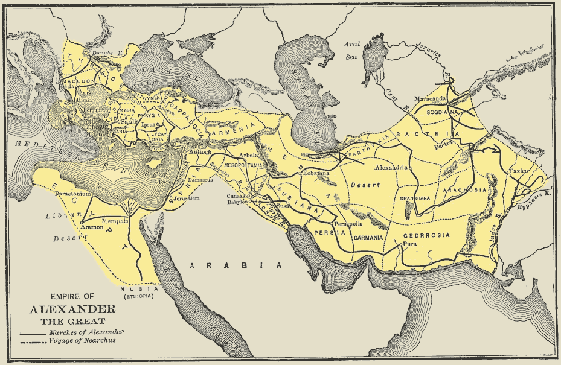
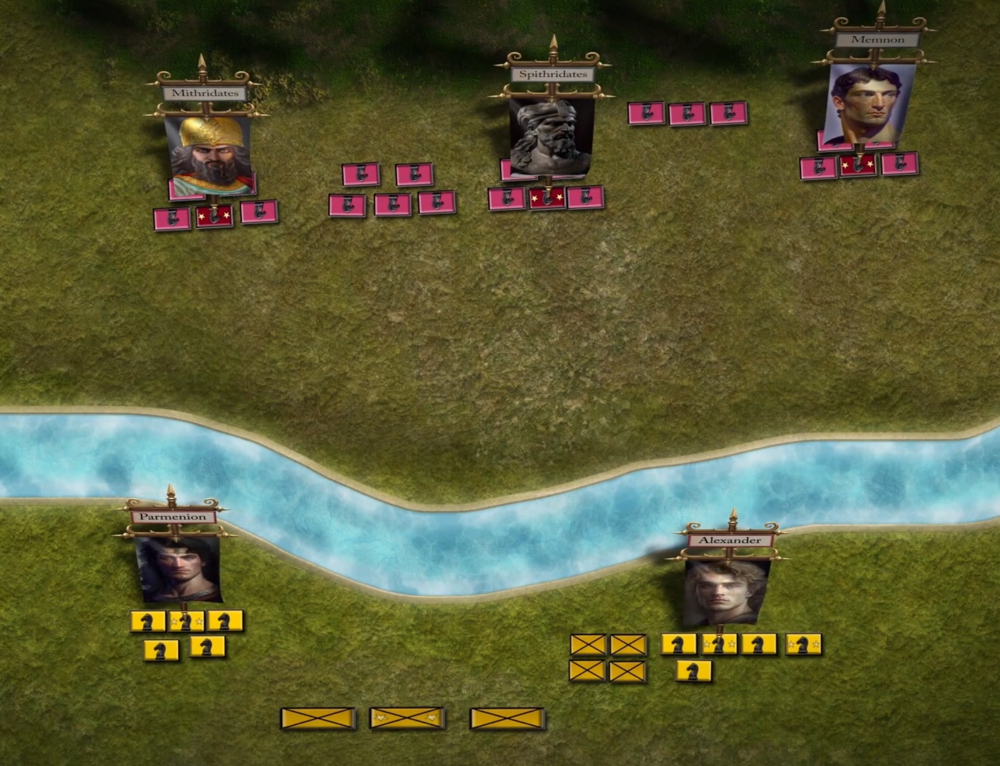
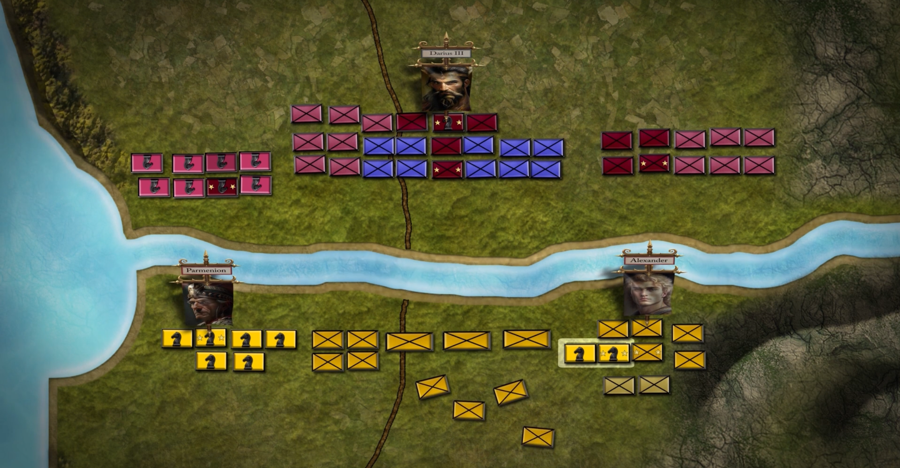
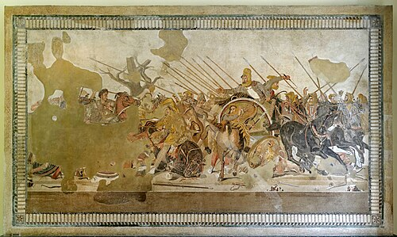
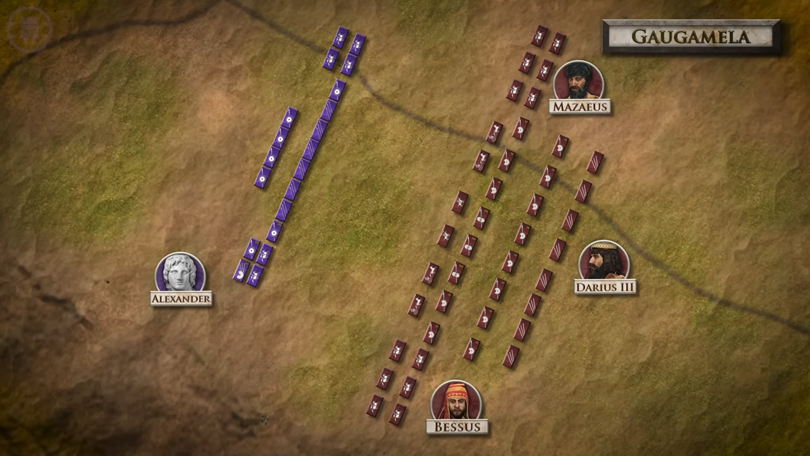
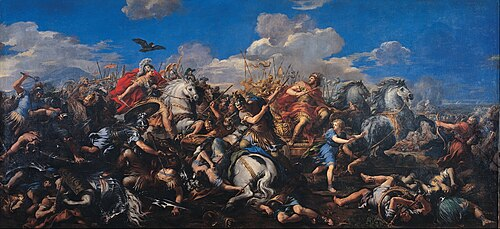
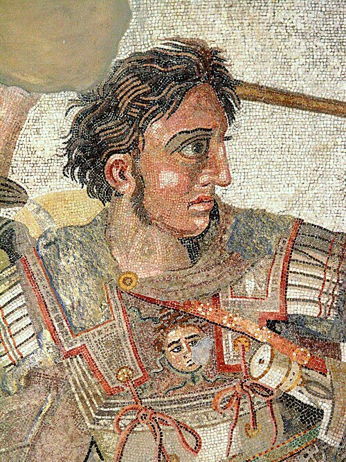
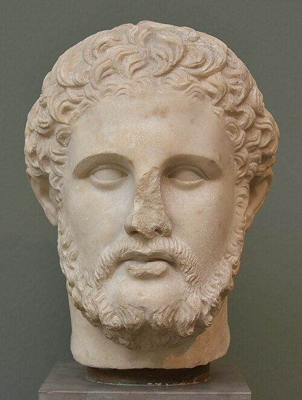

# Alexander Đại Đế — Con Bạc Đã Thắng (Rồi Tự Nuốt Chính Phe Mình)

**Phạm vi:** Alexander III xứ Macedon (356–323 TCN) qua bốn lăng kính: (1) dòng thời gian các chiến dịch, nhấn mạnh những rủi ro cực đoan ông chấp nhận trong ba trận đánh lớn và ở đền sấm Siwa; (2) cuộc tiến vào Ấn Độ, việc quân đội từ chối đi tiếp, và cuộc rút quân tàn khốc; (3) việc ông giết những người thân cận nhất của cha mình; (4) so sánh trực tiếp với cha ông, Philip II.

Bản đồng hành với [tổng quan Macedonia & Đế chế Hy Lạp](README_vi.md). Nguồn chính: bài giảng Civilization số 12, *The Tyranny of Alexander the Great*. Ở những chỗ bài giảng khác với giới sử học chính thống, ghi chú này đều nêu rõ.

---

## Mục lục

1. [Dòng thời gian tổng quan](#1-timeline-at-a-glance)
2. [Ba trận đánh: Rủi ro cực đoan, phần thưởng cực đoan](#2-the-three-battles-extreme-risk-extreme-reward)
3. [Ai Cập và lời sấm: "Con trai của Zeus"](#3-egypt-and-the-oracle-son-of-zeus)
4. [Ấn Độ: Quân đội nói không](#4-india-the-army-says-no)
5. [Giết người của cha: Parmenion và Cleitus](#5-killing-his-fathers-men-parmenion-and-cleitus)
6. [Philip và Alexander](#6-philip-vs-alexander)
7. [Lưu ý: Bài giảng so với các nguồn](#7-caveats-lecture-vs-the-sources)
8. [Nguồn tham khảo](#sources)

---

## 1. Dòng thời gian tổng quan

| Thời điểm | Sự kiện | Vì sao đáng chú ý ở đây |
|-----------|---------|--------------------------|
| 356 TCN | Sinh ra tại Pella (20/21 tháng 7) | Con của Philip II và Olympias |
| 338 TCN | Chaeronea: chỉ huy kỵ binh khi khoảng 18 tuổi | Lần đầu chứng tỏ bản lĩnh, theo kế hoạch của cha |
| 336 TCN | Philip bị ám sát; Alexander lên ngôi khi 20 tuổi | Các đối thủ và người thân của Parmenion bị loại; Hy Lạp nổi dậy |
| 335 TCN | Thebes bị san phẳng | Khủng bố như một chính sách |
| **Tháng 5/334** | **Granicus** | Suýt chết; được Cleitus cứu |
| **Tháng 11/333** | **Issus** | Lao thẳng vào Darius; từ chối đề nghị "chia nửa đế quốc" |
| 332–331 | Ai Cập; **lời sấm Siwa** | Được tôn là con của Zeus-Ammon |
| **1/10/331** | **Gaugamela** | Cú xung phong hình nêm vào Darius; sức mạnh Ba Tư bị bẻ gãy |
| 330 | Philotas bị tra tấn, **Parmenion bị ám sát** | Cuộc thanh trừng lớn đầu tiên |
| 328 | **Cleitus bị đâm chết bằng giáo** tại Maracanda | Cuộc thanh trừng lớn thứ hai |
| 326 | Hydaspes (Porus), rồi **binh biến ở sông Hyphasis** | Lần đầu quân đội của ông từ chối ông |
| 325 | Rút quân qua sa mạc Gedrosia | Tổn thất nặng nề |
| Tháng 6/323 | Chết ở Babylon, 32 tuổi | Không có người kế vị rõ ràng; đế quốc chia rẽ |

*Đế quốc của Alexander ở mức rộng nhất, từ Hy Lạp đến sông Indus. Phạm vi công cộng (Wikimedia Commons).*

---

## 2. Ba trận đánh: Rủi ro cực đoan, phần thưởng cực đoan

**Điểm chính:** Trong mỗi trận, Alexander đặt cả thân mình lẫn sự sống còn của toàn quân vào một ván cược duy nhất. Lần nào ván cược cũng thắng. Luận điểm của bài giảng là mẫu hình đó là một canh bạc, không phải chiến lược đúng đắn. Các nguồn sử cho bức tranh đầy đủ hơn: canh bạc ấy cũng là sự thực thi xuất sắc.

### Granicus (tháng 5/334 TCN) — lần tung xúc xắc đầu tiên

- **Quân số:** Ba Tư: 20.000 bộ binh và 20.000 kỵ binh; Alexander: 12.000 bộ binh hạng nặng, 6.000 bộ binh hạng nhẹ, 4.500 kỵ binh hạng nặng, 1.000 kỵ binh hạng nhẹ
- **Rủi ro:** Ông tấn công vượt sông vào tuyến phòng thủ Ba Tư đã bố trí sẵn, dẫn đầu đội kỵ binh, thay vì chờ đợi hay cơ động (Parmenion được cho là đã khuyên trì hoãn).
- **Suýt chết:** Một quý tộc Ba Tư đánh ông ngã trong cuộc hỗn chiến; **Cleitus the Black** chém đứt cánh tay kẻ tấn công vào phút chót.
- **Phần thưởng:** Các thống đốc (satrap) Ba Tư bị đánh tan và Tiểu Á rộng mở. Cách bài giảng diễn đạt: "Ông thắng, nhưng chỉ sát nút."

### Issus (tháng 11/333 TCN) — cú xung phong vào nhà vua

- **Bối cảnh:** Darius III đích thân ra trận, Alexander bị áp đảo về quân số trên địa hình mà người Ba Tư có thể tận dụng quân số đông.
- **Rủi ro:** Alexander đưa kỵ binh Companion lao thẳng vào Darius ở trung tâm quân Ba Tư. Cánh trái, dưới quyền **Parmenion**, phải trụ vững trước lực lượng Ba Tư đông hơn nhiều. Nếu cánh ấy vỡ, sẽ không còn đường lui.
- **Phần thưởng:** Darius bỏ chạy, quân đội tan rã, gia quyến hoàng tộc bị bắt. Darius sau đó đề nghị nhượng một phần lớn đế quốc để đổi lấy hòa bình. Alexander từ chối (Arrian còn kể Parmenion nói rằng ông sẽ chấp nhận, và Alexander đáp rằng mình cũng sẽ chấp nhận nếu là Parmenion).

*Tranh khảm trận Issus (khoảng 100 TCN), Bảo tàng Khảo cổ Quốc gia Naples. Phạm vi công cộng.*

### Gaugamela (1/10/331 TCN) — mẫu hình ở quy mô đầy đủ

- **Quân số:** Khoảng 47.000 quân Macedon và đồng minh chống lại đội quân Ba Tư mà các học giả hiện đại ước tính từ 120.000 trở lên (các nguồn cổ đại nói tới 1.000.000, bị coi là phi lý), cùng chiến xa lưỡi hái và voi.
- **Rủi ro:** Tuyến quân Ba Tư kéo dài hơn một dặm vượt ra ngoài tuyến của ông. Cánh trái dưới quyền Parmenion bị bao vây và gửi về những lời cầu cứu tuyệt vọng; một khoảng hở xuất hiện trong tuyến của chính ông. Người Ba Tư đã san phẳng mặt đất cho chiến xa, và Alexander cố ý kéo kỵ binh đối phương ra khỏi khu vực đó.
- **Phần thưởng:** Khi một khoảng hở mở ra trong tuyến của Darius, Alexander lập một mũi nêm gồm Companion và bộ binh, đâm thẳng vào trung tâm, và Darius lại quay đầu bỏ chạy. Quân Ba Tư tan rã. Darius bị Bessus sát hại vào năm sau.

*Pietro da Cortona, Trận chiến của Alexander và Darius (Gaugamela), 1644. Bảo tàng Capitoline, Rome. Phạm vi công cộng.*

### Điểm chung của ba trận

1. Ông đích thân chiến đấu tại điểm nguy hiểm nhất.
2. Ông thắng bằng cách **giết chết sự can đảm của nhà vua**, nhắm thẳng vào Darius thay vì mài mòn quân đội đối phương.
3. Kế hoạch **không có phương án dự phòng**: nó chỉ hiệu quả nếu cánh trái trụ vững đủ lâu.

Lập luận của bài giảng: điều này thành công nhờ **sự gắn kết, kỷ luật và lòng tận tụy** của Macedonia (so với đội quân đa sắc tộc, chiến đấu vì tiền của Ba Tư), và vì cánh trái của Parmenion đã trụ vững. Philip hẳn đã thương lượng. Các sử gia chính thống đánh giá rất cao thiết kế chiến thuật của Alexander, nên hãy xem đây là một cách đọc thiểu số (xem §7).

---

## 3. Ai Cập và lời sấm: "Con trai của Zeus"

**Điểm chính:** Sau Issus, Ai Cập thất thủ mà không cần giao chiến. Alexander sau đó thực hiện một chuyến đi dài, đầy rủi ro qua sa mạc tới một đền sấm xa xôi, và trở về với một câu chuyện về nguồn gốc của mình mà quân đội khó lòng chấp nhận.

- **Ai Cập:** Sau nhiều thế kỷ chịu ách cai trị Ba Tư, người Ai Cập chào đón ông như vị cứu tinh; ông được tiếp nhận như một pharaoh và lập ra Alexandria (331 TCN).
- **Chuyến đi:** Ông vượt sa mạc tới ốc đảo **Siwa**, nơi có đền sấm của **Zeus-Ammon**, tức thần Amun của Ai Cập được đồng nhất với Zeus của Hy Lạp. Bản thân chuyến đi là một canh bạc qua vùng đất không có nước, với một đoàn nhỏ.
- **Lời phán:** Theo các ghi chép còn lại (Plutarch, Arrian), vị tư tế chào ông là con của thần, vốn là danh xưng tiêu chuẩn của pharaoh trong hệ tư tưởng hoàng gia Ai Cập. Alexander giữ kín điều ông hỏi và điều ông được đáp, nhưng câu chuyện lan ra: ông là **con của Zeus**, chứ không chỉ là con của Philip.
- **Cách đọc của bài giảng:** "Philip không thật sự là cha ông." Alexander trở về và mong binh lính chấp nhận điều đó, rồi chẳng bao lâu đòi các sĩ quan thực hiện **proskynesis** (quỳ lạy hoặc hôn tay hay chân, một tục lệ cung đình Ba Tư). Quân đội Macedon, nơi binh lính có thể nói thẳng với nhà vua, phản cảm với việc này.

*Alexander, chi tiết từ Tranh khảm Alexander (khoảng 100 TCN), Bảo tàng Khảo cổ Quốc gia Naples. Phạm vi công cộng.*

**Vì sao khớp với mô hình "người con":** Một người con bị cha nổi tiếng che khuất có động cơ mạnh để tự nhận một người cha vĩ đại hơn. Nếu Zeus là cha bạn, thành tựu của Philip không còn là thước đo cho thành tựu của bạn.

---

## 4. Ấn Độ: Quân đội nói không

**Điểm chính:** Ba Tư có của cải, mối thù và một logic chiến lược đằng sau. Ấn Độ không có cái nào trong số đó. Quân đội vẫn theo ông cho đến giới hạn sức chịu đựng.

- **Vì sao Ba Tư hợp lý:** Của cải Ba Tư, lịch sử dài các cuộc tấn công vào Hy Lạp, và nghi ngờ rằng Ba Tư đứng sau vụ sát hại Philip.
- **Vì sao Ấn Độ thì không (theo bài giảng):** Không ai biết địa lý hay những gì nằm phía sau. Theo đuổi nó là tham vọng cá nhân.
- **Chiến dịch (326 TCN):** Alexander tiến vào Punjab và đánh bại vua **Porus** ở Hydaspes (tháng 5/326), một chiến thắng tốn kém có voi chiến, trong thời tiết gió mùa.
- **Binh biến (Hyphasis / Beas):** Những người lính kiệt sức sau tám năm chinh chiến và cách nhà hàng nghìn dặm từ chối đi xa hơn. Tướng **Coenus** thay mặt quân đội lên tiếng. Sau nhiều ngày hờn dỗi trong lều, Alexander quay lại.
- **Cuộc trở về (325 TCN):** Ông đóng một hạm đội và cho một phần lực lượng xuôi sông Indus; ông dẫn phần lớn quân đội đi về phía tây qua **sa mạc Gedrosia**. Cuộc hành quân gây tổn thất nặng vì khát và kiệt sức (các ước tính cổ đại rất cao và còn tranh cãi).
- **Phiên bản của bài giảng:** Ông chọn đường sa mạc như một hình phạt cho cuộc binh biến và xử tử những người đã lên tiếng thay quân đội. Các nguồn cổ đại thay vào đó nêu động cơ của Alexander là muốn sánh ngang Cyrus và Semiramis và tiếp tế cho hạm đội; cách đọc theo hướng trừng phạt là diễn giải của người giảng.
- **Hậu quả:** Kế hoạch chinh phạt **Ả Rập**; người Ba Tư được đưa vào quân đội và tầng lớp sĩ quan thay cho người Macedon, vì họ vâng lời mà không cãi.

Mẫu hình: cùng một tham vọng vô bờ như trong các trận đánh, nhưng giờ không còn một Parmenion nào để nói khi nào nên dừng.

---

## 5. Giết người của cha: Parmenion và Cleitus

**Điểm chính:** Hai người có công lớn nhất với sự sống còn và thành công của Alexander đều là người của Philip, và cả hai đều chết theo lệnh hoặc bởi tay ông.

### Vì sao hai người này quan trọng

- **Parmenion:** Cộng sự được Philip chọn và là vị tướng giỏi nhất của ông, nay chỉ huy cánh trái ở mọi trận lớn. Khi Philip chết, ông là người quyết định ai lên ngôi: ông nắm quân đội, và con rể ông là **Attalus** là đối thủ của Alexander (Attalus đã xúc phạm Alexander trong lời nâng cốc tại tiệc cưới của Philip). Parmenion đứng về phía Alexander và cho giết Attalus.
- **Cleitus the Black:** Được Philip đề bạt; đã cứu mạng Alexander ở Granicus.

### Parmenion (330 TCN)

- Một âm mưu chống Alexander bị phát giác. **Philotas**, con trai Parmenion, được báo về âm mưu đó, không tố giác, và bị bắt, xét xử rồi tra tấn.
- Dưới sự tra tấn, Philotas khai cha mình có dính líu, không có bằng chứng độc lập nào. Alexander sau đó cho **ám sát Parmenion** (tại Ecbatana) bằng một mệnh lệnh do các sứ giả mang đi.
- **Cách đọc rộng lượng:** Alexander không thể để một vị tướng có con trai vừa bị xử tử còn sống và nắm quyền chỉ huy.
- **Cách đọc của bài giảng:** Ghen tị. Binh lính yêu mến Parmenion hơn Alexander, và các sĩ quan trẻ muốn chiếm chỗ của ông. Sau Parmenion, không còn ai có thể kiềm chế Alexander.

### Cleitus (328 TCN)

- Tại một bữa tiệc say sưa ở Maracanda (Samarkand), Cleitus chỉ trích Alexander vì đã Ba Tư hóa, nhận công lao thành tựu của Philip, và chối bỏ lối sống Macedon.
- Câu nói mà bài giảng nhấn mạnh: *"Chính cha ngài mới là người xây dựng quân đội và lập ra kế hoạch."*
- Alexander lao tới, bị vệ binh giữ lại, giằng ra, và phóng ngọn giáo xuyên qua Cleitus. Về sau ông chìm trong hối hận sâu sắc (các nguồn đều đồng ý điều này).

### Sợi chỉ xuyên suốt

Cả hai người, bằng cách này hay cách khác, đã nói rằng thành công của ông không hoàn toàn là của riêng ông. Theo mô hình của bài giảng, đó chính là điều một người con bất an không thể tha thứ. Một nạn nhân thứ ba cũng khớp: trong năm cuối đời, **Antipater**, thống đốc Macedonia của Philip, bị triệu tới Babylon sau một cuộc cãi vã với Olympias; ông sợ điều đã xảy ra với Parmenion và Cleitus. Giả thuyết đầu độc về cái chết của Alexander (tháng 6/323) của bài giảng dựa trên nỗi sợ này; đa số sử gia hiện đại cho rằng bệnh tật (thương hàn hoặc sốt rét) có khả năng hơn.

---

## 6. Philip và Alexander

| Khía cạnh | Philip II | Alexander III |
|-----------|-----------|----------------|
| **Điểm xuất phát** | Thừa hưởng một vương quốc yếu, chia rẽ, phá sản khi 23 tuổi và xây dựng mọi thứ | Thừa hưởng đội quân mạnh nhất Hy Lạp khi 20 tuổi |
| **Mục tiêu cốt lõi** | Củng cố và thống nhất Macedonia và Hy Lạp; tổ chức | Vinh quang cá nhân; vượt qua mọi anh hùng, kể cả cha mình |
| **Phong cách chấp nhận rủi ro** | Tính toán: ngoại giao, hối lộ, hôn nhân, nghi binh (cuộc rút lui giả ở Chaeronea) | Được ăn cả ngã về không: đích thân dẫn kỵ binh xung phong vào vua địch |
| **Binh lính** | Bảo toàn họ như tài sản chính | Tiêu hao họ thoải mái vì uy danh (Issus, Gaugamela, cuộc hành quân Gedrosia) |
| **Nhân tài** | Đề bạt theo năng lực (Parmenion, Antipater, Cleitus) | Đề bạt lòng trung thành; loại bỏ những tiếng nói độc lập |
| **Bất đồng chính kiến** | Tranh luận và tận dụng nó | Coi là phản bội (Philotas, Parmenion, Cleitus, Âm mưu của các Pages) |
| **Ba Tư** | Sẽ thương lượng, rồi mở rộng từ từ | Từ chối các đề nghị của Darius; muốn tất cả |
| **Điểm dừng mở rộng** | Chưa tới: bị ám sát ở tuổi khoảng 46 | Vô bờ; chỉ dừng khi chính quân đội từ chối |
| **Di sản** | Một nhà nước bền vững và một đội quân chuyên nghiệp | Một đế quốc rộng lớn tan rã trong vòng một thế hệ |

*Philip II xứ Macedon, tượng bán thân đá cẩm thạch. Xem ghi chú về hình ảnh trong [README tổng quan](README_vi.md).*

**Mô hình của bài giảng:** Người cha *xây dựng* (phán đoán tốt, trọng dụng người tài, vị tha); người con *thừa hưởng* và vì thế mở rộng (chấp nhận rủi ro, đòi hỏi sự phục tùng, vinh quang cá nhân). Cơn khát của người con đến từ sự bất an: người ta xì xào rằng mọi thứ ông có đều nhờ cha.

**Kết luận trong một câu:** Philip chế tạo nhạc cụ; Alexander chơi nó hết cỡ âm lượng cho đến khi nó gãy.

---

## 7. Lưu ý: Bài giảng so với các nguồn

- **Parmenion "gánh phần việc nặng":** Một quan điểm thiểu số. Các ghi chép về Gaugamela cho thấy cú xung phong hình nêm của Alexander mới mang tính quyết định. Cuộc khủng hoảng cánh trái của Parmenion một phần bị làm mất uy tín bởi truyền thống thiên về Alexander của Callisthenes.
- **Siwa:** Bài giảng nói lời sấm bảo ông rằng Philip không phải cha mình. Các ghi chép cổ đại chỉ nói về lời chào ông là con của thần; những điều khác được nói thì không ai biết.
- **Thời điểm proskynesis:** Các nguồn đặt sức ép mạnh nhất ở Bactria (327 TCN), sau Siwa; sử gia Callisthenes phản đối và việc này bị bỏ.
- **Hyphasis và Gedrosia:** Các nguồn khác nhau về động cơ, lộ trình và tổn thất.
- **Đầu độc:** Một truyền thuyết, không phải sự thật đã xác lập.
- **Những điểm chưa kiểm chứng trực tuyến:** Lời phán ở Siwa, chi tiết về Philotas/Parmenion, Cleitus, và số thương vong ở Gedrosia đến từ hiểu biết chung về Arrian và Plutarch (và bài giảng), không phải từ các trang đã truy cập trong phiên này. Hãy kiểm chứng trước khi dựa vào. Các mốc ngày sinh, ngày mất, Granicus, Gaugamela, cũng như quân số và chiến thuật ở Gaugamela đã được đối chiếu với Wikipedia (xem bên dưới).
