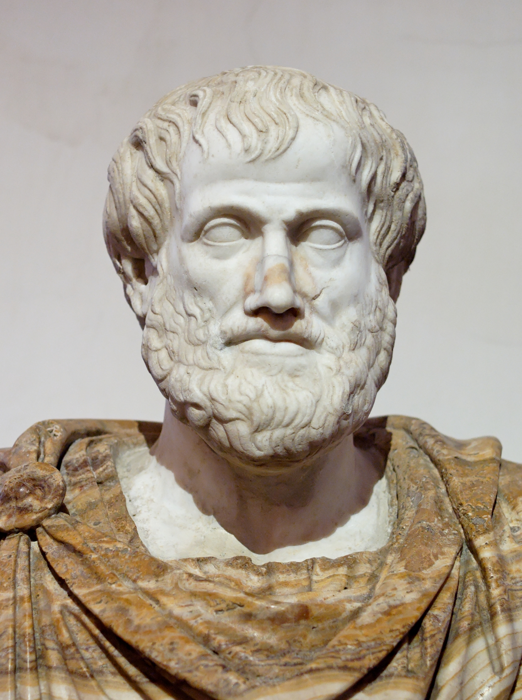
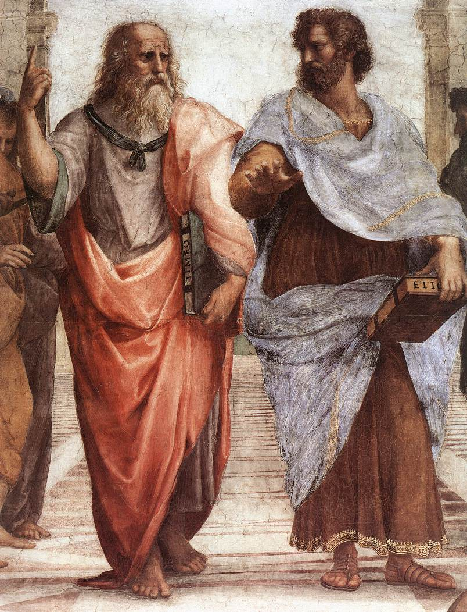

# Aristotle — The Professor Behind the Empire

**Scope:** Aristotle (384–322 BC) read through four lenses: (1) the professor who systematized Greek knowledge for Macedon's pan-Hellenic project; (2) his relationship with Philip II and Alexander; (3) what happened after Alexander's death and why Greek influence spread even faster; (4) Plato vs. Aristotle, and why one philosophy fits a church and the other fits an empire.

Companion to the [Macedonia & the Greek Empire overview](README.md) and [Alexander the Great](alexander-the-great.md). Primary source: Civilization lecture #13, *Aristotle and the Greek Legacy*. The lecture's thesis is deliberately provocative (the lecturer calls it "controversial" and admits oversimplifying), so every section separates **what the lecture argues** from **what the sources document**. See [Section 5](#5-caveats-lecture-vs-the-sources).

---

## Table of Contents

1. [Aristotle the Professor: Centralizing Greek Knowledge](#1-aristotle-the-professor-centralizing-greek-knowledge)
2. [Aristotle, Philip, and Alexander](#2-aristotle-philip-and-alexander)
3. [After Alexander: Why Greek Influence Sped Up](#3-after-alexander-why-greek-influence-sped-up)
4. [Plato vs. Aristotle: A Church and an Empire](#4-plato-vs-aristotle-a-church-and-an-empire)
5. [Caveats: Lecture vs. the Sources](#5-caveats-lecture-vs-the-sources)
6. [Sources](#sources)

---

## 1. Aristotle the Professor: Centralizing Greek Knowledge

*Aristotle — Roman marble copy of a Greek bronze attributed to Lysippos, Palazzo Altemps, Rome. Public domain. [Source page](https://commons.wikimedia.org/wiki/File:Aristotle_Altemps_Inv8575.jpg).*

**Takeaway:** the lecture treats Aristotle less as a lone thinker in the mold of Plato and more as the head of a research institution, a professor running a knowledge-collection project.

**Three "paradoxes" the lecture uses to make the case:**

| Paradox | What the lecture says | What the sources add |
|---------|----------------------|----------------------|
| **Nothing original survives** | We have no text we can prove he personally wrote | True in a narrower sense: his polished dialogues are lost (fragments only); the surviving treatises are considered **lecture aids**, not works meant for publication |
| **Impossible range** | ~200 works: politics, poetics, ethics, rhetoric, physics, metaphysics, biology | Wikipedia confirms the range; about a third of his output survives |
| **Student contradicts master** | After ~20 years under Plato, his worldview negates Plato's | Confirmed in substance (see [Section 4](#4-plato-vs-aristotle-a-church-and-an-empire)) |

**The lecture's resolution:** Aristotle was a *systemizer* (the lecturer also says "censor", "editor", "sympathizer"), not an original mind. The three paradoxes disappear if his job was to collect and standardize Greek knowledge, which explains the textbook-like writing, the encyclopedic range, and the fact that his philosophy was chosen for its political usefulness rather than for being Plato's heir.

**Why Philip needed a professor.** The pan-Hellenic project (uniting the Greek world and invading Persia) assumed a common Greek identity that barely existed: Greeks in Asia Minor were "probably more Persian than Greek". Standardizing Greek knowledge into textbooks and an encyclopedia was the way to manufacture that identity. The lecture adds a general rule: conquerors throughout history have done the same, because systematizing knowledge is how you co-opt the intellectual elite and avoid being seen as a "barbarian conqueror".

**What the record supports:**

- Aristotle founded the **Lyceum** in Athens (334 or 335 BC; Wikipedia gives both), after Macedon ruled Athens. He taught there about twelve years and composed most of his surviving work in 335–323 BC.
- Students were **assigned historical or scientific research**, and the school assembled a large library of manuscripts, maps, and natural-history specimens. Alexander reportedly sent books and plant and animal specimens from his campaigns.
- His biology was built on fieldwork (two years on Lesbos, with Theophrastus) using observation and dissection, with input from fishermen, beekeepers, and travelers. That is a research program run through assistants.

This is the solid core of the "professor" reading: a managed, collaborative, encyclopedic enterprise. Whether it was *commissioned* by Philip is the lecture's inference, not a documented fact.

---

## 2. Aristotle, Philip, and Alexander

**Takeaway:** the documented links are real (court-physician father, a royal invitation to tutor Alexander, a Lyceum founded under Macedonian rule). The lecture's "secret partner and go-between" story is inference layered on top.

*Raphael, School of Athens (1509–11), detail of Plato and Aristotle. Public domain. [Source page](https://commons.wikimedia.org/wiki/File:Sanzio_01_Plato_Aristotle.jpg).*

### Timeline

| Date (BC) | Event | Status |
|-----------|-------|--------|
| 384 | Aristotle born in Stagira; father **Nicomachus** is personal physician to King Amyntas of Macedon (Philip's father) | Documented |
| 383 | Philip II born | Documented |
| c. 367–348/47 | Aristotle at Plato's Academy, ~20 years | Documented |
| 369–365 | Philip a hostage in Thebes | Documented |
| 359 | Philip becomes regent, then king | Documented |
| 348/47 | Plato dies; Aristotle leaves Athens (Assos, then Lesbos) | Documented |
| **343/42** | **Philip invites Aristotle to Pella to tutor 13-year-old Alexander**, at the school of **Mieza** | Documented |
| 338 | Chaeronea; Macedonian hegemony over Greece | Documented |
| 336 | Philip assassinated; Aristotle returns to Athens about a year later | Documented |
| 334/335 | Lyceum founded | Documented |

### Aristotle and Philip

- **Lecture's claim:** the two boys grew up together at court, were educated abroad in parallel (Philip in Thebes for military science, Aristotle at the Academy for intellectual science), and stayed in contact. During the Academy years Aristotle befriended Athens's powerful families, so he was the logical **middleman** for Philip's bribery and diplomacy. The lecture notes that Athens strangely did not resist Philip, and that Demosthenes complained Philip was bribing his opponents.
- **What is documented:** the father-physician link and the 343/42 invitation. **Nothing in the sources read for this note** shows Aristotle acting as Philip's bribe-broker. That part is a hypothesis built from timing and plausibility.

### Aristotle and Alexander

- **Documented:** the tutoring lasted only a few years (Alexander became regent at about 16). Ptolemy and Cassander may have attended some lessons. Aristotle reportedly gave Alexander an annotated *Iliad* and urged eastern conquest, with an ethnocentric view of Persia.
- **Later estrangement:** Wikipedia reports they drifted apart over how to administer city-states, how to treat conquered peoples, and the definition of courage. This fits the lecture's own picture of Alexander Persianizing his court (see [Alexander the Great](alexander-the-great.md)): the professor's "Greeks above barbarians" worldview collided with a king who wanted to rule a mixed empire.
- **The poisoning rumor** that Aristotle helped kill Alexander rests on an "unlikely claim" made about six years after the death. Treat it as slander.

**Reading:** Aristotle was embedded in the Macedonian court from birth to death. Whether he was a strategic partner (lecture) or a brilliant teacher the Macedonians found convenient (the alternative the lecturer concedes in Q&A), the outcome is the same: Macedon's ruling house and Aristotle's philosophy became linked.

---

## 3. After Alexander: Why Greek Influence Sped Up

**Takeaway:** Philip's goal was a *united Greece*. Alexander's accident of conquest produced an empire nobody had planned for, and the successors could only hold it by exporting Greek culture at a far larger scale. The lecture calls the shift from "pan-Hellenic" to "**pan-Hellenistic**".

### What happened (323–281 BC)

- Alexander died on 10 June 323 BC with no workable heir. Generals split the satrapies at the **Partition of Babylon**; Antipater and Craterus held Macedon and Greece.
- News of his death sparked the **Lamian War**: Athens and others rose against Antipater and lost at Crannon (322 BC). Aristotle, exposed as a Macedonian associate, **fled Athens** for Chalcis and died there in 322 BC. He is said to have refused to let Athens "sin twice against philosophy".
- The **Wars of the Successors (Diadochi)** ran until about 281 BC and left three main kingdoms: **Ptolemaic** (Egypt), **Seleucid** (Asia), **Antigonid** (Macedon and Greece). Ptolemy seized Alexander's body in 322/321 BC.

### Why culture spread faster than under Philip

The lecture's logic: once you rule people who are far more numerous, far more ancient, and far prouder than you, you need a cohesive identity for the ruling class and a tool to govern with.

| Kingdom | Strategy (lecture) | Record |
|---------|--------------------|--------|
| **Seleucid** | Syncretism: Greeks adapt to a well-established Persian culture, but still need a coherent Greek identity, so they import Aristotle's textbooks | Hellenistic culture is described as a fusion with West Asian and Northeast African traditions |
| **Ptolemaic** | Impose Greek culture on proud Egypt (which had repeatedly rebelled against Persia). Steal Alexander's body, found Alexandria, fund the **Museum** | Ptolemy did take the body; the Museum and Library of Alexandria followed |

**Alexandria as the institutional heir.** The **Mouseion** was a research institution whose scholars received salaries, free meals and lodging, and tax exemption. Its scholars edited canonical texts (Zenodotus on Homer; Aristophanes of Byzantium introduced line division, diacritics, and critical signs; Aristarchus wrote authoritative commentaries) — the lecture's "standardize, systemize, add commentaries, footnotes, and indexes" work. There is a Peripatetic link: Demetrius of Phalerum, a student of Aristotle's successor Theophrastus, may have helped collect early texts (the sources do not say Aristotle's own library was transferred).

**The Athens manuscripts story.** Galen reports that Ptolemy III borrowed the original manuscripts of Aeschylus, Sophocles, and Euripides, gave 15 talents as a deposit, sent lavish copies back, and kept the originals. The lecture tells it with Ptolemy's agents as the actors and treats it as proof that Alexandria was *buying* cultural authority.

**Effects that outlived the kingdoms:** Koine Greek became the lingua franca; Greek colonists settled cities as far as Afghanistan and Pakistan; Greek religion mixed with local cults (Serapis); and Greek thought met Judaism in Alexandria (the Septuagint), the fusion the lecture credits with eventually enabling Christianity.

**Why Aristotle fits:** the lecture adds a motive for the Macedonian-descended rulers: Greeks regarded Macedonians as barbarians, so elevating a Macedonian-born philosopher as *the* Greek authority served the conquerors' legitimacy.

---

## 4. Plato vs. Aristotle: A Church and an Empire

**Takeaway:** the two systems answer "what is the world?" so differently that one invites you to leave it and the other invites you to work in it. Any ruler wanting soldiers and taxpayers prefers the second; any institution wanting souls and salvation prefers the first.

### The three differences (the lecture's framing)

| | **Plato** | **Aristotle** |
|---|-----------|---------------|
| **How to know** | Rationalist: pure thought, mathematics | Empiricist: observe, then induce |
| **What a person is** | Dualist: soul (eternal) over body (decays) | Materialist focus: the body and what happens to it |
| **What is real** | Eternal, immutable Forms; this world is a shadow | Prime Mover sets everything in motion; things change and have a *telos* (purpose) |
| **What is good** | Approach the **Form of the Good** | Fulfill your purpose and achieve *arete* (excellence) and *eudaimonia* (flourishing) |

The scholarly version: Plato's Forms exist apart from particulars; Aristotle holds universals exist *in* particular things ("the form of apple is in each apple"). Raphael's *School of Athens* shows this: Plato points to the heavens, Aristotle gestures toward the earth.

The lecturer stresses that the Plato–Aristotle split became **the fundamental debate of Western philosophy**: rationalists (Descartes) vs. empiricists (Hume).

### Why Plato is the start of a church

Follow Plato's logic to the end: the material world is a copy; the body is a tomb for the soul; what you do in this world is "pointless" unless it moves your soul toward the Good. The result is an **eternal, perfect, unchanging God; a shadow world; a soul that should return to its source**. That is the skeleton of Christian theology.

- **Documented:** Aristotle too fed into the "Neoplatonism of the Early Church" and later Catholic scholasticism (Aquinas called him "The Philosopher"). Platonism came first in that chain, though; Aristotle's full return into Christian thought is the medieval step.
- **Background knowledge, not re-verified this session:** the tradition running from Plato through Neoplatonism to Augustine; Nietzsche's jibe that Christianity is "Platonism for the people".
- **Lecture's nuance (conflicts with the framing above):** the lecturer credits Aristotle, via the Hellenistic Greek–Jewish synthesis, with making Christianity *possible*, by spreading Greek education across the Levant. The two claims are compatible if you separate **Plato = theology's shape** from **Aristotle (via Alexandria and Hellenism) = the delivery system and the Greek education that reached Jewish readers**.

### Why Aristotle is the philosophy of empire

The lecture's thought experiment: *what would Philip or Alexander think of Plato?* A king who tells Plato "I want to conquer the world" hears "it's all unreal; you're conquering a shadow; go do mathematics." Alexander "would probably cut off Plato's head."

Aristotle supplies the opposite incentives:

- **Purpose is good.** A soldier who fights well is doing good; a ruler who unites more people is doing more good.
- **Work is virtuous.** Effort and action produce flourishing; for Plato, the art and labor of this world are imitations of imitations.
- **Observation serves administration.** Cataloguing animals, constitutions, and poems is also how an empire learns what it rules.
- **Hierarchy is natural.** The record shows Aristotle took an ethnocentric view of Persia and urged eastern conquest, in keeping with a philosophy that could justify Greek rule.

### Where Zen and the Art of Motorcycle Maintenance fits

Robert Pirsig's 1974 book is useful here because its narrator, **Phaedrus**, spends the book asking the lecture's question from the other side: what did the Greeks lose when they turned the "Good" into a system?

**Verified against sources this session (Wikipedia):**

- Pirsig's narrator argues that for the early Greeks, **Quality and Truth were not separate: they were one, *arete***. He calls the later split artificial, though necessary at the time, and a source of modern dissatisfaction.
- His Metaphysics of Quality presents itself as a better lens than the **subject/object mindset he attributes to Aristotle**.
- The book's running contrast of **classical** (rational analysis, like diagnosing the bike) and **romantic** (feeling, "being in the moment") understanding is the same shape as the Aristotle/Plato–Sophist divide he dramatizes.

**Pirsig's detailed argument (from general recollection of chapters 28–30; I could not read the text in this session, so treat it as unverified until checked against the book):** Phaedrus traces the split to the fifth-century Sophists, who taught *arete* as lived excellence. Plato, attacking them, turned the Good into a fixed, eternal Form, and Aristotle then codified reason into categories, a system of definitions, subjects, and predicates. This is the origin, in Pirsig's telling, of the "Church of Reason" that modern technical culture inherits.

**How it connects to this file:** the lecture's Aristotle (a *systemizer* who standardized Greek knowledge) and Pirsig's Aristotle (the *codifier* who froze dialectic into categories) are the same figure described from opposite moods. Both make the same point: the systematizing habit that let empires govern and let universities teach also squeezed out the living sense of "the Good" that *arete* once carried. That is also the practical lesson of the book's motorcycle: analysis repairs the machine; it does not tell you why to ride.

---

## 5. Caveats: Lecture vs. the Sources

| Lecture claim | Status |
|---------------|--------|
| Aristotle wrote nothing original | **Overstated.** His popular dialogues are lost; surviving treatises are mostly lecture-derived. Originality of thought is not disproved by this |
| Aristotle was Philip's middleman for bribing Athens | **Unsupported** in sources read; inference from timing and friendships |
| He "grew up with" Philip | **Unverified.** His father served Philip's father, so proximity is plausible; the sources read do not document it |
| The Lyceum was a Macedonian encyclopedia project | **Plausible, undocumented.** Research assignment and library are documented; a Philip commission is not |
| "Aristotle may be a fiction created by Alexandria's scholars" | **The lecturer's own speculation**, listed as one of three possibilities; mainstream scholarship rejects it. Aristotle's will, the Lyceum, and his student circle are historically attested |
| Ptolemy's agents and the 15-talent trick | **Mostly supported** (Galen); the story names Ptolemy III, and Galen's account is a later report |
| Christianity would not exist without Aristotle | **Contested.** Early Christian thought leaned Platonic; Aristotle's largest impact came in the medieval period |

Where this note goes beyond the lecture, it says so. Where sources disagree (Lyceum founded 334 vs. 335; Aristotle's flight dated 323 vs. 322), both dates are given.

---

## Sources

**Primary source material:**
- Lecture transcript: "Civilization" series #13, *Aristotle and the Greek Legacy* (auto-generated captions)
- Context: lectures #10 (Socrates & Plato), #11 (Philip II), #12 (Alexander)

**Web sources read this session:**
- Wikipedia, "Aristotle" — [en.wikipedia.org/wiki/Aristotle](https://en.wikipedia.org/wiki/Aristotle) (life, Macedon, Lyceum, transmission, Plato comparison, influence)
- Wikipedia, "Lyceum (classical)" — [en.wikipedia.org/wiki/Lyceum_(classical)](https://en.wikipedia.org/wiki/Lyceum_(classical)) (founding, research, library, succession)
- Wikipedia, "Library of Alexandria" — [en.wikipedia.org/wiki/Library_of_Alexandria](https://en.wikipedia.org/wiki/Library_of_Alexandria) (Mouseion, Homer editions, Galen's manuscript story)
- Wikipedia, "Wars of the Diadochi" — [en.wikipedia.org/wiki/Wars_of_the_Diadochi](https://en.wikipedia.org/wiki/Wars_of_the_Diadochi)
- Wikipedia, "Hellenistic period" — [en.wikipedia.org/wiki/Hellenistic_period](https://en.wikipedia.org/wiki/Hellenistic_period)
- Wikipedia, "Zen and the Art of Motorcycle Maintenance" — [en.wikipedia.org/wiki/Zen_and_the_Art_of_Motorcycle_Maintenance](https://en.wikipedia.org/wiki/Zen_and_the_Art_of_Motorcycle_Maintenance)
- Wikipedia, "Metaphysics of Quality" — [en.wikipedia.org/wiki/Metaphysics_of_Quality](https://en.wikipedia.org/wiki/Metaphysics_of_Quality)

**Not verified:** Pirsig's chapter-level argument about the Sophists, Plato, and Aristotle (the book's text was not accessible); the Nietzsche line and the Augustine lineage (general knowledge).

**Image credits (Wikimedia Commons, public domain):**
- `aristotle-bust-altemps.jpg` — Roman copy after Lysippos, Palazzo Altemps. [File page](https://commons.wikimedia.org/wiki/File:Aristotle_Altemps_Inv8575.jpg)
- `school-of-athens-plato-aristotle.jpg` — Raphael, *School of Athens* (detail). [File page](https://commons.wikimedia.org/wiki/File:Sanzio_01_Plato_Aristotle.jpg)
