# Rome's Founding Beliefs

*How Rome made its own history into a religion. The central claim running through these
lectures: Rome became the master of the Mediterranean not because of manpower, technology, or
wealth — by those measures Carthage should have won — but because of its **character**, a value
system built on three pillars (**piety, Libertas, Res Publica**) and taught as **myth**. "Believing
this history is what makes you a Roman." The early stories are legend, written down by **Livy**
under the early Empire; as the lecturer repeats, "we don't believe these stories to be that true…
what matters is what they believed."*

---

## I. Legendary & Mythic Prehistory

Rome tells two founding stories, and both are about exile, violence, and destiny.

The first begins with the **fall of Troy** (c. 1184 BC). As the city burns, the Trojan prince
**Aeneas** escapes carrying his aged father Anchises on his back and leading his small son by the
hand. That single image — a man saving his father and his child while the world collapses — became
the visual definition of *pietas*, the duty to gods, family, and state that Rome would later make
its highest virtue. Everything Aeneas does, he does not for himself but for what he owes to those
above and below him.

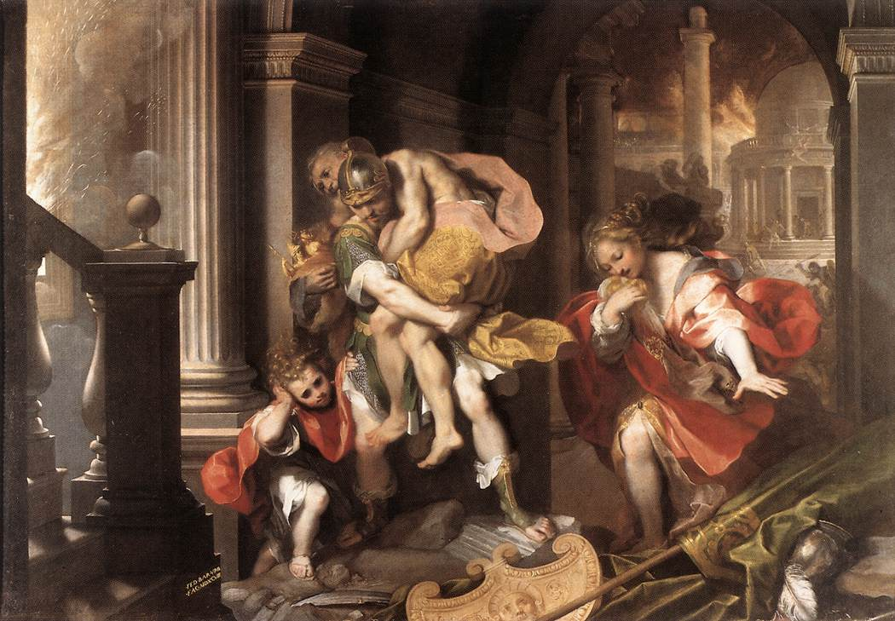
*"Aeneas' Flight from Troy" by Federico Barocci (1598). Aeneas carries his father Anchises and leads his son from the burning city — the founding image of Roman* pietas*.*

Aeneas wanders to **Carthage**, where Queen **Dido** falls in love with him. When destiny forces
him to leave for Italy, she kills herself and curses his descendants forever — the mythic seed of
the wars between Rome and Carthage. (Centuries later the lecturer will say Dido's dying curse is
why Hannibal came.) Aeneas reaches Italy, wars with the local prince **Turnus**, and founds the
line that will become Rome.

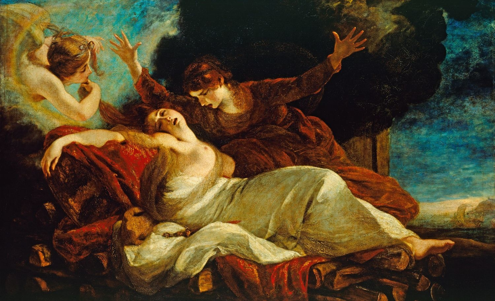
*"The Death of Dido" by Sir Joshua Reynolds (1781). Abandoned by Aeneas, the Carthaginian queen takes her own life and curses his line — the legendary origin of the Punic Wars.*

The second story is **Romulus and Remus** (traditionally 753 BC — "we don't actually know," the
lecturer stresses; "that's just what the Romans believed"). Twins fathered by **Mars** and born to
a banished royal virgin, they are ordered drowned but are saved, suckled by a **she-wolf**, and
raised by a shepherd. From this legend the lecturer draws a first lesson about the Roman psyche:
**violence sits at the core of existence.** When the grown twins found their city on the Tiber's
hills, only one can be king — so Romulus kills his brother Remus. Sometimes, the myth teaches, you
must kill your own brother, and it is the right thing to do because the gods have ordained it.

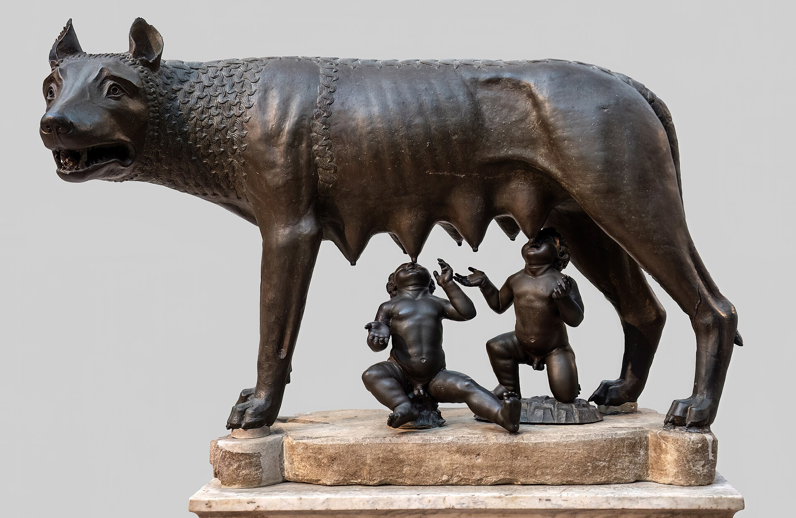
*The Capitoline Wolf suckling Romulus and Remus — Rome's oldest self-image, of a city born from abandonment, divine paternity, and a founder who killed his twin.*

Short of people, Romulus declares Rome an **asylum**, welcoming refugees, exiles, and outcasts and
granting them citizenship — and then, short of women, he stages the **"Rape of the Sabine
Women."** Roman men abduct the daughters of the neighboring Sabines at a festival. The Sabine
fathers raise an army; but as the two sides meet, the women themselves run *between* the lines and
beg their new husbands and their fathers not to fight. Romulus then makes the Sabines citizens too,
**doubling Rome's population in a stroke.** The lesson the lecturer draws: everything — even the
violence done to these women — can be sacrificed to the survival and glory of Rome. And the
practical engine of Roman power is hidden here: Rome **manufactures a people by absorption**, not
by blood. This openness to citizenship is the structural superpower that will later give Rome
limitless manpower.

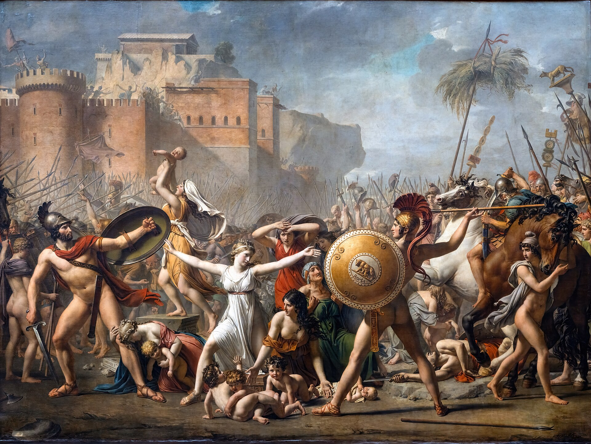
*"The Intervention of the Sabine Women" by Jacques-Louis David (1799). The abducted women throw themselves between their Roman husbands and their Sabine fathers — and Rome doubles itself by making former enemies into citizens.*

---

## II. The Roman Kingdom & the Republic's Birth

For roughly two centuries (traditionally **753–509 BC**) Rome was ruled by **seven kings**, three
of them Etruscan — the advanced, sea-trading civilization that then dominated Italy and from whom
Rome would borrow almost everything, including the very idea of the republic. Most of the kings
were remembered as good. The last was not.

**Tarquinius Superbus — "Tarquin the Proud"** (c. 535–509 BC) — was a tyrant whose name means
*arrogant*. He ruled by hubris, refusing to consult the nobility and killing those who challenged
him. His son was worse: a prince who enjoyed abusing his power, above all by raping the women of
Rome. He set his sights on **Lucretia**, a noblewoman famous for her virtue — precisely because
violating her would be the greatest insult.

After the rape, Lucretia summoned her husband and his friend **Lucius Junius Brutus** (the king's
own nephew, who despised the tyranny), made them swear to avenge her — and then, doubting they
would, drew a knife from her dress and **stabbed herself in the heart** before their eyes. Now
bound by honor, they were forced to act.

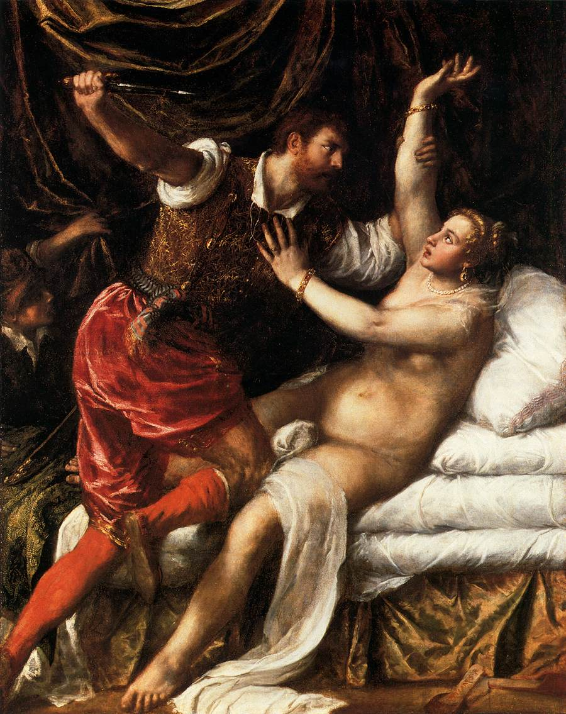
*"Tarquin and Lucretia" by Titian (c. 1571). The rape of the virtuous Lucretia — and her suicide — became the spark that ended the Roman monarchy.*

**Brutus founded the Roman Republic (509 BC)** while the king was away at war. His genius was
institutional. All the king's power had rested on **five duties** — military, judicial,
legislative, administrative, and religious — and Brutus **split those powers not among individuals
but among elected institutions**: the consuls (head of state and army), the praetors (justice),
the Senate (law), the aediles (administration), and the Pontifex Maximus (religion), each elected,
each checking the others. Romans would now obey not a king but the Republic — defined as its
**laws, its traditions, and its institutions**. The system, copied largely from the Etruscans,
would last roughly **500 years**.

Then Brutus proved the meaning of Roman devotion at unbearable cost. A conspiracy to restore the
king was uncovered — and among the plotters were **his own two sons**. They were tried, condemned
to death, and the execution fell under the authority of the consul: Brutus himself. No one would
have blamed him for stepping aside or pleading illness. Instead he came to work. Before all of
Rome, who watched not the boys but their father's face, Brutus oversaw the beheading of his sons —
**weeping the entire time, yet never stopping the executioners.** This is the Roman ideal of
devotion in its purest form: *you are so devoted to Rome that you will sacrifice your own children
to ensure its survival.* Soon after, Brutus and one of Tarquin's sons charged each other on
horseback and ran each other through, dying together. For the rest of Roman history Brutus would be
remembered as the greatest Roman who ever lived — until Julius Caesar. (It is no accident, the
lecturer notes, that Caesar's assassins invoked his memory.)

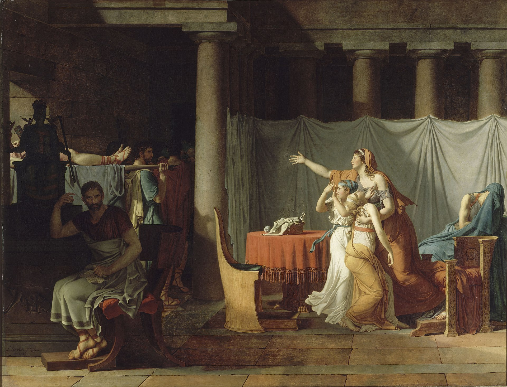
*"The Lictors Bring to Brutus the Bodies of His Sons" by Jacques-Louis David (1789). Brutus sits in shadow, rigid with grief, as his executed sons are carried home — devotion to Rome above love of family.*

Two more heroes seal the founding ethic during the war that followed, when the Etruscan king **Lars
Porsena** marched to restore Tarquin (c. 508 BC). When the enemy army reached the bridge over the
Tiber and the garrison fled, one man — **Horatius Cocles** — refused to run, because to run was to
let the army pour into Rome. Alone on the bridge, he hurled insults at thousands ("you are slaves;
we Romans will always be free"), buying time while his comrades hacked the bridge down behind him.
Two officers joined him; the three held the span until it began to fall, then the two ran back and
Horatius made the last stand alone. As the bridge collapsed he leapt into the Tiber in full armor —
and *survived.* The lesson: a hero of Rome need not be nobility like Brutus; **any ordinary Roman,
through devotion alone, can save the city.**

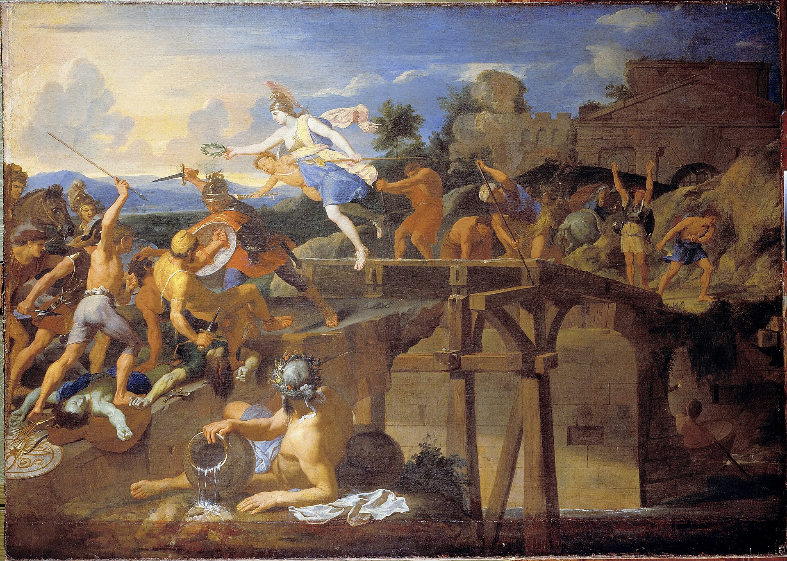
*"Horatius Cocles Defending the Bridge" by Charles Le Brun (c. 1642). One man holds the Tiber bridge against an army while Rome cuts it down behind him.*

Then **Gaius Mucius Scaevola** slipped into the enemy camp on payday to assassinate the king — but
not knowing which of two men on the platform was the king, he gambled, stabbed, and killed the
*secretary* by mistake. Captured and threatened with being burned alive unless he revealed his
fellow conspirators, Mucius instead **thrust his own right hand into the fire** and held it there
without flinching, declaring that he was merely the first of a hundred young Romans sworn to kill
the king — kill him and ninety-nine would follow. (What steadied him, in the telling, was the
remembered face of Brutus ordering his sons' deaths: burning a hand is easier than that.) Porsena,
concluding that Rome bred men he could never defeat or frighten, gave up and withdrew. The war was
over.

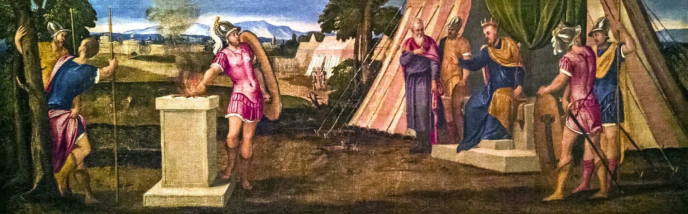
*Mucius Scaevola thrusts his own hand into the fire before King Porsenna to prove Rome cannot be frightened — a demonstration of fearlessness that ended the war.*

These four stories — Brutus and his sons, Horatius, Mucius, and behind them Lucretia — are not
history but **catechism**. They are the moral curriculum of *pietas*, *Libertas*, and *Res
Publica*, and they could be taught to *anyone* who became a citizen. To know and believe these
stories *was* to be Roman.

---

## III. The Second Punic War: Character Over Resources

**Central thesis:** Rome became the great Mediterranean power not because of manpower, technology,
or wealth — the "traditional" military criteria, which would have favoured Carthage — but because
of its **character / value system**, which produced superior **cohesion, discipline, and
devotion.** Traditional military analysis asks three questions: How many soldiers? How good is the
technology? How much money? On every count Carthage — richer, with a better navy and the greatest
general alive — should have won. The lecturer replaces those three with a better three: **Are the
soldiers cohesive? Are they disciplined? Are they devoted?** Those qualities flow from a people's
character, and Rome's character was built for war.

**1. Rome's openness to citizenship gave it limitless manpower.** Where Athens, Sparta, and
Carthage all hoarded citizenship and could only be born into, Rome — poor and small and with no
choice — *welcomed* immigrants as citizens and could draw on the vast manpower of the entire
Italian peninsula. The principle was set at the founding (Romulus doubling Rome by enfranchising
the Sabines, c. 750 BC), enforced by treaty (conquered neighbors were obligated to send soldiers),
and pushed to its limit in the crisis itself, when Rome **freed its slaves to fill the legions**
against Hannibal (216–202 BC). Armies don't win wars, the lecturer insists — *nations* do.

**2. Rome wins by refusing to quit and absorbing horrific losses.** This was visible even before
Carthage. Around **280 BC** the Greek king **Pyrrhus of Epirus** answered the southern Greeks' call
for help and beat the Romans in battle after battle — but at such ruinous cost that he reportedly
realized another such victory would leave him with no army at all. The origin of the "**Pyrrhic
victory**": you can win every battle and still lose, because the Romans simply *kept coming* and
were not afraid to die.

The existential duel was with **Carthage** — the rich Phoenician merchant empire — and its greatest
weapon was **Hannibal Barca**, regarded by many as the finest general who ever lived. Hating Rome
and certain it would never stop expanding, Hannibal did the unimaginable: he marched an army with
war elephants **over the Alps in winter** into Italy (218 BC), losing many men and beasts in the
crossing but arriving at Rome's doorstep, where he recruited Rome's enemies (the Gauls) to refill
his ranks.

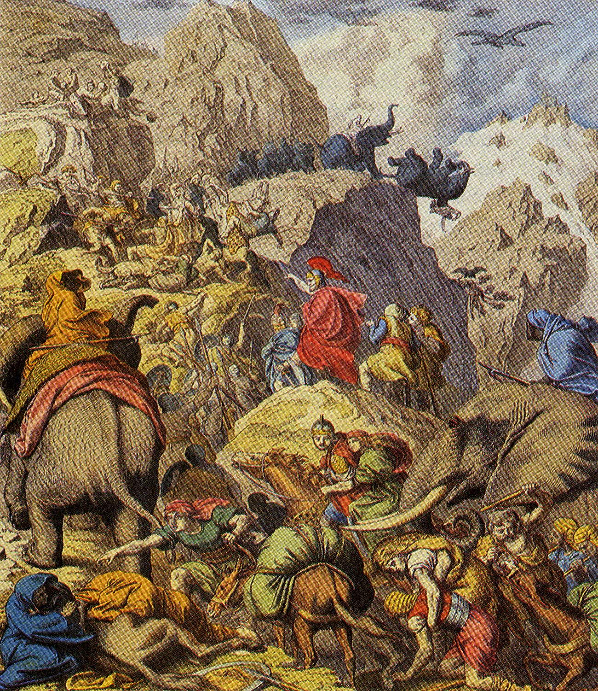
*Hannibal's army and its war elephants cross the Alps into Italy (218 BC) — a feat thought impossible, especially in winter.*

The same trait reached its apocalyptic test at **Cannae (216 BC)**. After losing army after army to
Hannibal, Rome spent two years building the largest army it could and threw it at him on a narrow
plain. Hannibal, badly outnumbered, drew his line into a **concave** curve; the Romans, packed by
the terrain into a deep mass, drove into the center and pushed it back — until the bulge inverted
and Hannibal's wings folded around them while his cavalry, having routed the Roman horse, sealed
the rear. This is the textbook **double-envelopment**: the Roman army was surrounded and
slaughtered.

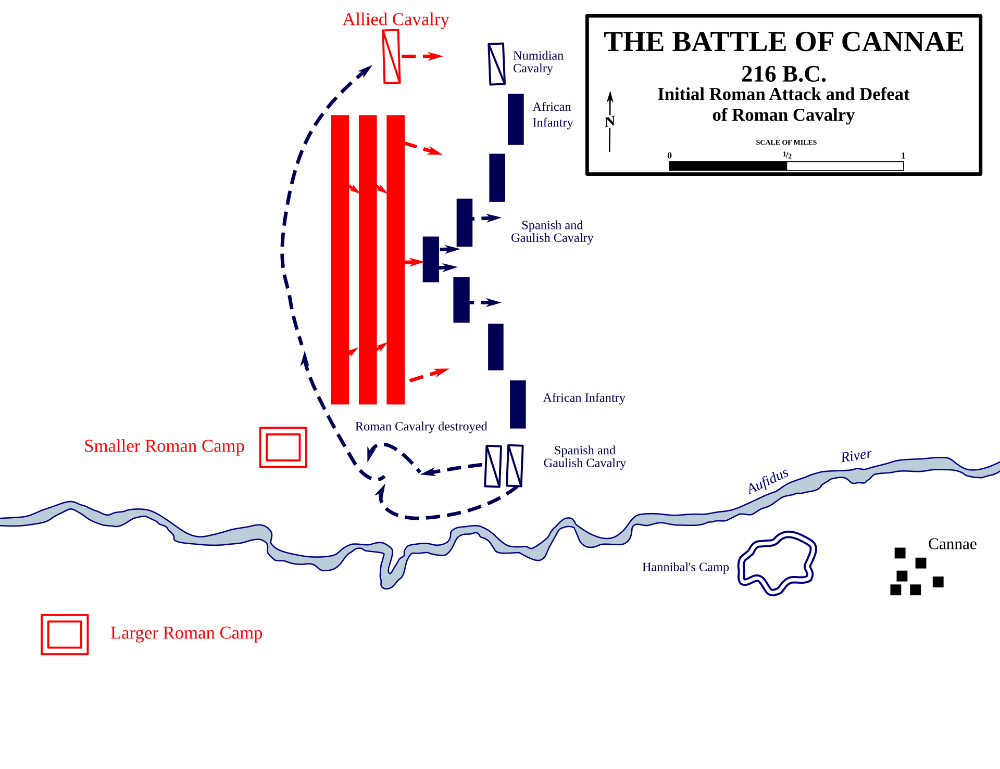
*The opening of Cannae (216 BC): Hannibal's cavalry routs the Roman horse on the wings while the deep Roman infantry column pushes into his deliberately weak center.*

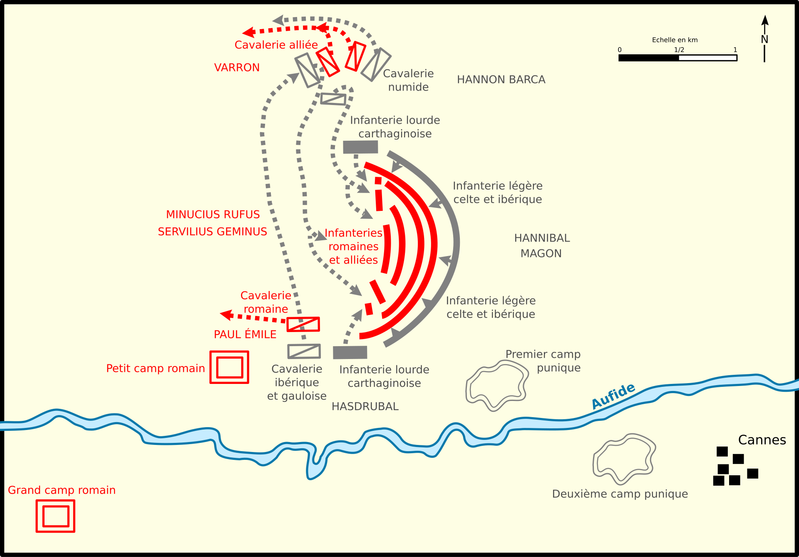
*The completed trap: the Carthaginian wings and African infantry fold around the Roman mass and the cavalry closes the rear, encircling and destroying the larger army.*

The lecture's figures (an "80,000"-man army, ~70,000 dead) overstate the case — the "80,000" is
plainly a slip for ~80,000, and standard estimates give ~50,000–70,000 Roman dead — but the scale
was still catastrophic: roughly **20% of Rome's adult male population** and **a third of the
Senate** killed. Hannibal, certain the war was won, sent envoys to negotiate peace. And here Rome
did the thing that, the lecturer says, is "unique in human history": the Senate met, faced a bleak
and hopeless situation, and **refused even to discuss surrender** — *Romans do not surrender.* They
told Hannibal to come if he wished; they would raise another army. The war ground on for fifteen
more years until **Scipio Africanus** carried it to Africa and broke Hannibal at **Zama (202 BC)**.

**3. The three pillars of Roman identity — *piety, Libertas, Res Publica* — taught as
history-as-mythology.** Where the Greeks separated history (what humans did) from mythology (what
gods did), the Romans **elevated their history into religion.** The founding legends (Romulus and
Remus, the Sabine women), Brutus founding the Republic and executing his sons, Horatius at the
bridge, Mucius burning his hand — these *are* the three values made into story. *Piety* is duty to
gods, city, and father. *Libertas*, for a Roman, did not mean Greek freedom of speech; it meant
**freedom under law** — obeying Rome's laws, institutions, and traditions, "because otherwise we'd
all just be savages." *Res Publica* — public virtue — turned politics into a **meritocratic
competition** to win glory for Rome, the highest prize being a **Triumph**, the parade granted to a
general who won new territory. This is *why* Rome would not break after Cannae: with a third of the
Senate dead, ambitious young men like Scipio saw not catastrophe but *opportunity* to prove
themselves and earn their own immortality in Rome's memory. Devotion meant being willing to
sacrifice even your children for Rome.

**4. The Republic separated the king's five powers into elected institutions** — the stable system
described in Section II, lasting ~500 years, and copied from the Etruscans. Brutus's reform (509 BC)
is the institutional expression of *Libertas*: no man can be king, because the king's powers now
live in offices, not in a person.

**5. Carthage lost because, as a merchant culture, it could never recognize an existential
threat.** Carthage was a republic too, but run by a **Council of Elders** — the wealthiest
merchants, for whom *war is bad for business.* They never backed Hannibal's war wholeheartedly: he
had to **bribe them** with Spanish silver to be left alone, and after he crossed the Alps and won
at Cannae they sent him **no logistical support** — no food, no reinforcements — partly because
conquering poor Italy promised no profit, and partly because a victorious Hannibal might come home
and make *himself* king. So the greatest general who ever lived spent his Italian years foraging
for food while Rome, united, starved him out. Fifty years later **Cato the Elder** visited
Carthage, was shocked to find it *richer than ever*, and returned ending every speech with
"**Carthage must be destroyed.**" In the **Third Punic War (149–146 BC)** Rome besieged the city,
razed it, enslaved its people, and **burned its books** — erasing Carthaginian culture so
thoroughly that "we know almost nothing about them" (an overstatement, but the point stands). This
is the Roman mentality: **devotion means all or nothing** — you do not surrender, and you do not
show mercy.

**6. Methodological caveat.** The early stories are **oral tradition**, written down generations
later by **Livy** under the early Empire, and surviving in multiple versions. Lucius Brutus was
probably a real person; whether he did these things is "debatable." As the lecturer repeats: *"we
don't believe these stories to be that true… what matters is what they believed."* The history is
true as **identity**, not as fact.

---

## IV. The Crisis & Fall of the Republic

**Central argument:** Julius Caesar succeeded because he was a **mythmaker** — a "man of destiny"
who constructs a new reality through words and deeds — and he was killed precisely because his new
myth of Rome displaced the old one, creating *cognitive dissonance* in the Old Guard. Three framing
questions organize his life: **What did he want? Why did he succeed? Why was he killed?**

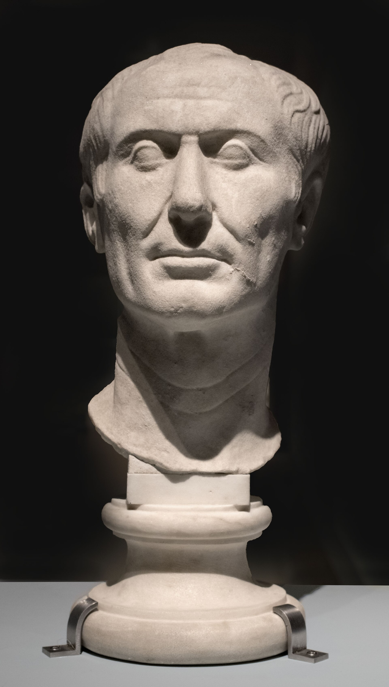
*The Tusculum portrait — likely the only surviving bust of Caesar made in his lifetime. Caesar flooded Rome with his own image on busts and coins, building what we would now call a cult of personality.*

**1. The Republic became a self-contradicting "imperial republic" after 146 BC.** Having beaten
every rival, Rome was now an empire governed by a republic built for a poor city-state — a
contradiction. The three values that had made Rome strong now generated **corruption, inequality,
and "elite overproduction"** (the lecturer borrows Peter Turchin's modern term). Conquest made a
few obscenely rich and many poor: aristocrats seized public ("common") land worked by slaves, while
citizen-soldiers drafted to Spain and Syria returned to find their farms gone, fell into debt, lost
their land cheaply to the rich, and drifted landless into the city. *Res Publica* curdled into a
race for bribes and provincial plunder; the elite split into **optimates** (the established "best
men," defending the status quo) and **populares** (the ambitious, allying with the desperate
people). The conventional start of the fall: the **Gracchi brothers**, who proposed buying the rich
out of illegally occupied common land and redistributing it to the poor — and were **both
assassinated** by the senatorial elite (Tiberius 133 BC, Gaius 121 BC), proving the system was
*incapable of reforming itself.* Then the **Social War** (91–88 BC) forced citizenship on Rome's
Italian allies; and **Marius and Sulla** did the unthinkable, marching their personal armies *on
Rome itself.* Sulla won, made himself dictator, and invented the **proscriptions** (82–81 BC) —
published kill-lists of ~1,000–2,000 enemies, whose property went to whoever murdered them — before
**retiring** rather than seizing kingship.

**2. Caesar cultivated his public image from youth — facts mattered less than appeal.** Caesar
(born 100 BC, Marius's nephew) survived Sulla's proscription as a teenager by bribery. The lecturer
illustrates his mythmaking with the **pirate kidnapping** (75 BC): captured and held for ransom,
Caesar reportedly told the pirates their price of 20 talents was *insulting* — he was worth at least
50 — drank and joked with them, promised to come back and crucify them all, and after his release
did exactly that. Almost none of it can be verified, and that is the point: **Caesar understood that
a story's power lies in how memorable it is, not whether it is true.** The same instinct drove his
dispatches from Gaul, read aloud in the Forum, and the perfect three-word headline "*Veni, vidi,
vici*" (47 BC).

**3. He was a mythmaker because he was simultaneously general + politician + administrator.** These
three roles demand contradictory personalities — Pompey was a great general but a poor politician;
Hannibal a great general but no legislator. What let Caesar be all three at once was
**imagination**: he could imagine himself as different men and so *become* them, which made him
unpredictable and let him read opponents who could never read him. The evidence: surprising the
optimates by **giving up a Triumph to stand for the consulship** (59 BC); forming the secret **First
Triumvirate** with Pompey and Crassus (60 BC) — an alliance of men who were politically enemies; the
**Gallic Wars** (58–51 BC), where he forged the world's best army (loyal to *him*) and, by his own
propaganda, "killed a million, enslaved a million, let a million live"; the mythically pointless but
imaginatively electric **invasions of Britain** (55 & 54 BC), "the moon landing of its day"; and the
**Julian calendar** (46 BC).

**4. His "clemency" was both strategy and a break with Roman norms** — for Romans did not value
mercy. Ordered to disband his army, Caesar instead **crossed the Rubicon** (49 BC), declaring war on
the Senate. Where the optimates expected destruction, he offered **clemency** — *we are all Romans;
promise not to fight me and go free.* He showed it in Spain (49 BC), and after crushing Pompey at
**Pharsalus** (48 BC) he extended it again and again, a deliberately *un-Roman* generosity that was
also shrewd politics.

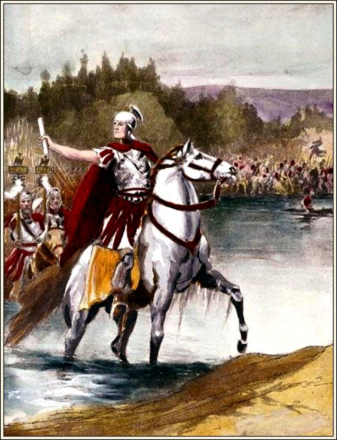
*Caesar leads his army across the Rubicon (49 BC), the act of war against the Senate from which there was no return — "the die is cast."*

**5. He did not actually want to be king; he wanted to "make Rome great again," like a more merciful
Sulla.** On this reading, Caesar's model was Sulla, who seized power, reformed, and *retired*.
Caesar's reforms of 44 BC — land, debt relief, the calendar, citizenship for soldiers and Italians —
aimed to resolve the contradictions that had wrecked the Republic. But his **speed** disrupted Roman
identity faster than Romans could absorb it: a foreign-born senator here, an anti-corruption rule
there, each one good for Rome but threatening to someone's sense of what Rome *was*. *(This is the
single most debated claim in 2,000 years of history; the lecturer admits "no one has resolved it,"
then argues firmly for one side. The dictatorship-for-life, the cult of personality, and the diadem
incidents lead many historians to read genuine monarchic ambition.)*

**6. He was killed by friends, not enemies — because reform creates cognitive dissonance.** The
conspirators were his own circle: **Decimus Brutus** (his loyal lieutenant), **Cassius** (a pardoned
Pompeian, perhaps resenting that Caesar's mercy implied he was no threat), and **Marcus Brutus**
(whom Caesar treated as a son, and whom Roman rumor even made his biological son). What united ~60
senators was the feeling that **Rome was changing too fast**; what gave them a banner was the memory
of the *other* Brutus, the Republic's founder, whose duty was to kill would-be kings. On the **Ides
of March, 44 BC**, they stabbed Caesar to death in the Senate.

---

## V. The Birth of the Empire

**Central thesis:** **The death of Caesar is what made Octavian emperor.** Killing Caesar converted
Caesar's *myth* into *reality* — it proved he never wanted to be king — and the people's love and
guilt were transferred onto his heir.

**1. Caesar's will reshaped the board.** Antony read it aloud (44 BC), and it stunned Rome three
times over: it gave **every citizen** roughly three months' wages and turned Caesar's private
gardens into **public parks**; it named not Antony but an unknown 18-year-old grand-nephew,
**Octavian**, as adopted son and primary heir; and it named a *conspirator*, Decimus Brutus, a
secondary heir. The will broadcast that Caesar had loved the people — and even loved the men who
killed him. Octavian **borrowed money** to honour the cash bequest in full, binding the people's
gratitude to himself.

**2. Octavian was not lucky, brilliant, ruthless, or a great general — yet he won.** The lecturer
walks through five common explanations and finds each insufficient. *Lucky?* — you don't become
emperor by luck. *Brilliant?* — not in Caesar's way; his oratory was ordinary. *Ruthless?* — yes,
but *everyone* in Rome was ruthless (Antony "killed his own wife," the lecture claims — actually
unsupported). *The legions' loyalty to Caesar's name?* — but they were loyal to Antony too, who had
a stronger claim. *His general **Marcus Agrippa**, who actually won his battles (e.g. **Actium**, 31
BC)?* — true, but other men had brilliant generals, and the deeper puzzle is *why Agrippa stayed
loyal.* The real engine, the lecturer argues, is the **converted myth**: the people's transferred
love. (Modern analogies offered: inherited political affection like Justin Trudeau or George W.
Bush.)

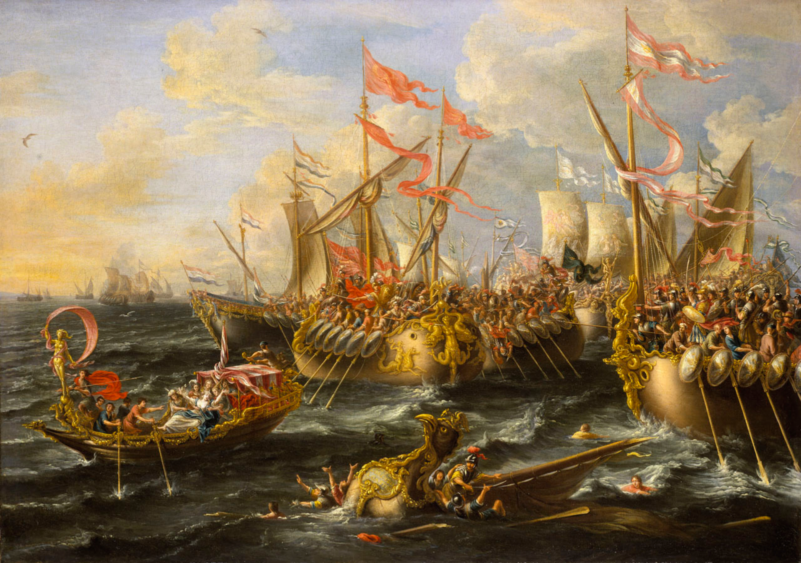
*"The Battle of Actium" by Lorenzo A. Castro (1672). Agrippa's fleet destroys Antony and Cleopatra's at Actium (31 BC) — the victory that left Octavian master of the Roman world.*

**3. Caesar's assassination was psychologically explicable through Roman taboos.** Why did Caesar —
a genius — not see it coming, and go unguarded? Because the killing was, to a Roman, *unimaginable.*
Three taboos protected him: the **pomerium** (Rome's sacred boundary, within which no weapons and
no violence were permitted, on pain of the gods' vengeance); the **sanctity of the Senate** and of
Caesar's body, which the Senate had declared divine; and **personal obligation**, since Caesar had
personally appointed most of the senators present. The proof is in the act: of ~60 conspirators,
**only about five could bring themselves to stab him**; the rest stood paralyzed. The first blow,
struck from behind by a trembling man, was a mere "pin prick" — the origin, the lecturer says, of
"**backstabbing**." And this same taboo carries a deeper implication: if violence against the
sacred was unthinkable, then **kingship — the ultimate taboo — was unthinkable for Caesar himself.**
His very murder is evidence he never meant to be king. *(The 23 wounds are well attested and many
conspirators did strike; the "only five, paralyzed" detail is dramatized beyond the sources.)*

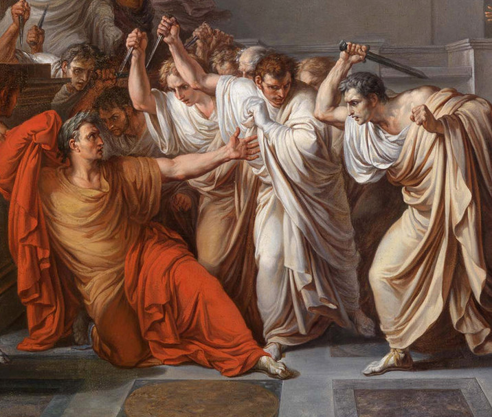
*"The Death of Julius Caesar" by Vincenzo Camuccini (1804–05). The senators close in — but in the telling, only a handful could overcome the taboo and strike.*

**4. The conspirators and Antony then self-destructed.** **Marcus Brutus could not act**: when
Decimus Brutus was attacked, Cassius urged Marcus to help, and Marcus did nothing — because to march
his army on Rome would make *him* the ambitious would-be king he had killed Caesar to prevent. He
could only wait for death. **Antony self-destructed trying to "out-Caesar" Caesar**: to prove he,
not Octavian, was the rightful heir, he launched a failed **Parthian** campaign, fell into
drink and depression, took up with **Cleopatra** (Caesar's old mistress) and divorced Octavian's
sister, and finally **willed Roman territory to his children by Cleopatra** (34–32 BC) — handing
Octavian the pretext for war. Along the way came the **Second Triumvirate** (Octavian, Antony,
Lepidus, 43 BC) and its proscription of the great orator **Cicero**; the defeat and deaths of
Cassius and Marcus Brutus at **Philippi** (42 BC); **Actium** (31 BC); and the **suicides** of
Antony and Cleopatra (30 BC). Octavian stood alone.

**5. Augustus built durable one-man rule disguised as restoration — then failed at succession.** In
**27 BC** Octavian theatrically "restored the Republic" to the Senate, which handed everything back
and named him **Augustus** — "first citizen" (*princeps*), never king. Beneath the costume, he
concentrated all real power: **Egypt as his private estate** to bankroll a **professional standing
army** loyal to him personally (not the Senate), and the **Praetorian Guard** as Rome's secret
police. He reigned ~40 years and launched the **Pax Romana**. His one failure was **succession**:
his scheme to adopt the most competent relative unravelled when his transitional heir **Tiberius**
allegedly destroyed the favoured **Germanicus** and his line, leaving the disastrous **Caligula** (AD
37). The lecturer's provocative claim — that in spirit the Empire "died" here and merely coasted ~300
more years on size and inertia — is a deliberately minority reading.

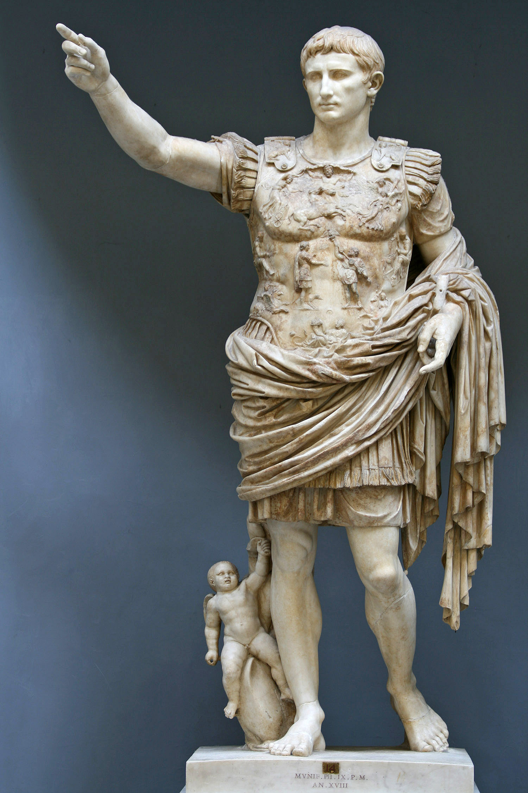
*The Augustus of Prima Porta. The first emperor presents himself as eternally youthful commander and restorer of the Republic — one-man rule dressed as tradition.*

---

## VI. Vergil and the *Aeneid*: The War for the Soul of Rome

**Central thesis:** Augustus commissioned Virgil's **Aeneid** (29–19 BC, under his close
supervision) as what the lecturer calls "the greatest work of propaganda in human history" — to win
three battles at once: **legitimacy, a new Roman identity (piety over Libertas), and the defeat of
corrupting Greek culture.** The deeper claim: Western civilization here pivots from the Greek gospel
of **love** (Homer) to the Roman gospel of **piety/obedience** (Virgil).

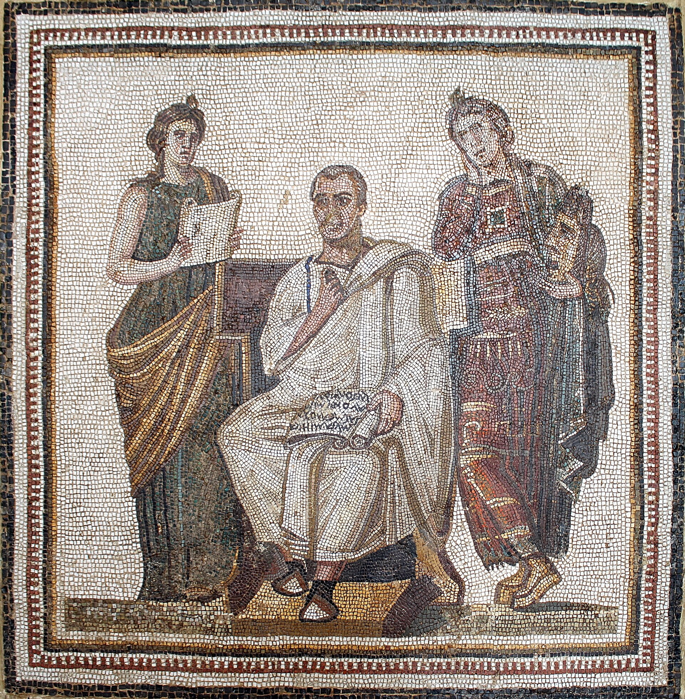
*A Roman mosaic of Virgil seated between two Muses, holding a scroll of the* Aeneid*. Augustus built the poem to stand beside Homer — and to replace him in Rome's schools.*

**2. Augustus faced three problems — legitimacy, identity, and Greek cultural dominance — all
solvable by one new founding myth.**

- **Legitimacy.** He was a conqueror, but neither his family (the Julii) nor he descended from
  Rome's two founding myths — Romulus or Lucius Brutus. So a new myth was planted (Caesar had
  already begun it): the Julii descend from **Aeneas** of Troy, son of the goddess **Venus**.
  Divine ancestry that *predates Romulus* outranks any elected office.
- **Identity.** The old value **Libertas** — "no kings, kill the tyrant" — was exactly the myth
  (Lucius Brutus's) that had armed Caesar's assassins. It had to be displaced by a new identity
  built on **piety and obedience**, lest future "Brutuses" feel duty-bound to kill the emperor.
- **Greek cultural dominance.** Educated Romans revered Greek culture — Homer, Plato, the
  tragedians — and felt culturally inferior even as they ruled the Greeks militarily. Augustus
  believed Greek culture was *corrupting* (it was Greek hedonism, in his view, that ruined Antony),
  and that its foundation was **Homer**, the *Iliad* and *Odyssey* being the schoolbook "Bible" of
  Greek civilization. To defeat Homer he needed a Latin epic to **replace him in the schools.**

**4. The *Aeneid* inverts every Homeric value** — love becomes a disease, imagination becomes
destructive, and duty/obedience triumph.

First, the contrast. **Homer is an educator; Virgil is a propagandist.** Homer wrote at the dawn of
Greek civilization, planting seeds; Virgil wrote when Rome was already everywhere, teaching people
to obey an empire. In the *Iliad*, the cold killing-machine Achilles is *humanized*: after he kills
Hector and defiles the corpse, Hector's father **King Priam kisses the hand of the man who killed
his son** to beg for the body — and Achilles, seeing his own father in Priam, weeps, relents, and
forgives himself. The warrior becomes capable of **pity**. Homer's gospel: **love is the basis of
civilization**, the force that lets even bitter enemies find common ground. (The lecturer flags this
as one interpretation among many.)

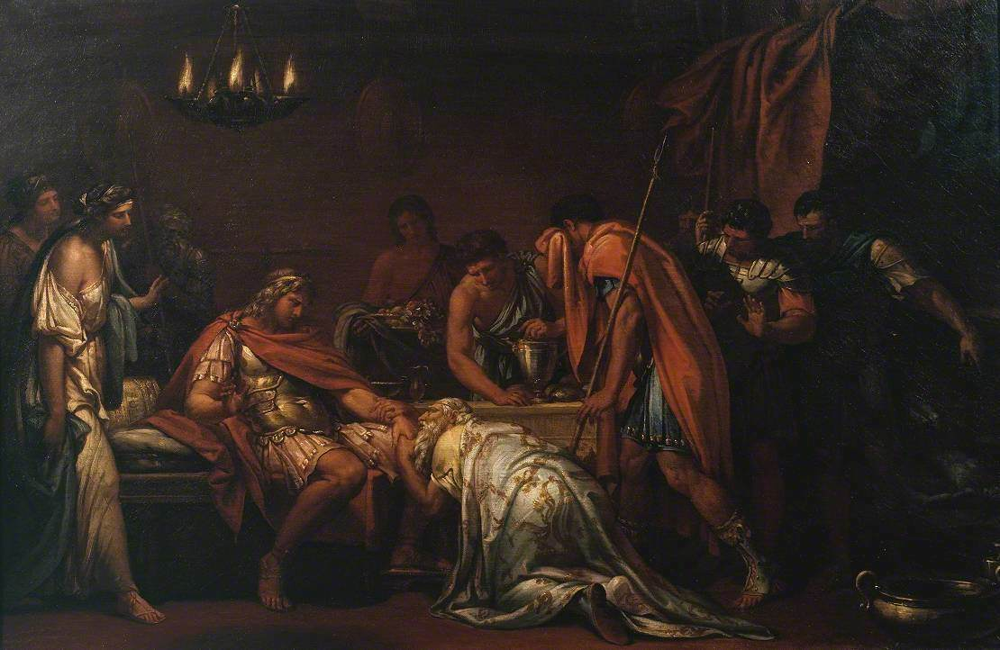
*"Priam Pleading with Achilles for the Body of Hector" by Gavin Hamilton (1775). The old king kisses the hand of his son's killer — Homer's image of pity as the root of civilization, the value Virgil will invert.*

The *Aeneid* systematically **inverts** this. Love becomes a **disease and a trap**: Helen's love
caused the Trojan War, and **Dido's** love for Aeneas — who abandons her on the gods' orders — will
curse Rome with Hannibal. Aeneas's wife **Creusa** dies during the escape from Troy (and in the
telling kills herself) so that nothing distracts him from his mission — the lecture's chilling gloss
is that "a good wife is someone who will kill herself for her husband." The **Trojan Horse** is
reframed as **Greek culture itself** — logic, philosophy, theatre — the beautiful lie that destroys
a city from within, which dutiful Rome must resist. (This allegory is the lecture's invention, not
Virgil's text.) And the **killing of Priam** by Achilles' son Neoptolemus — who throws the old
king's own plea for honour back in his face before murdering him — announces the new world's rule:
*there is no place for love, friendship, and forgiveness; only brutality and force will triumph.*

The proof that Aeneas has *become* the embodiment of piety comes at the very end. Throughout the
poem the gods must keep ordering Aeneas to do his duty — to leave Helen, to leave Troy, to leave
Dido. But in the final scene, when he has beaten **Turnus** and Turnus surrenders and begs for
mercy, Aeneas *wants* to spare him — and then sees, on Turnus's body, the belt of a friend Turnus
killed. He drives in his spear and kills the suppliant **without any divine prompting.** He no
longer needs to be told his duty; he *knows* it and embraces it. Mercy has yielded to *pietas*.
This is why scholars who think the abrupt ending means the poem is "unfinished" miss the point: the
ending *completes* Aeneas's character arc, the mirror-inversion of Achilles'. *(Most scholars read
the* Aeneid *as far more ambivalent than pure propaganda — the "two voices" hear Virgil mourning
Dido, Creusa, and Turnus, not endorsing their fate; and "co-authored by Augustus" is not the
scholarly view.)*

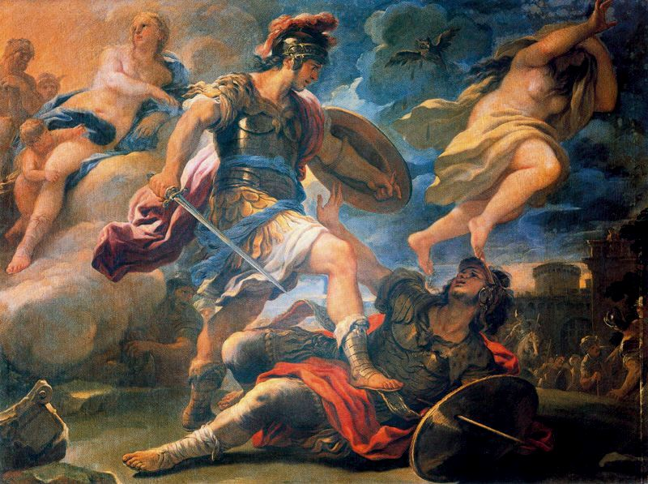
*"Aeneas and Turnus" by Luca Giordano. Aeneas stands over the surrendering Turnus and kills him anyway — duty overriding mercy, with no god commanding it. Aeneas has become pure* pietas*.*

**5. The *Aeneid* frames Augustus as the end point of history** — the **Pax Romana** as "eternity"
and perfection, achieved by replacing love with piety/obedience. Everything in the poem converges on
Augustus: the destiny that drives Aeneas exists so that his line can build the empire that ends all
wars. The lecturer draws the philosophical contrast sharply: for **Homer, love** is the unifying,
animating force, and **imagination** is what gives life; for **Virgil, love** is the force that
*creates conflict* (Helen, Dido), and **imagination** is *destructive* — what matters is stability
and obedience. *Love comes from within you; piety is what is told to you.* In the Pax Romana you
need only **obey**, and the world is perfect: history has reached its destination and stopped.

The lecture closes by looking forward twice. First, it claims this same piety-first program will
later be carried by **Christianity** — "the Romans will create" a religion that makes obedience the
cornerstone (a provocative teleology: Christianity in fact arose from Judaism and was persecuted by
Rome for centuries before adoption). Second, it asks where Rome — "the most non-creative people in
the world," who "stole everything" — got its idea of **eternity** itself. The answer, and the next
lecture's subject: **Egypt.**

---

### A note on these stories

These four lectures are **argument-driven and rhetorical**, not neutral history. Their power lies in
three interpretations — *character over resources*, *Caesar the mythmaker*, *Homer's love versus
Virgil's piety* — and their weaknesses cluster in three kinds of overreach: **numeric slips**
(80,000 at Cannae; Antony "killed his wife"), **legend or propaganda presented as fact** (child
sacrifice, the Gallic "genocide" totals, Brutus as Caesar's son), and **single strong readings
stated as settled** (Caesar never wanted to be king; the *Aeneid* as pure co-authored propaganda;
Tiberius as "the death of the Empire"). But the lecturer's own caveat is also the through-line of
the whole story: with these founding beliefs, *what matters is not whether they are true, but that
the Romans believed them* — because believing them was what made you a Roman.
